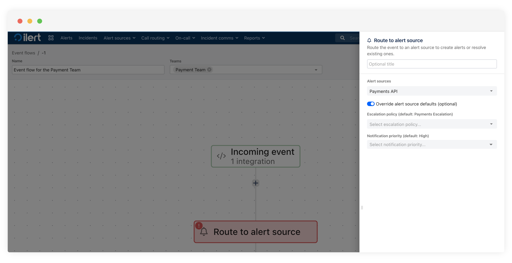

# Event flows

Event flows in ilert enable teams to automate and streamline the processing of incoming events. With event flows, you can build visual workflows that evaluate, branch, and route events dynamically based on conditions, support hours, or alert source configurations. This helps reduce manual effort, improve response times, and ensure incidents are handled appropriately.

### Create a new event flow

1. Navigate to **Alert sources → Event flows** from the top navigation menu.

<figure><figcaption></figcaption></figure>

\
2\. Click **Create new event flow** on the top right or by clicking a blue button.

<figure><figcaption></figcaption></figure>

3.  **Enter a name** for the event flow and assign it to one or more teams (_optional_).\

    <figure><figcaption></figcaption></figure>

### Add an incoming event

1. **Click the Incoming event** block to define how events will trigger the flow.
2. **Select one or more integrations** from the dropdown to associate them with the flow.

<figure><figcaption></figcaption></figure>

3. After selecting integrations, you’ll see the generated **API endpoint**. Use this endpoint to send events. ilert allows you to use these **integrationKeys / integrationURLs** as a drop-in replacement of alert source versions right within monitoring tools.

### Add flow logic: Branches, alert sources, and support hours

<figure><figcaption></figcaption></figure>

Click the **+ icon** to add logic blocks after the incoming event. You can choose from the following nodes:

* **Branch**: Create various scenarios depending on the conditions.
* **Route to alert source**: Direct all alerts to a specified alert source.
* **Support hours**: Route events based on the predefined [Support hours](https://docs.ilert.com/alerting/support-hours).
* **AI Responder (Beta)**: Activates an AI agent that analyzes incidents in real-time, leveraging data from various data sources and provides recommendations for faster resolution.


Many more blocks are coming soon, allowing for transformation, webhook calls, and more. Please reach out to us at [support@ilert.com](mailto:support@ilert.com) if you have suggestions or feature requests.


#### Branch: Route events based on conditions

<figure><figcaption></figcaption></figure>

1. Select **Branch** to define logic based on filters like `context.event.summary`, `context.event.customDetails.labels`, etc.
2. Add filter groups **using AND / OR logic** to create conditional branches.
3. Add more branches as needed. The first matching branch will be executed. If no branch matches, the event proceeds to the **Else** path.

#### Route to alert source: Direct all alerts to a specified alert source

<figure><figcaption></figcaption></figure>

1. Select the **Route to alert source** to send the event to an existing alert source.
2. Optionally override the alert source defaults by selecting a different escalation policy or notification priority.

#### Support hours: Route based on working time

<figure><figcaption></figcaption></figure>

1. Select **Support hours** to route events during or outside business hours.
2. Choose Support hours (configured separately under [Support hours](https://docs.ilert.com/alerting/support-hours)).
3. Events are then routed based on their arrival time.

### Finalize and activate the flow

You can **copy or cut a node or a subtree** by clicking a three-dot icon.

<figure><figcaption></figcaption></figure>

Once all branches and logic have been added, click **Save** in the top-right corner of the screen. The flow is now active and will start processing events from the selected integrations.

### FAQ

**Q: Can I reuse the same integration in multiple event flows?**\
A: You can create multiple **integrationKey/integrationUrls** of the same integration type for multiple event flows.

**Q: What happens if no branch of a branch node matches in a flow?**\
A: If no branch conditions match, the event proceeds to the Else path by default.

**Q: Where do I configure Support hours?**\
A: Navigate to Alert sources → Support hours to define and edit team working hours.\
