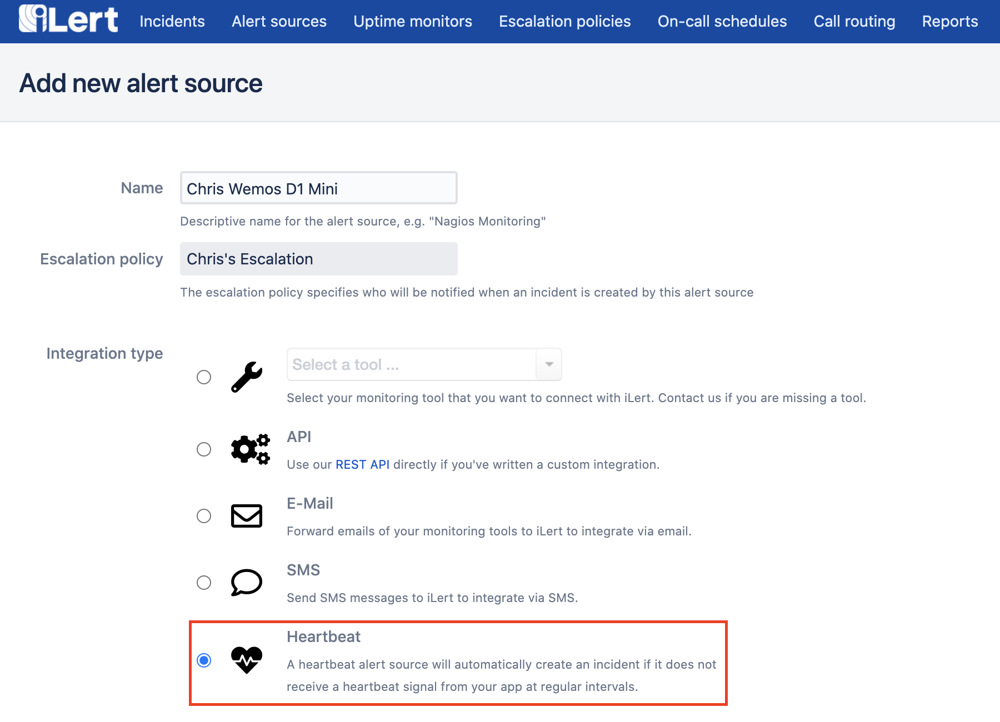

# Heartbeat Monitoring

ilert's heartbeat alert sources allow you to monitor services, devices, or workflows very easily — depending only on an HTTPS outbound connection.

Simply log in to your account, click on the **Alert sources** navigation menu, and choose **Create new alert source**.



Choose **Heartbeat** as the alert source type and configure the settings to your liking, just like any other alert source you might have already created.

With heartbeat alert sources, you may additionally choose an **interval** in which a ping (HTTP request) of your service, device, or workflow is expected. If the ping is not received by ilert in the configured interval, an alert will be created.


After your alert source has been created, you will be taken to its details view, where the API key will be shown. You can use this API key to call ping requests for your heartbeat alert source.


Using the **URL** (including the API key) you can simply try out heartbeats (pings), e.g. with curl on the command line:

```
curl https://api.ilert.com/api/v1/heartbeats/${YOUR-APIKEY}
```

You can find more examples on how to implement heartbeats here:


[prometheus-heartbeat-example.md](prometheus-heartbeat-example.md)



[cli-heartbeat-examples.md](cli-heartbeat-examples.md)

