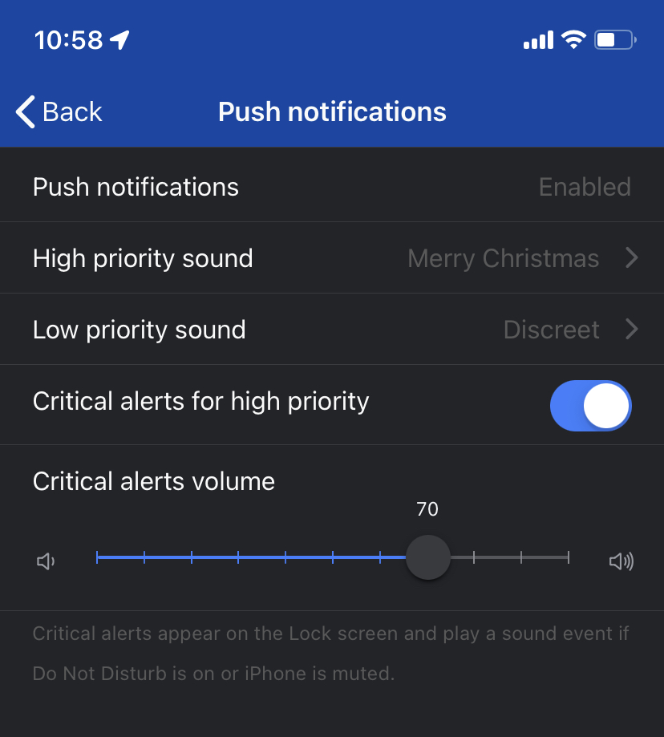

# iOS Critical Alerts Configuration


Note: this guide is meant for iOS users only. For Android, please refer to [this page](android-push-notification-dnd-configuration.md)


## Setting up critical alerts on iPhones and iPads

* Open up the ilert mobile app
* Open the main navigation (top left icon)
* Tap on **settings** (cog icon, top right)
* Tap on **High priority notifications** -> make sure **iPhone Push Notification** is selected in the list _and that no delay has been configured_
* Navigate **back to the Settings** menu and tap on **Push notification settings** -> **Enable Critical alerts for high priority**
* Choose an override volume for your critical alerts


Note that only high priority alerts will be delivered as critical alerts. Alerts with low priority will use low priority notification settings


## Are you an Apple Watch User?


When wearing your apple watch, critical notifications will not appear on your phone, but on your watch and they will not use the custom sound as well as override volume settings. To prevent missing alerts you will have to make additional adjustments to your watch's settings.


* Open your **Watch** app on your iPhone

.jpg>)

* Navigate to **Notifications**

* Scroll down in the list to find the **iLert** app and disable the watch notifications for the app.

This will enforce critical alerts to be send to your iPhone even if you are wearing your Apple watch.
