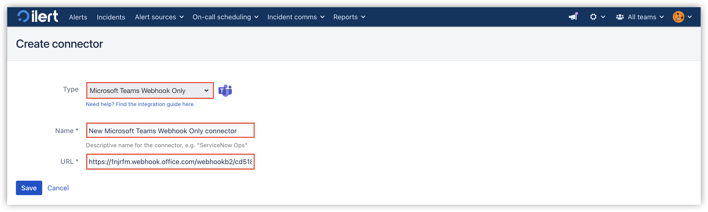
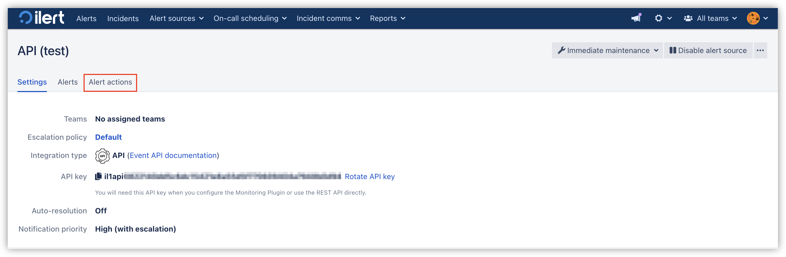
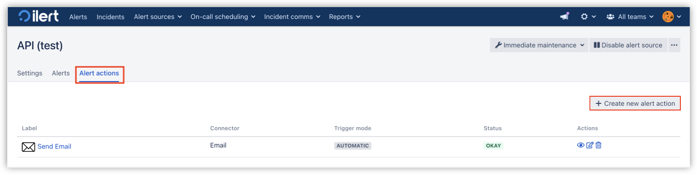
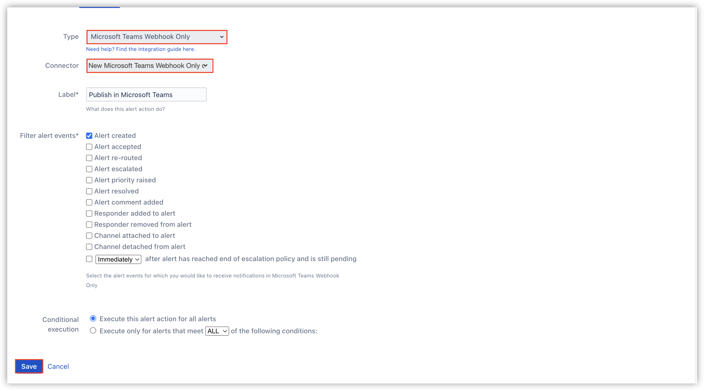
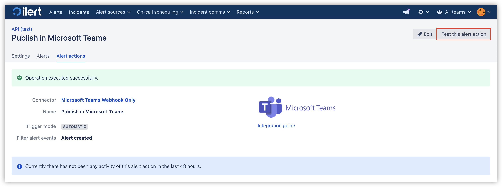

# Microsoft Teams Integration via Incoming Webhook


**Office 365 connectors within Microsoft Teams are deprecated.** Please migrate to Workflow.



If possible we suggest to use [iLert's Microsoft Teams Bot](./) for the setup, this guide and integration is only suggested in case you do not want to grant any permissions to ilert


## In Microsoft Teams: Add an ilert Connector to a channel 


**Admin permission required**

To set up the integration, you must have admin rights in ilert.


1. Select the channel in which you want to publish ilert Alerts and click **...** -> **Connectors**

<figure><figcaption></figcaption></figure>

2. Type webhook in the search field and click **Add**

<figure><figcaption></figcaption></figure>

3. Again click on **Add**

<figure><figcaption></figcaption></figure>

4. Now in **Connectors** click on **Configure**.

<figure><figcaption></figcaption></figure>

5. Type the **connector Name** and click **Create**.

<figure><figcaption></figcaption></figure>

6. Copy the **connector URL** and click **Done**.

<figure><figcaption></figcaption></figure>

7. Your connector has now been set up. You will need the URL from step 4 in ilert.

## In Microsoft Teams: Manage existing Connectors 

1. Select the channel in which you want to publish ilert Alerts and click **...** -> **Connectors**

<figure><figcaption></figcaption></figure>

2. In the **Manage** tab click on **Configured**.

<figure><figcaption></figcaption></figure>

3. Now open up the dropdown list by clicking on **Configured** and click on the **Manage** button of the desired connector.

<figure><figcaption></figcaption></figure>

## In ilert: Create the Microsoft Teams Connector and link it to the alert source 

1. Click the gear icon → **Connectors**

<figure><figcaption></figcaption></figure>

2. Click **Create Connector**
3. Select **Microsoft Teams** as **Type**. Assign a name for the connector, enter the URL from [above](incoming-webhook.md#add-to-channel) and save it.

<figure><figcaption></figcaption></figure>

4. **Go to** the alert sources tab and open the alert source whose alerts you want to publish to Microsoft Teams. Click **Alert Actions → Add New Alert Action**.

<figure><figcaption></figcaption></figure>

5. Select **Microsoft Teams** as the **type**, select the connector created in step 3, and name it.

<figure><figcaption></figcaption></figure>

6. Select the alert filters and conditions for execution as needed and save the alert action.

<figure><figcaption></figcaption></figure>

7. Finished! You can now test the connection by clicking on the button **Test this alert action**. Thereafter, a test message will be posted on the Microsoft Teams channel.

<figure><figcaption></figcaption></figure>

## FAQ 

**Can I link multiple Microsoft Teams Spaces to an ilert account?**

Yes.

**Are updates to an alert published on the Microsoft Teams channel?**

Yes, the following updates to an alert are currently being released:

* **Escalations** : An alert is assigned to another user through an automatic escalation.
* **Manual Assignments** : An alert is manually assigned to someone.
* **Actions** : An alert is accepted or resolved.
