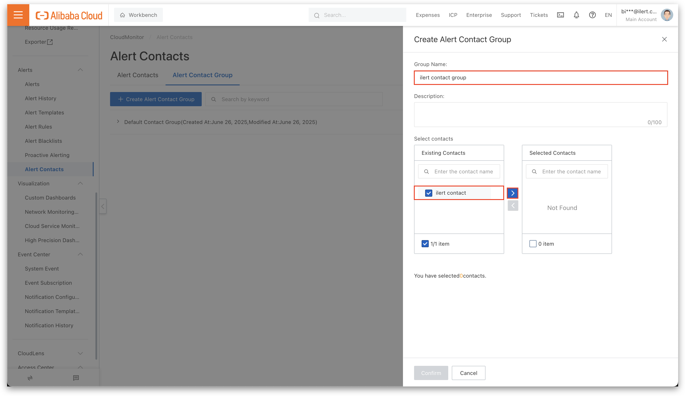

# GitLab deployment pipeline

## Setting up

### Creating your deployment pipeline in ilert

In any way a pipeline is required, which will also generate a new `integrationKey` required to route deployment events when they occur. Head to your ilert account and navigate to **Alert sources -> Deployment events**

<figure><figcaption></figcaption></figure>

Head over to the deployment pipelines tab and click on **Create new pipeline**

<figure><figcaption></figcaption></figure>

Provide a name for your pipeline

<figure><figcaption></figcaption></figure>

**Optional**: And if you are going to manage branch specific deployments, choose the branches in the branch filter section for which you would like to create deployment events in ilert.

<figure><figcaption></figcaption></figure>

**Optional**: If you would like to use a global webhook flow, where you coordinate specific deployment events for different repositories across multiple pipelines, you can use the event filters to fine tune, which specific event types should create deployment events in ilert and drop other ones. (_This is mainly usefull when using multiple GitLab account wide webhooks_)

<figure><figcaption></figcaption></figure>


We generally recommend Release based deployment events, as these are the easiest to setup while providing the most foundated correlations. Note that Push based deployment events can become very spammy, especially when used with Github account wide webhooks.


In any way, by clicking on Create you should end up on the detail view of your GitLab deployment pipeline.

<figure><figcaption></figcaption></figure>

Providing you with a freshly generated `integrationKey` and the copy & pastable **URL** ready for your webhook setup.

### Creating an account wide GitLab webhook for your pipeline

Head to your (or your organizations) GitLab groups settings page **Home -> Groups -> Settings (left sidebar) -> Webhooks -> Add webhook**

<figure><figcaption></figcaption></figure>

<figure><figcaption></figcaption></figure>

Create a new webhook by **pasting the URL** from your freshly created ilert deployment pipeline into the URL field

<figure><figcaption></figcaption></figure>

Scroll down the list and choose whichever suits to your setup of `Push events, Merge request events and Releases events` (_you can also mark all and use the ilert event filter in your pipeline to switch faster in the future_)

<figure><figcaption></figcaption></figure>

<figure><figcaption></figcaption></figure>

<figure><figcaption></figcaption></figure>

When you are done click on "**Add webhook**" for your webhook to be created. You are now all set and should see deployment events coming into your ilert account.
