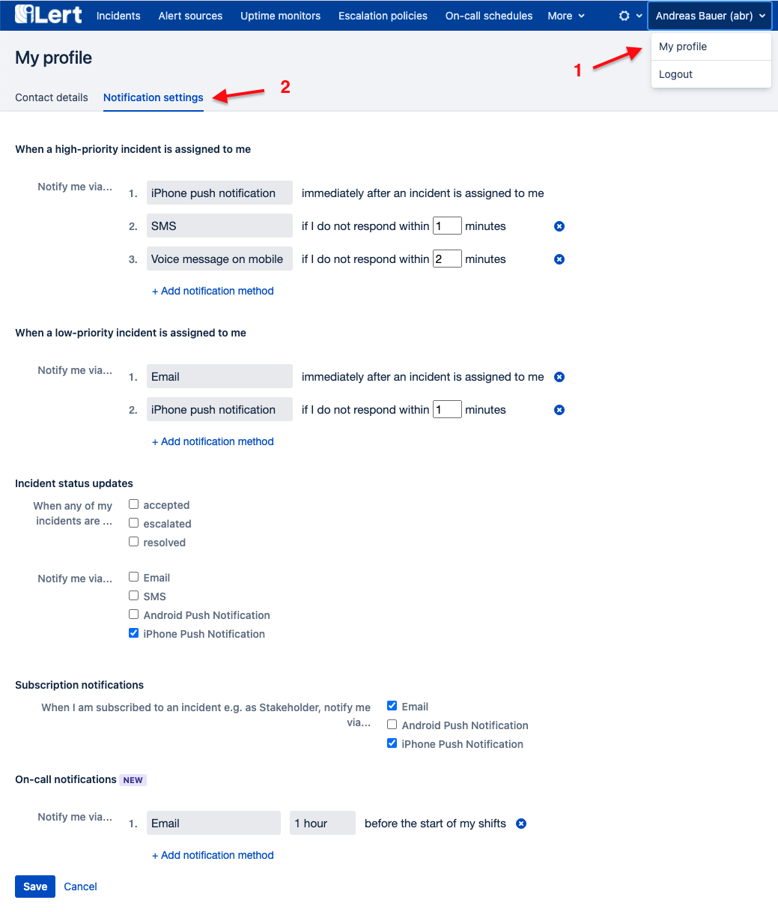

# Introduction to iLert

## What is iLert? 

iLert is a platform for alerting, on-call management and uptime monitoring. It helps teams to reduce response times to critical incidents by extending monitoring tools with reliable alerting, automatic escalations, on-call schedules and other features to support the incident response process, such as [informing stakeholders](stakeholder-engagement.md) or creating tickets in external incident management tools.

## Core concepts 

### Incident

An incident is an issue that requires immediate attention and needs to be resolved. Incidents are reported by an alert source and immediately trigger the notification process using the alert source's escalation policy.

An incident can have the following states:

| Status | Description |
| :--- | :--- |
| `PENDING` | The incident hasn't been acknowledged yet and will escalate until the incident is either acknowledged or resolved. |
| `ACCEPTED` | The user to whom the incident is assigned to is working on resolving the incident and the escalation process is halted. |
| `RESOLVED` | The incident is resolved and no more notifications are sent. A resolved Incident cannot be opened again. |

### Alert source / inbound integration

An alert source represents the connection between your tools \(usually a monitoring system, a ticketing tool, or an application\) and iLert. We often refer to alert sources as **inbound integrations**.

iLert provides the following inbound integration options:

<table>
  <thead>
    <tr>
      <th style="text-align:left"></th>
      <th style="text-align:left"></th>
    </tr>
  </thead>
  <tbody>
    <tr>
      <td style="text-align:left"><a href="../integrations/jira/"><b>Tool integrations</b></a>
      </td>
      <td style="text-align:left">
        

        
These are pre-built integrations by iLert and work-out-of the box with
          your monitoring tools. If you&apos;re missing a tool, feel free to suggest
          an integration that you&apos;d like to see in iLert.

      </td>
    </tr>
    <tr>
      <td style="text-align:left"><a href="../integrations/email/"><b>Email integration</b></a>
      </td>
      <td style="text-align:left">Forward emails to an alert source&apos;s email addres to integrate with
        iLert.</td>
    </tr>
    <tr>
      <td style="text-align:left"><a href="https://api.ilert.com/api-docs/"><b>Event API</b></a>
      </td>
      <td style="text-align:left">Write your own integration using our easy-to-use Event API.</td>
    </tr>
    <tr>
      <td style="text-align:left"><b>SMS integration</b>
      </td>
      <td style="text-align:left">Send alerts to iLert via SMS.</td>
    </tr>
    <tr>
      <td style="text-align:left">&lt;b&gt;&lt;/b&gt;<a href="../uptime-monitors/heartbeat-monitoring/"><b>Hearbeat monitoring</b></a>
      </td>
      <td style="text-align:left">A heartbeat alert source will automatically create an incident if it does
        not receive a heartbeat signal from your app at regular intervals.</td>
    </tr>
  </tbody>
</table>

### Connectors and connections / outbound integrations

Connectors and connections allow you to extend your incident response and communication to other tools. They allow you to either manually or automatically perform actions on incidents, such as

* Create ticket in JIRA
* Post a message in Slack
* Post a webhook to a defined HTTP end point
* Trigger a serverless function in AWS, GCP or Azure

A **connector** is created globally in iLert and usually contains all the information to connect with the target system. A **connection** is created at the alert source level and uses its connector to perform a concrete action. Example: Let's say we want to create an issue in JIRA for every incident in iLert. We need to create ...

* ... a JIRA **connector** that contains the URL of the JIRA server and the credentials to connect to it.
* ... a **connection** at the alert source level that contains information such as whether to trigger the connection manually or automatically for every incident, the JIRA project ID and issue type, and any custom fields that we might want to set in the JIRA issue.

We often refer to connectors as **outbound integrations**.

### Escalation policy

An escalation policy connects an alert source with the users that are responsible for this alert source. It defines which users or on-call schedules should be notified when an incident is created.

### On-call schedule

On-call schedules determine who will be notified when an incident is created based on the time of day. Only one user per schedule can be on-call at a time. You can reference an on-call schedule in an escalation policy.



### Notifications

In iLert, each user defines in his profile how he will be notified of an incident. A user with admin rights can also maintain the notification settings for other users. iLert supports the following notification channels:

* E-mail
* SMS
* Phone calls
* iPhone and Android push notification

Notifications in iLert are bi-directional, that is, you can respond to a notification using the same channel on which you were notified \(without logging into iLert\).

You have the following response options:

1. Acknowledge the incident
2. Mark the incident as resolved
3. Escalation to the next user

You can find a list of caller IDs for sms and phone calls [here](phone-numbers/#sms-alerts).

To set your notification preferences

1. Click on your name on then top right and select **My profile**
2. Go to the **Notification settings** tab
3. Change your notification preferences and click **Save**

