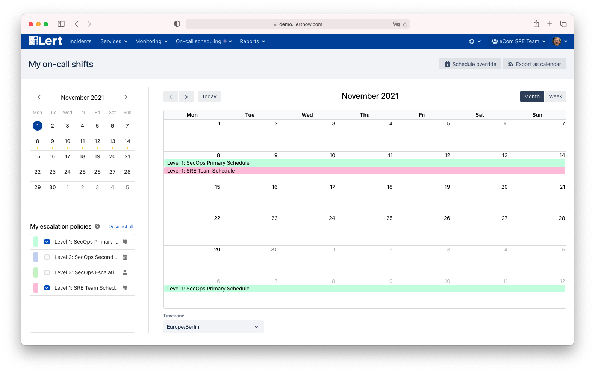
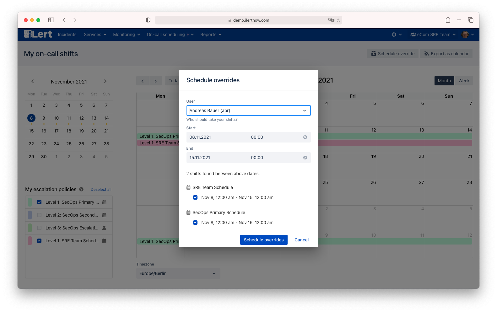
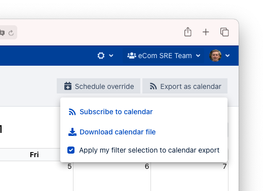

# My on-call shifts

The **My on-call shifts** page allows users to see their shifts across all on-call schedules and escalation policies in a single view. Moreover,  a user can easily create overrides across multiple schedules.

### Definition of "being on-call"

A user is considered to be on-call if he is part of an escalation policy (either directly or indirectly through an on-call schedule). This escalation policy must be used by at least one alert source.&#x20;


Escalation policies that aren't used by any alert source do not affect your on-call status and won't show up in this view.


If a user is on-call by being directly included in the escalation policy, then on-call entries will show up as "always on-call" starting from the date when the escalation policy was last updated until infinity. If a user is on-call by being included through the membership of an on-call schedule, then on-call entries will be shown as shifts from the on-call schedule.

### My on-call shifts page

* **My on-call calendar**: shows the shifts for the selected escalation policy levels. The date picker on the left lets you quickly navigate between months and jump to a specic date. Moreover, it highlights days for which you are on-call with an orange dot.
* **My escalation policies** selector lets you select the escalation levels that you wish to see on-call entries for. Note that escalation policies are only included in the list; if you are a member and they are used by at least one alert source. Your selection preference will be remembered.
* **Timezone** selector **** lets you change the time zone in which you view the on-call entries. By default, the timezone of your user profile is taken.
* **Schedule override** lets you create overrides for multiple schedules at once.&#x20;
* **Export as calendar** lets you embed your on-call shifts in any calendar application.&#x20;

### Scheduling overrides

There are two ways to create overrides:

* by selection the dates in the calendar with your mouse
* by clicking on the **Schedule override** button

A pop up will appear showing you the shifts that will be affected by the override. You may change your end and start date and the affected shifts before finally scheduling any overrides.


* Overrides that are created from the **My on-call shifts** page can only by deleted individually by going to each on-call schedule.
* Overrides only apply for on-call schedules and don't replace you in escalation policies.


### Exporting your on-call shifts as calendar events

You can subscribe to your on-call shifts by copying the calendar subscription link into your calendar app (Google Calendar, Apple Calendar, Outlook, etc.). The calendar subscription will include all your all your current and future on-call shifts.

