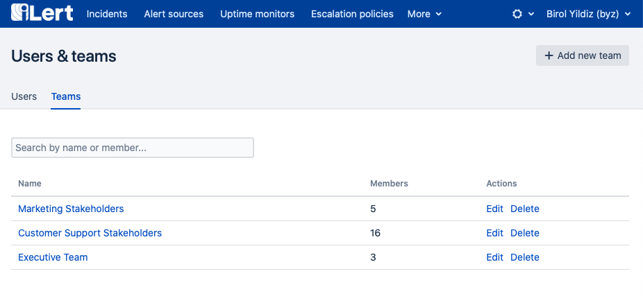
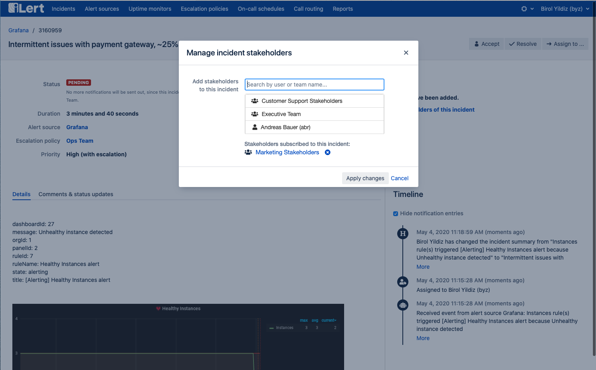
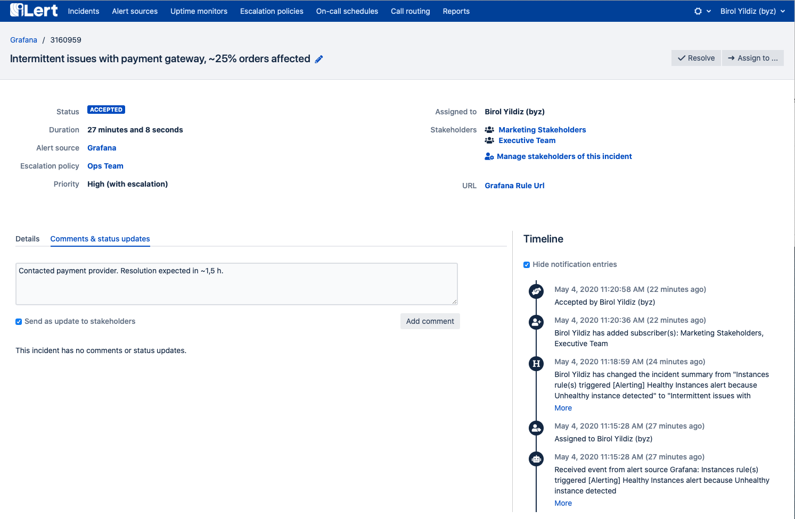
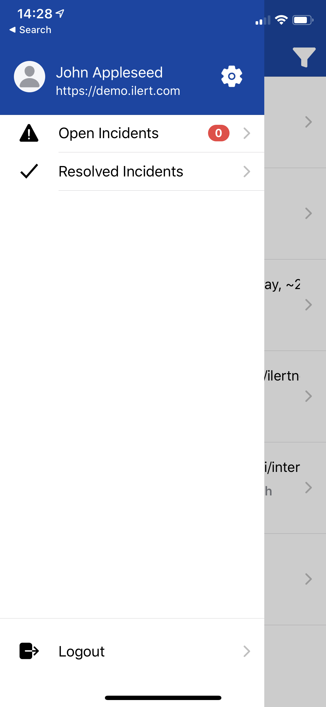
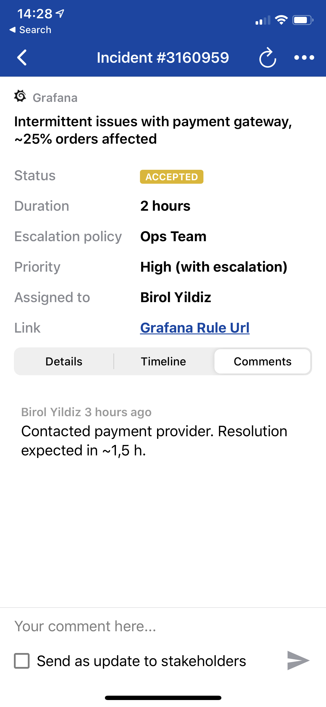

# Stakeholder engagement

## Overview 

With iLert's Stakeholder Engagement feature, you can keep stakeholders informed during an ongoing incident with minimal effort while focusing your time on incident resolution.

Use cases for stakeholders may include

* **Internal stakeholders** within your organization, e.g. executives, the marketing team, customer support team, or 

  other departments 

* **External stakeholders** outside your organization, e.g. if you're an IT service provider and want to keep your 

  customers in the loop about an ongoing incident.

Stakeholders will only be able to see the incidents to which they've subscribed to and won't be able to see any other data, such as other incidents, alert sources, escalation policies, etc.

## Group stakeholders into teams 

We recommend grouping stakeholders into teams. That way, you can subscribe an entire team to an incident instead of adding every user one by one. E.g., you could create teams by department or business service, which also makes it easier for incident responders to decide who to inform about an ongoing incident.

To manage teams, click on the cog icon and go to _Users and teams_. Note that you need to have the admin role to manage teams.

## Subscribe a stakeholder to an incident 

Stakeholders - or any other iLert user - can be subscribed to incident by any incident responder within the web interface or the mobile app.

Before you add a stakeholder to an incident, make sure to change the incident summary text so that stakeholders will be able to understand the impact of the incident. On the incident page, click on _Manage stakeholders of this incident_.

After being added to an incident, stakeholders will immediately receive a notification using their preferred contact methods and will receive additional notifications for any of the following events:

* a status update is posted on the incident with the checkbox _Send as update to stakeholders_ enabled
* when the incident is resolved

## FAQ

### Where do stakeholder set their contact details and notification methods?

Stakeholders can log into our mobile app and change their contact details and methods. Any admin can also change the settings for a stakeholder.

### What data will stakeholders be able to see?

Stakeholders will only see the incidents to which they have been added as stakeholders. They won't be able to see any other incidents and objects, such as alert sources, escalation policies, etc.

Mobile app screenshots when logged in as stakeholder:

### Is there a way to automatically notify stakeholders about ongoing incidents?

No, not yet. Currently, stakeholders have to be manually subscribed to an incident by an incident responder.

