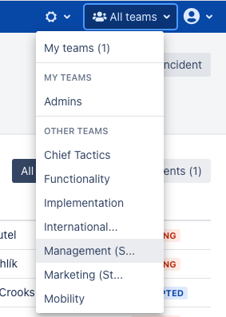
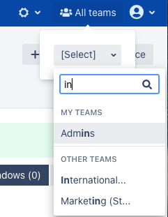
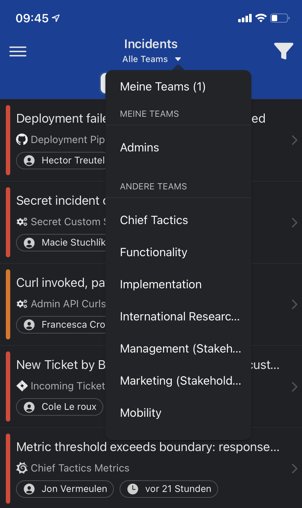
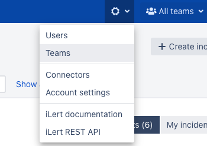
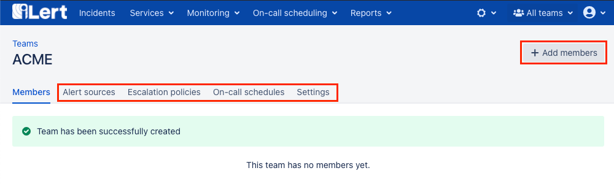
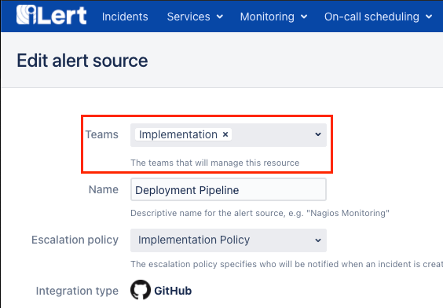
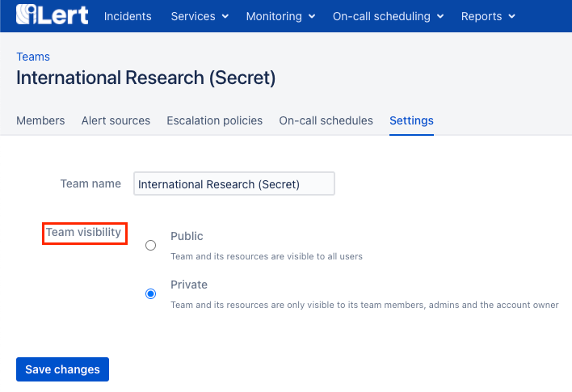
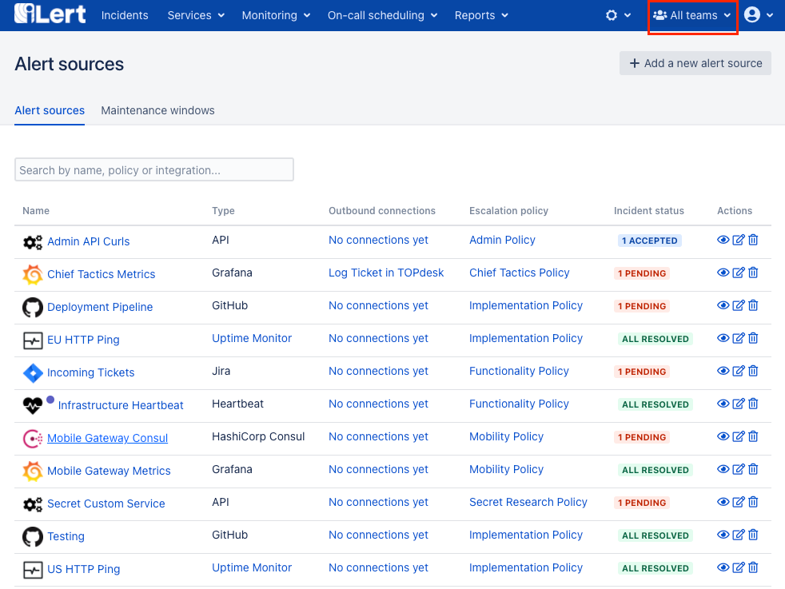
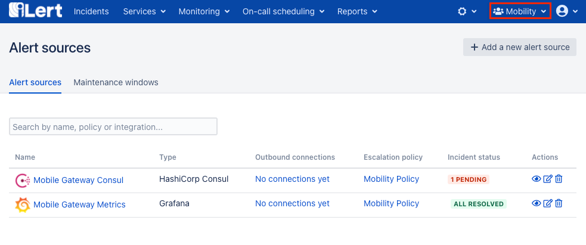

# Team-based organisation

iLerts flexible teams feature allows you to easily manage complex permission scenarios and keep the UI experience for your users and teams simple by only showing the resources owned by the selected team. It enables productivity while managing hundreds of alert sources and users, as well as hundred-thousands of incidents.

## Team Filter

The team filter lets you switch between different team contexs. It gives you the following options depending on the corresponding teams existing in your account.

* **All teams** essentially removes any filter and shows you all objects that you have permission to view, including those that are not associated with any teams
* **My teams** shows you all objects of the teams that you are a member of
* **A specific team:** selecting a specific team will show you all objects that are associated with the selected team

The team filter is located at the top right in the navigation bar:

In case your account requires a large amount of teams, the team filter will automatically collapse and include a search field to quickly navigation between different team views:

The team filter is also available in the mobile app:

The team filter selection is stored for each user and synced across devices - meaning users will always continue where they left off, even when changing from desktop to the mobile app.


**Visibility of the team filter**

The team filter will automatically disappear when the user has no selectable teams available. Pleaes note that the team filter has no effect in the team management UI, as all resources and users in the permission context of the current user may be assigned to the team.


## Creating Teams

Teams can be created by **Admin** users and the account owner. Existing team members may also be managed by users that have been elevated to **Admins** in the team itself \(see [Team Roles](teams.md#team-roles)\).

To create a new team, navigate to the list view using the **Teams** link in the settings navigation menu.

Click on **Add new team**, enter a name for your new team and use the **Create team** button to create it.

You may now add new members or resources to the team.

You may also directly manage the team ownerships of resources in their edit views, for example alert sources:

In case no teams are available for the current user \(with included write permission\) the team selector may not appear in the edit views.

## Private Teams

You may choose to create a private team, which allows you to **restrict visibility** of the team and its associated objects \(including users\) **to the team members**. Note that global admins and the account owner will be able to see the data of a private team, even if they are not a member of the team.

To make a team private, navigate to the team's setting page and chose **Private** under **Team visibility**.


**What happens to objects that are associated with both a private and a public team?**

The private visibility setting of a team takes precedence over its public visibility. That is, if an object is assinged to two teams, one public and one private, the object will be visible to both teams **only** and won't be visible to members of other teams. 

Such objects will be marked with the icognito icon in the list views.


## Team Roles


When working with teams, we recommend to keep all global users that do not require elevated permissions on the **Responder** role and use team roles instead. For example, instead of assigning a user the **User** role as their base role, use the **Responder** role as their base and assign the user the team role **User.**


Team roles extend the permissions of base roles within the context of a team. For example if you have been assigned the **Responder** role as your base role, and have been assigned the **Team User** role within a team, you will be granted the permissions of the User role within that team. 


Note that you cannot be assigned a less permissive team role than your base role in a public team. For example if your base role is **User**, you cannot be assigned the **Team Responder** role within a public team. However, this is not the case for private teams. The team roles in a private take precedence over base roles. E.g. if your base role is **User**, you can be assigned **Team Responder** permissions in a private team.


The following team roles are available:

* Stakeholder
* Team Responder
* Team User
* Team Admin

The permissions of team roles match the permissions of[ global roles](user-roles-and-permissions.md#role-permissions), except that they are limited to the team's context \(meaning resources that this team has ownerships of\).


Global stakeholder users cannot be assigned more permissive roles within a team.


## Resource ownership adjustments

Besides plain resource read and write permissions which are based on [global roles](user-roles-and-permissions.md) and may be overwritten in a team context by the equivalent team roles, as described above in [Team roles](teams.md#team-roles).  
The permission for addition and removal of team ownerships is validated under the following axiom:


Adding or removing an ownership \(_describing the assignment of a resource to a team_\) is only allowed if the operating user is member of the team \(_referred in the ownership_\) with write level team permissions. This accounts to all global user roles, except for admins and account owners. A resource delete operation is in this case equal to a removal of all ownerships.


An example to put this axiom into action:

A user \(with global **User** role\) that is a member of _Team1_ \(with team role **User**\) is not able to delete an alert source that is owned by _Team1_ and Team2. Because he is neither an **Admin** nor a write-level team member of _Team2_. He may only remove the ownership of _Team1_ of which he is a team member and leave the resource ownership solemnly to _Team2_.

## Resource Visibility

An administrator with the All teams filter sees all alert sources in the account.

A user of the Mobility team with active specific team filter only sees the alert sources of his interest.


Resources and users of public teams, are shown to all users with read permissions.



Unassigned resources \(without any owners / teams\) are treated as public resources.


## Incident Visibility

An incident is visible to a user in a team context if

* its alert source is part of the team context or
* its escalation policy is part of the team context or
* if the current user is subscribed to the incident as stakeholder
* it's assigned to the current user directly

This way incidents may still be shared across team contexts or re-assigned by higher level permission users to ensure the most flexible workflow for your users in any scenario.

## Report visibility

The context and permission of teams will automatically adopt onto incident, on-call and even notification reports. Meaning that the selected team filter will have a direct impact on the shown resources in the report, as well as the user permissions on the data accessable in the shared form of the report.


Further restriction of resource permissions to a user will reflect onto shared report urls even after they are created e.g. when hiding an alert source from a user by placing it in a private team without his access, the shared incident report will also hide the incidents from this alert source automatically. 


## FAQ

### When using iLert am I required to configure teams?

No you dont have to. Teams is ment to be an enhancement for larger companies and enterprises to keep their users productive. When no teams are created in your account, the team specific ui elements wont be shown and you may use and share all resources globally across your account by default.

### Why is there no Guest team role?

The Guest user is ment to be without global read permission per default - meaning only the membership of a team will grant him rights to see resources within the context of these teams. Therefore there is no reason to offer a non-read permissioned role on the team level.

### What happens if I turn a private team to public with team roles giving lesser permissions?

The roles giving lesser permission e.g. a global User with a Responder team role will be automatically changed so that the team role reflects the global role in our example this will give the global User the User team role \(a warning will be shown on the settings page beforehand\).

### Is it possible to manage multiple teams that cannot see each other and their resources at all in the same account?

Absolutely. To achieve this, all users should have the global **Responder** role, while being placed in their specific teams with the **User** team role, this way users will always have to assign new resources to their team.Then all teams should be configured to be private, a user or resource should never be in more than one team, this way their context are completely separated. Do not forget to place the **Account owner** in its own private team to hide him from the others and to delete the Default escalation policy.

