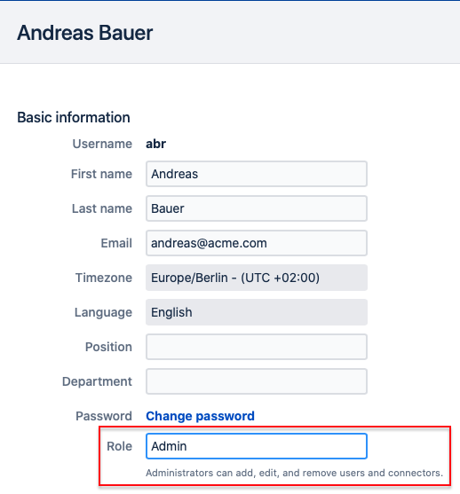

# User roles and permissions

## Available roles

A user in iLert can have one of the following roles:

* Stakeholder
* Responder
* User
* Admin
* Account Owner

### Stakeholder

Stakeholders will only be able to see the incidents to which they have added as a subscriber won't be able to see any other data, such as other incidents, alert sources, escalation policies, etc. Additionally, they can't login to the web application. Instead, they can use the iLert mobile app to get insights into current incidents that they are subscribed to and manage their profile and notification settings. This role is only available as part of our Premium plan

### Responder

Responders can use the web ui and mobile app to manage incidents just like **Users**, however they have no permission to create or modify any objects, such as alert sources, schedules, or escalation policies. Besides taking actions on incidents, Responders can add themselves as overrides to schedules.

### User

Users can create or modify entities like alert sources or on-call schedules, however they cannot create or modify \(or invite\) other users \(of any role\), as well as change account setttings. Users are also not able to create or modify Teams.

### Team Admin

**Users** may not create or modify teams. But an **Admin** may grant a User, as member of a team, the right to modify certain team. A Team Admin is therefore actually not a role in itself, it is an additional permission that may be granted to a **User** on a team basis**.**

### Admin

An Admin is a **User** with elevated priviliges. He may not access or modify the account settings. However he can create and modify **Users** as well as **Teams**, he may also change the role of **Users** and can create and edit connectors**.**

### Account Owner

An account owner has the same privileges as an **Admin**, with the addition of being able to access and modify the account settings as well as subscription and billing settings. Only the account owner himself is able to transfer the Account Owner role to another **User**. There can only be a single account owner per account. 

## Role permissions

The table below gives an overview of the role permissions.

<table>
  <thead>
    <tr>
      <th style="text-align:left"><b>Operation</b>
      </th>
      <th style="text-align:center"><b>Stakeholder</b>
      </th>
      <th style="text-align:center"><b>Responder</b>
      </th>
      <th style="text-align:center"><b>User</b>
      </th>
      <th style="text-align:center"><b>Admin</b>
      </th>
      <th style="text-align:center"><b>Account Owner</b>
      </th>
    </tr>
  </thead>
  <tbody>
    <tr>
      <td style="text-align:left">Access web app</td>
      <td style="text-align:center">&#x274C;</td>
      <td style="text-align:center">&#x2705;</td>
      <td style="text-align:center">&#x2705;</td>
      <td style="text-align:center">&#x2705;</td>
      <td style="text-align:center">&#x2705;</td>
    </tr>
    <tr>
      <td style="text-align:left">Use mobile app</td>
      <td style="text-align:center">&#x2705;</td>
      <td style="text-align:center">&#x2705;</td>
      <td style="text-align:center">&#x2705;</td>
      <td style="text-align:center">&#x2705;</td>
      <td style="text-align:center">&#x2705;</td>
    </tr>
    <tr>
      <td style="text-align:left">Modify profile settings</td>
      <td style="text-align:center">&#x2705;</td>
      <td style="text-align:center">&#x2705;</td>
      <td style="text-align:center">&#x2705;</td>
      <td style="text-align:center">&#x2705;</td>
      <td style="text-align:center">&#x2705;</td>
    </tr>
    <tr>
      <td style="text-align:left">Subscribe to incidents</td>
      <td style="text-align:center">&#x2705;</td>
      <td style="text-align:center">&#x2705;</td>
      <td style="text-align:center">&#x2705;</td>
      <td style="text-align:center">&#x2705;</td>
      <td style="text-align:center">&#x2705;</td>
    </tr>
    <tr>
      <td style="text-align:left">Manage incidents</td>
      <td style="text-align:center">&#x274C;</td>
      <td style="text-align:center">&#x2705;</td>
      <td style="text-align:center">&#x2705;</td>
      <td style="text-align:center">&#x2705;</td>
      <td style="text-align:center">&#x2705;</td>
    </tr>
    <tr>
      <td style="text-align:left">View objects, e.g. schedules and escalation policies</td>
      <td style="text-align:center">&#x274C;</td>
      <td style="text-align:center">&#x2705;</td>
      <td style="text-align:center">&#x2705;</td>
      <td style="text-align:center">&#x2705;</td>
      <td style="text-align:center">&#x2705;</td>
    </tr>
    <tr>
      <td style="text-align:left">Add him/herself as override to a schedule</td>
      <td style="text-align:center">&#x274C;</td>
      <td style="text-align:center">&#x2705;</td>
      <td style="text-align:center">&#x2705;</td>
      <td style="text-align:center">&#x2705;</td>
      <td style="text-align:center">&#x2705;</td>
    </tr>
    <tr>
      <td style="text-align:left">Add (anyone) as overrides to schedules</td>
      <td style="text-align:center">&#x274C;</td>
      <td style="text-align:center">&#x274C;</td>
      <td style="text-align:center">&#x2705;</td>
      <td style="text-align:center">&#x2705;</td>
      <td style="text-align:center">&#x2705;</td>
    </tr>
    <tr>
      <td style="text-align:left">Modify objects, e.g. schedules and escalation policies</td>
      <td style="text-align:center">&#x274C;</td>
      <td style="text-align:center">&#x274C;</td>
      <td style="text-align:center">&#x2705;</td>
      <td style="text-align:center">&#x2705;</td>
      <td style="text-align:center">&#x2705;</td>
    </tr>
    <tr>
      <td style="text-align:left">Manage teams</td>
      <td style="text-align:center">&#x274C;</td>
      <td style="text-align:center">&#x274C;</td>
      <td style="text-align:center">&#x274C;</td>
      <td style="text-align:center">&#x2705;</td>
      <td style="text-align:center">&#x2705;</td>
    </tr>
    <tr>
      <td style="text-align:left">Manage users</td>
      <td style="text-align:center">&#x274C;</td>
      <td style="text-align:center">&#x274C;</td>
      <td style="text-align:center">&#x274C;</td>
      <td style="text-align:center">&#x2705;</td>
      <td style="text-align:center">&#x2705;</td>
    </tr>
    <tr>
      <td style="text-align:left">
        
Manage account

        
settings and subscription

      </td>
      <td style="text-align:center">&#x274C;</td>
      <td style="text-align:center">&#x274C;</td>
      <td style="text-align:center">&#x274C;</td>
      <td style="text-align:center">&#x274C;</td>
      <td style="text-align:center">&#x2705;</td>
    </tr>
  </tbody>
</table>

## Change a user's role


This requires admin or account owner privileges


To change a user's role

1. Click on the cog-icon in the navigation bar and select **Users & teams**
2. Click the **Edit** link for the user you would like to change.
3. In the **Basic information** section, select the user's role from the dropdown menu


If you need help with the roles or are looking for different permission [feel free to get in touch](../contact.md)


