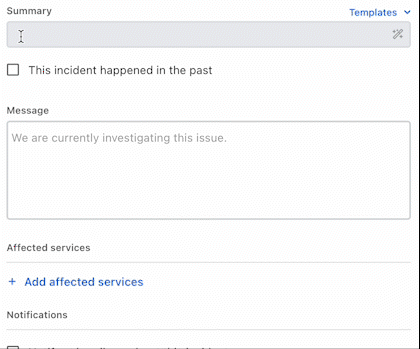
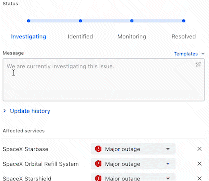

# Using ilert AI for efficient incident communication

In the heat of incident response, it's essential to keep your focus on resolving the issue at hand. Sometimes, drafting a comprehensive and accurate incident communication can be challenging, especially under stress. That's where ilert's AI-assisted incident communication comes into play.

### What does ilert's AI-assisted incident communication do?

ilert's AI-assisted incident communication feature is designed to help you generate incident communications swiftly and accurately. It streamlines the process of documenting incident summaries and details, so you can concentrate your efforts on resolving the issue causing the incident. ilert AI also intelligently guesses which services along with their impact level should be included in incident.&#x20;

### How to use ilert AI for new incidents?

Whenever you're creating a new incident or updating an existing one, provide a very short summary of what you want to communicate in the summary or message field and click on the :magic\_wand: icon on the right of the input field.

<figure><figcaption></figcaption></figure>

Based on the summary (e.g. "spacex services unavailable"), ilert AI will generate the incident summary and message and also predict and include relevant services in the incident.&#x20;

### How to use ilert AI for incident updates?

In the midst of incident resolution, providing regular updates can be a complex task, especially when the pressure is high. That's where ilert's AI feature steps in to assist you.

Just as it aids in generating new incident reports, ilert AI can also efficiently produce updates for ongoing incidents. Whether you're deeply engaged in incident management or merely aiming for a swift closure, ilert AI is there to ensure proper communication with all impacted services.

<figure><figcaption></figcaption></figure>

### What kind of data is shared?

For new incidents

* Service **names** for a small selection of services that ilert AI chooses based on the relation to the prompt or the context of the user entering the prompt e.g. services owned by related teams. No other service data is shared.
* The provided **summary** is included in the prompt.

For incident updates

* Service names of all the services the current. Services names that are not part of the ongoing incident are not shared.&#x20;
* The current status of the incident.
* The entered message content is used as prompt.&#x20;

### What model is used?

We're experimenting with a variety of large language models, including open source ones. Any of the following models may be used:&#x20;

<table><thead><tr><th>Model</th><th width="120.66666666666669">Provider</th><th width="160" data-type="checkbox">Available for this use case</th><th>Info</th></tr></thead><tbody><tr><td>il-LLaMA-1</td><td>ilert</td><td>true</td><td>ALPHA</td></tr><tr><td>il-ludwig-rnn-2</td><td>ilert</td><td>false</td><td></td></tr><tr><td>gpt-4</td><td>OpenAI</td><td>true</td><td>BETA</td></tr><tr><td>gpt-3.5-turbo</td><td>OpenAI</td><td>true</td><td>default</td></tr><tr><td>text-davinci-003</td><td>OpenAI</td><td>true</td><td>deprecated</td></tr></tbody></table>

