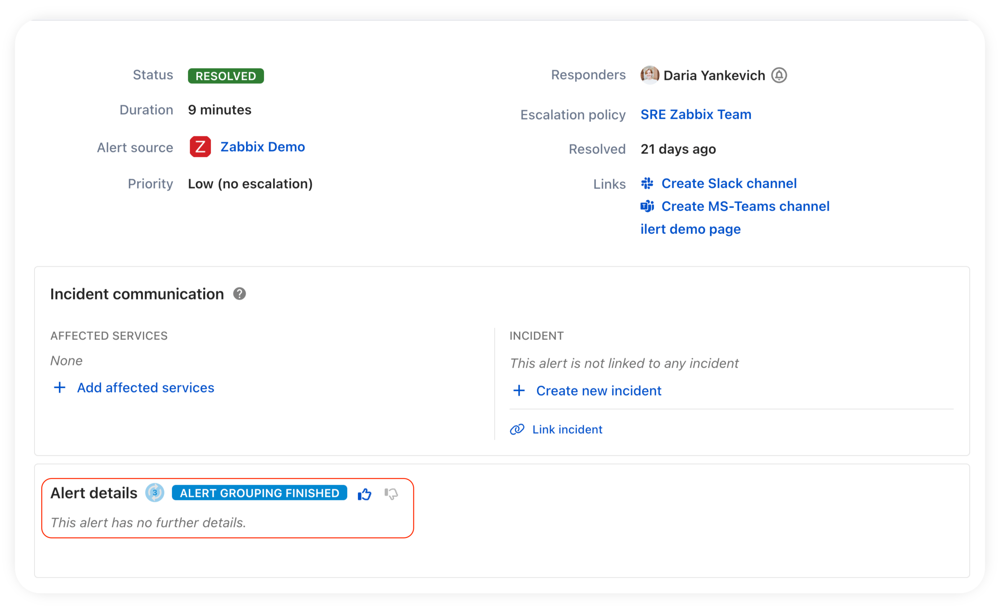

# Using ilert AI for alert grouping

Besides window based grouping and action-window based grouping we have introduced event content similiarity grouping using ilert AI for alert sources in 2024. With a few clicks users can setup and fine tune their similarity grouping for each alert source.


ilert AI for alert grouping **does not share data** with any third-parties in its AI processing, all models (and vector databases) that are used as part of the pipeline are (trained), maintained and hosted on ilert's servers.


To get started head to your alert source's edit view and look in the **Advanced settings** section for the grouping options. Choose **Group by content similarity**.

<figure><figcaption></figcaption></figure>

Content similarity grouping comes with two options that can be adjusted to fine tune the grouping behaviour. You can come back and adjust these at any time.

### Grouping window

You may choose a larger value here if you are confident in your **Similarity threshold** setting or your monitoring tool events might occur over a larger timespan. In case you are still getting comfortable with your treshold it makes sense to leave the window small to prevent you from missing on alerts. If your main goal is to prevent flooding 5-10 minutes should suffice. If you want precisive stitching a 12-24 hour window might suit best.

### Similarity threshold

A value between **0.1 <-->0.995** where a value close to **1** describes almost identical alerts (**less grouping**) and a value closer to **0** describes less identical (_0 = completely different_) alerts (**more grouping**). You can fine tune to as low as **0.005** steps.

Clicking on the **set threshold** option will open a modal that runs an on demand clustering algorithm on up to 1000 alerts in the last 60 days that this alert source has received, everytime you adjust the slider for threshold value.

<figure><figcaption></figcaption></figure>

A grouping preview will show you the sharpness of the selected threshold based on your live alerts that the alert source has processed in the described window.

<figure><figcaption></figcaption></figure>


Remember you need to have send a few alerts to the alert source to see any grouping preview results (the set threshold option is not available during the creation wizard)


### Fine tuning the threshold value

As described, a higher threshold will result in more precise grouping based on the content of the alerts, shown in our sample above as no alert is grouped at all above. If we lower the threshold to 0.695 we see alerts being grouped.

<figure><figcaption></figcaption></figure>

Lowering the threshold further our group continues to form over all desired alert contents:

<figure><figcaption></figcaption></figure>

Seeing this it seems that for our sample use case might have a perfect threshold at around 0.53 <--> 0.63. If we continue to reduce our threshold we can see that our grouping becomes too generic:

<figure><figcaption></figcaption></figure>

As all alerts are suddenly grouped in a single group.


Note that this is a sample case with demo content, in the wild monitoring tool specific payloads have large contents filled with technical language that will behave differently for each use case, so fine tuning as shown above will be required to reach your desired behaviour.


### Alert grouping metrics

<figure><figcaption></figcaption></figure>

As soon as you enable alert grouping, new metrics will appear in the **Alert source settings**. You can adjust a timeframe to see how effective the feature is for the alert source for a specified period. The following metrics are available:

* **Reduced alert volume.** The percentage by which the total number of alerts decreases after grouping similar alerts.&#x20;
* **Grouping precision.** The percentage of correctly grouped related alerts based on feedback from responders in the alert detail view.&#x20;
* **Improved response time.** The reduction in time to resolve alerts after using alert grouping, assuming each grouped alert saves 30 seconds.

You can leave feedback for every group of alerts. To do so, click the alert and find 👍 and 👎 icons in the **Alert details** section.

<figure><figcaption></figcaption></figure>

### Video Tutorial: How to enable Intelligent alert grouping


