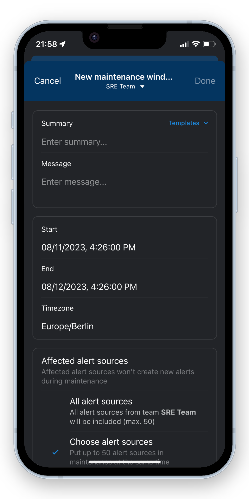

# ilert Release Notes


These notes get usually updated retrospectively within the first 2 weeks of the following month


## December 2023

### New features and improvements

* The **notification aggregation** and suppression has been **reworked**, each notification channel now supports a unique suppression style e.g. voice calls now 3 per 3 minutes per alert source or push notifications now up to 20 per minute as long as their content is unique (_find out more in Alerting -> Understanding event flows -> Notification aggregation_)
* AI assisted **postmortems** is now in **open beta**, enable ilert AI in the account owner's account settings and visit an incident to try it out
* Status pages now support themes: feel free to switch to our new **status page dark theme** if it fits your branding
* The repeating schedules API has been stabilised for Terraform use cases
* We have launched **ilert wrapped 2023** (check out your responder year recap, it will be available until 12.01.24)

## November 2023

### New features and improvements

* We have introduced a new feature for SSO SAML users to prevent auto-provisioning on the SdP side for certain users called: **provisioning required attribute**
* The integrations API has been reworked to support a better catalogue experience and more information in the app's wizards
* We have improved the unverified contact log entries in the alert timeline to properly identify which contact was not verified
* We have added **dynamic priority templates to alert sources**, using these you can extract payload fields from your events and map them to the priority of your alerts
* We have added **dynamic links templates to alert sources**, using these you can extract links directly from the event payload of your alerts
* We have added a faster way to login to the ilert **mobile app using QR codes** (you can find the link in the push token area of your notification preferences in the web app)
* Over the lifetime of a recurring on-call schedule it can accumulate a large sum of ended layers, that can reduce performance, we have introduced a new **layer archiving** feature that automatically archives older ended layers, keeping the schedule fast.

### Status page updates

* We have added a **localized public status page subscription** experience for German status page visitors
* We have added a new **layout option for status page structures: responsive columns** this works especially well when displaying a large amount of services on your status page or when you want to render your status page horizontally
* The **status page opt-in and opt-out pages** are no longer landing pages on the global webapp (app.ilert.com) but instead are **hosting on your status page directly**, allowing for less of break of CI for your customers
* In addition to the new status page responsive layout, you may now decide if a group should open by default, as well as defining to display the SLA graph or not unrelated to the service's SLA history setting
* We have also added countless improvements to the rendering experience of status pages e.g. font or colors

### New and updated integrations

* New inbound integration: **Tulip**
* New inbound integration: **Graylog**
* New inbound integration: **Catchpoint**
* New inbound integration: **Loki**
* New inbound integration: **Mimir**
* New inbound integration: **Cortex**
* We have **improved the Datadog** inbound integration to support different event type flavors e.g. downtimes
* **MS Teams, Autotask and ServiceNow** alert actions can now be more easily managed through the API

## October 2023

### New features and improvemens

* **Support hours** have been moved out of alert sources into their **own entity**, you can now share a support hour across multiple sources and use team ownerships to controll access
* We have added a new **Mute notifications** feature in web and mobile app, responders can now mute their notifications for specified or customized time periods
* The **AI assisted incident postmortems** feature has reached closed BETA, reach out if you are interested in using before its GA
* We have introduced a feature that autmatically archives historical layers of large repeating on-call schedules, to keep performance steady no matter the use-case
* Integration icon and logo generation has been reworked for web and mobile to improve performance of the UI
* **Reworked SMS notifications** to allow for a better focus on alert summary content
* Alerts in state ACCEPTED may now be accepted by responders that are not yet added to the responder list of the alert

### New and updated integrations

* Auvik alert creation has been improved (new fields)
* The Grafana inbound integration now supports custom priority mapping based on label values

### ChatOps

* The Microsoft Teams bot now supports a new who is on call command (**@iLert oncall**) that can be customized for teams and channels using a Microsoft Teams alert source
* The Microsoft Teams Activity Feed display information for the bot's cards has been improved

### Terraform

* New alert action filter types have been added
* Alert source templates (text form) are now available in Terraform
* delayMin field for escalation policies
* New alert source time based grouping options are now available in Terraform

## September 2023

### New features and improvements

* The schedule detail view calendar mode now creates shareable URLs that include your calender configuration
* Static schedules received multiple improvements for QoL and a new default shift start setting that is remembered for your user profile
* Call routing speech detection has been improved for certain scenarios where the input was not properly detected
* The alert comment (messages) UI has been reworked
* Alerts can now be manually linked to incidents (and also unlinked from them)
* Last activity in (admin's) user list is updated more frequently for web UI activity
* Status page enduser facing email communication now resolves the status page name as friendly email from address
* We have relaxed the view permission checks for Maintenance Windows a little (Note: edit permissions stay the same) it is no longer required to have a permission to access every single related alert source and service, but now sufficient to have access to a single one of those related entities
* You can now provide custom time ranges for overrides in my-oncalls, giving you more flexibility if you want to override partial shifts
* The subscription button on private status pages now adjusts its state asynchronously depending on the current viewer
* We have added an additional step to prevent accidental deletion of resource like alert sources
*   Alerts with linked incidents are now marked with a :fire: icon

    <figure><figcaption></figcaption></figure>

#### Manual alert escalation

You no longer need to lookup who's next in the escalation chain. You can now manually escalate alerts to an escalation level of your choice. The escalation process will resume from the selected level.

<figure><figcaption></figcaption></figure>

#### Support for partial overrides on the My on-call shifts page

Ever wanted to take someone else's on-call, but not their entire week long shift, but only for a day? Now you can do this from the **My on-call shifts** (both in the web and mobile app) page when taking someone else's on-call and overriding your shifts. Until now, this was possible only on the on-call schedule itself.&#x20;

<figure><figcaption></figcaption></figure>

### Alert actions first party BETA

This has been in the making for a while: we have completely overhauled our alert actions and connector UIs and APIs, giving tons of new QoL features like multi alert source assignments or team management to alert actions. We have launched the closed **BETA** and would love to hear your feeback on it - so if you are interested in trying it out just **reach out via email or live chat**.

<figure><figcaption></figcaption></figure>

### New and updated integrations

* A new inbound integration has been added for Particle
* The Grafana inbound integration now supports the cluster alert label to build alert summaries by default

### Chatops

* The ilert Slack bot now supports a new [**who is on call**](chatops/slack/lookup-who-is-on-call.md) command ( /ilert oncall )
* Create dedicated channels in Microsoft Teams to communicate alert updates
* New /il-alert command to create alerts from within Slack - you can customize this feature for your team and Slack channels using a Slack alert source
* The Slack bot now supports further alert based interactions such as raise, reroute, escalate etc.

## August 2023

### New features

* You may now choose your primary phone number, if you are using multiple contacts. The primary phone number will be preferred when making call routing agent calls or showing your number to other users in on-call requests
* You can now choose a specific timed window to group your alerts in your alert source e.g. group all incoming events for 5 minutes, until creating the next alert
* The alert source creation process has ben overhauled, there is a now a wizard that guides through the most important steps of the setup

### New and updates integrations

* New inbound integration Twilio Errors
* New inbound integration Uptime Kuma
* We have overhauled and enhanced our Github inbound integration, you may now choose specific alert action types and event types for which to create or resolve alerts, we also do support **Github Advanced Security** type webhook events now
* Grafana v9 Links have been optimized, instead of showing general instance links we prefer to show specific dashboard links now
* It is now possible to turn an alert source bidirectional even though it was already created
* You can now choosen to enhance Autotask inbound alerts with company details, by enabling the specific setting for your Autotask alert source in ilert
* You may now choose if you want to receive full text alert details or short forms in Microsoft Team channel notifications, by adjusting the **longDetails** field in your MS Teams connector

### Chatops

* Create dedicated channels in Microsoft Teams to communicate alert updates
* Added new create alert feature to Microsoft Teams bot (note: you may optionally customize the behaviour using ilert [Microsoft Team alert sources](chatops/slack/create-alerts-in-slack.md#overview))
* It is now possible to re-authorize your Microsoft Teams bot without removing your existing alert actions

## July 2023

### New features

* Added a new text mode for alert source templates, you can use the top right icon in the input area to switch between text and block mode when creating alert templates
* API key analytics are now available showing live API key resource usage for every user (Navi -> Profile -> Manage API keys) this feature also ships with an API resource for ADMINs to fetch account wide API usage information see [https://api.ilert.com/api-docs/#tag/Reports/paths/\~1reports\~1api-keys\~1usage/get](https://api.ilert.com/api-docs/#tag/Reports/paths/\~1reports\~1api-keys\~1usage/get)

### Mobile app

*   [Maintenance windows](alerting/maintenance-windows.md) are now also available in the mobile app\

    <figure><figcaption></figcaption></figure>
* The alert creation view has been reworked to match the features of the web UI

## June 2023

### New features

* Migrated the platform to a new infrastructure, improving performance, scalability and availability
* New session management, allowing for more secure and longer running sessions
* Added remember me option for even longer running web sessions
* 2-FA codes are now supported by the mobile app's login
* We launched [ilert AI](broken-reference), which adds advanced generative artificial intelligence features for responders along the incident management lifecycle

### New and updated integrations

* Updated Slack bot
* Added new create alert feature to Slack bot (note: you may optionally customize the behaviour using ilert [Slack alert sources](chatops/slack/create-alerts-in-slack.md))

## May 2023

### New features

* New navbar widget for user onboarding and product updates
* Improved performance of schedule UIs

### New and updated integrations

* Google Cloud Security Command Center inbound integration

## April 2023

### New features

* Brand new alert source list and edit UI
* Brand new call routing number list UI
* Brand new maintenance window list UI
* User list CSV export

### New and updated integrations

* Improved the Sentry inbound integration
* New status field for Autotask outbound integration
* Improved Autotask outbound company search, now dynamically fetching based on search input
* Upgraded Jira outbound integration to dynamically detect Jira Cloud, Jira Server and other Jira versions and switch the API automatically so that old and new installations are seemlessly supported

## March 2023

### New features

* We have launched a new feature for notification preferences: **live test notification** status
* We have added additional states to our alert notification timeline events, that now allow you to (live) **track the status of outbound alert notifications** and see if they have been delivered to or (e.g. Whatsapp) read be the responder, they work seemlessly for all notification channels
* We have launched an overhowl of our escalation policy list and detail views
* We added additional details to delete dialogs across the platform
* We have introduced the new ilert Free billing plan
* The user list search has been improved
* Alert email notifications links now come with an additional confirmation step

### New and updated integrations

* New Checkly inbound integration
* Optimized Appdynamics inbound integration

## February 2023

### New features

* Generic alert summary, details and routingKey templating with our **new template editor for alert sources**.
* **We have launched a complete re-work of our Notification Preferences feature**
* shiftColor is now supported in API
* Public status pages may now receive unlimited subscriber imports in state INACTIVE, during activation a license with a fitting range of subscriptions is needed however.
* We have enhanced the information in our /api/integrations resource

### New and updated integrations

* Cisco Meraki has been added as new inbound integration
* We have optimized our PRTG inbound integration

## January 2023

#### New features

* You may now backfill incidents via the API
* New on-call widget in mobile apps for iOS and Android
* Improved maintenance window creation
* Improved 2FA login experience

#### New and updated integrations

* Further improvements to the ServiceNOW bidirectional integration
* Status page service groups structure and metrics for [Terraform](https://registry.terraform.io/providers/iLert/ilert/latest)
* Improved version of the [ilert browser extension](https://github.com/iLert/ilert-chrome)

## December 2022

#### New features

* Metric data source credentials are now validated during creation
* Status pages now support service groups
* Dozens of new schedule override features that make it easier and faster to add overrides on the fly
* Reworked My-on-calls features to take and pass on-call shifts
* New end-of-escalation reached events for alert actions
* Status page SMS and Webhook subscriptions

#### New and updated integration

* checkmk alert detail parsing has been improved
* checkmk now supports custom detail labels

## November 2022

#### New features

* We have updated our platform to our new logo and CI
* automation rules (alert -> incident) have been integrated into alert actions and may now be manually triggered or configured with conditional execution
* Status pages will now automatically collapse large amounts of services, SLA data and uptime graph are fetched on demand by opening collapsed services

#### New and updated integrations

* Prometheus metrics data source
* new relic now supports the new [workflow](integrations/new-relic/new-relic-workflow.md) events
* Prometheus inbound integration now supports the custom url and urlLabel labels (added as links to alert)
* Microsoft SCOM inbound [integration](integrations/ms-scom.md)
* Twilio Alarms inbound [integration](integrations/twilio-alarms.md)

## October 2022

#### New features

* New major milestone: **metrics** for status pages

#### New and updated integrations

* PandoraFMS [inbound](integrations/pandorafms.md) integration
* HashiCorp Cloud (HCP) Consul support
* Terraform client now supports mulitple responders in escalation policies
* Datadog metrics data source

#### Other

* ilert **Backstage** plugin has been updated to support mulitple responders, services and status pages

## September 2022

#### New Features

* An initial delay can be configured for escalation policies
* Private status pages now support IP whitelists
* Service uptime history can now be managed and overwritten

#### Improvements

* Alert submit UI supports additional fields to overwrite: priority, policy or responders
* Added MFA reset for Admin users

#### New and updated integrations

* Jira alert sources now support Service Desk Events
* Grafana alert sources now support Grafana V9 events

## August 2022

**New features**

* This feature has been long-awaited by many customers: we have added support for **Multiple Responders**
* \=> Escalation policy rules now support multiple users and schedules
* \=> During the escalation of an alert all responders will be added to the alert
* \=> A user may request additional help of another responder on any open alert
* We have added a new messenger for alert notifications: **Telegram**, users may connect their ilert account to their Telegram app and respond to alerts on their favorite messenger
* We have added live updates to our alert list view
* Status pages of a team can now be managed in the team admin view

**Improvements**

* We have completely reworked the alert list view, users will now see additional information and improvements such as responders and their individual alert status, escalation policy filter, **aggregation status of events for a specific alert**, bulk resolve comments, highly reduced load and response times, deep links for filter configurations
* We have completely reworked the user list view, admins have now access to new tools and filters that should help them with their day to day tasks: filter for roles, mfa status and team membership, pagination, highly reduced load and response times, deep links for filter configurations
* Increased status page service limit from 30 to 100
* Doubled the API rate limits for Terraform clients
* Improved response time of team edit view

**New and updated integrations**

* Increased amount of fetched companies for Autotask connectors to 1000 and added a search view to the selection

**Other**

* Alert reports are now available in the professional plan, on-call reports stay a premium only feature

## July 2022

### New features

* Maintenance windows now support services and appear on related status pages
* Maintenance window now offer different types of notifications along their lifecycle when affecting services or status pages with private or public subscribers
* ilert will now inform the owner of incidents (via email) that are publicly visible on status pages in case they have been pinned there for longer than 4 hours
* Alert actions may now be cloned to other alert sources
* We now support conditional execution for alert actions making it possible to filter and tune alert streams to webhooks or tools like Microsoft Teams and Slack

### Mobile apps

* Now support incident list and detail views
* Now support status pages and services
* We have reworked the navigation as well as the stakeholder user experience
* We have improved the performance for customers with a large amount of teams and users

### Improvements

* we have introduced a new region field for users and adjusted all calendar and date/time relevant components to deliver a seemless localized experience

### New and updated integrations

* Our Zabbix native integration now supports [severity mapping](integrations/zabbix/native.md#faq) and [bidirectional problem/alert acknowledgement](integrations/zabbix/native.md#faq-1)

## June 2022

### New features

* The s[ervice outage edit API ](https://api.ilert.com/api-docs/#tag/Service-Outages)is now available
* All public facing incident communications emails now support beautifully crafted html email versions
* We have introduced a new feature for private status pages to make them available to any user within an organization even if the entity itself is owned by a private team or hidden from stakeholders "Account Wide View"
* we have launched a [public roadmap](https://roadmap.ilert.com/roadmap)
* we have launched a completely new onboarding experience for new accounts
* added a new subscription API endpoint for status pages to add or remove a single subscriber

### Improvements

* the MFA status is now visible in the user list
* browser caching of certain script and style resources has been optimized for faster page load

### New and updated integrations

* [Samsara Inbound integration](integrations/samsara.md) has been added

## May 2022

### New features

* Conditional alert actions; you may now add additional filters to alert actions
* Alert action duplication, you may now easily copy and paste an alert action to other alert sources
* Call routing numbers may now use uploaded audio files to playback greeting, waiting and mailbox messages
* New endpoints have been added to the API to support add and remove operations for single user/team private subscribers

### Improvements

* Overall page load times have been reduced for the web-ui, especially for accounts with large user and team bases

### New and updated integrations

* Sentry inbound integration has been improved to support alert metric events
* Autotask inbound integration has been improved to support new webUrl attribute for ticket link generation
* SignalFX inbound integration has been improved to support better alert detail extraction

## April 2022

### New features

* [Status pages](incident-comms-and-status-pages/status-pages.md) and [Incident com 2.0](broken-reference/) are now in GA
* New [alert creation API](https://api.ilert.com/api-docs/#tag/Alerts/paths/\~1alerts/post) e.g. possible to target specific user
* [2FA and MFA ](user-administration/two-factor-authentication-mfa.md)are now available for every ilert user
* Call routing is now available in Italian

### New and updated integrations

* Hyperping Integration
* Paoloalto Networks Prisma Cloud Integration

## March 2022

### New features

* We have launched private and public status pages in closed BETA.
* We have launched [dynamic alert actions](rest-api/application-hooks/dynamic-alert-actions.md) (application hooks) in closed BETA.

### Improvements

* User shift color (profile settings) is now used in all schedule visualisations
* Status page editors now receive update notifications when the domain status of their page changes

### New and updated integrations

* IXON alert source now supports dynamic routing

## February 2022

### New features

* We have launched the [ilert developer platform](rest-api/developing-ilert-apps/), which enables you to create your own applications on top of ilert's uptime platform and share them with other ilert users.
* [Incident Communications](broken-reference/) 2.0 is now in public BETA for all Premium users.
* Support for WhatsApp as a notification channel

### Improvements

* Event API: routingKey may now be used to re-assign alerts during ALERT events
* Alerts API: escalationPolicy attribute is now included in the response payload
* Services of teams can now be managed in the teams admin UI

### New and updated integrations

* Our ServiceNow bidirectional integration now supports dynamic mapping of assignmentGroups and escalation policies (as well as re-assignment)

## January 2022

### New features

* we have launched our Incident Communications 2.0 BETA, [reach out to us](contact.md) to join during the testing phase
* On-call schedules: we now allow you to create more complex recurring schedules with [schedule layers](on-call-management-and-escalations/on-call-schedules/recurring-schedules.md#schedule-layers).
* New alert view: as part of our new Incident Comms 2.0 feature, a brand new revamp of our Alert Detail View has been launched, including live updates for Alerts and Alert related information.
* as part of our Incident Com 2 Feature, Stakeholder users may now use the web login (they were previously limitted to the Mobile App only)

### Improvements

* the `GET /api/log-entries` [resource](ilert-release-notes.md#undefined) now supports `?include=vars` and `?filter-types=ALERT_UPDATES` parameters, as well as pagination for more advanced and detailed alert timeline access
* Microsoft Teams Alert Actions have been rebuild to support a direct Teams query for enterprise customers with > 10k Teams.
* the (Support) Live Chat has been made available to EU customers (see Account Settings

## December 2021

### New and updated integrations

* Oh Dear [Inbound](integrations/ohdear.md)
* Gitlab Inbound [Integration](integrations/gitlab.md)

## November 2021

### New features

* users may now choose their personal shift color that is rendered in schedules

### New and updated integrations

* Humio Inbound
* Apifortress Inbound
* Freshdesk Inbound
* AppSignal Inbound
* Lightstep Inbound
* IBM Cloud Functions Inbound
* Crowdstrike Inbound

### Improvements

* critical alert push notifications are no longer triggered for update notification types
* update type notifications are now fanned out to all registered push token devices
* call routing numbers now support blacklists for incoming callers
* assign to policy action no longer sends two notifications but one
* added re-authorize option for Slack bot
* updated all alert source and connector icons to newest version with increased resolution
* the resolving user will no longer receive a resolve notification

## October 2021

### New features

* we have released a new version of our API check [here for more info](rest-api/api-version-history/)
* we have added a new API resource [incident reports](https://api.ilert.com/api-docs/#tag/Reports)

### New and updated integrations

* new inbound integration IXON
* new inbound integration Salesforce
* new inbound integration Jumpcloud
* new inbound integration StatusHub
* new inbound integration AWS GuardDuty

### Improvements

* rendering performance of timelines of schedules has been improved

## September 2021

### New features

* added policy routingKeys to the [event API](https://api.ilert.com/api-docs/#tag/Events/paths/\~1events/post)
* added a new uptime monitor type: SSL

### New and updated integrations

* added dynamic user-, priority- and policy mapping to our [ServiceNow integration](integrations/service-now/inbound.md)
* updated [Jira inbound integration](integrations/jira/inbound.md) to support alert creation on update events
* added new fields for [ServiceNow outbound](integrations/service-now/outbound.md) alert creation

### Improvements

* added response keywords check for HTTP uptime monitors
* added option to delete user avatar
* increased displayed team name sizes in action dropdowns and list views

## August 2021

### New features

* [My on-call shifts](on-call-management-and-escalations/on-call-schedules/my-on-call-shifts.md) page
* Avatar upload (in user contact details)

### New and updated integrations

* Microsoft Teams Chat (new bot)
* Microsoft Teams Meeting (new bot)

### Improvements

* updates for on-calls API
* updates for schedule shifts API

## July 2021

### New and updated integrations

* Zendesk inbound integration now supports attaching comments to alerts
* Zammad inbound integration now supports attaching comments to alerts

## June 2021

### New and updated integrations

* Zendesk inbound integration
* Additional DingTalk Action that does not require a connector setup

### New features

* Added `team-context` HTTP header to control team context on a per request basis when using api keys
* Escalation policy detail view has been added
* Attaching comments to alerts is now additionally possible through the events [API](https://api.ilert.com/api-docs/#tag/Events/paths/\~1events/post)

### Improvements

* Improved team details in settings view
* Preventing ongoing call routing sessions from intervention through accept and resolve actions through mobile
* Email bounces are now made visible in the user contact information
* Updated algorithm to improve search results in list views

## May 2021

### New and updated integrations

* The alert priority of Zammad, ServiceNOW and SearchGuard Inbound Integrations is now fully managed in the alert source
* DingTalk Outbound Integration

### New features

* Added option for account owners to disable report sharing
* Added API keys, which may now be created by each user and provided during API calls instead of basic auth
* Added option to logout of all mobile devices using the web UI

## April 2021

### New and updated integrations

* New: [Zoom Chat](integrations/zoom/chat.md) Integration
* New: [Zoom Meeting](integrations/zoom/meeting.md) Integration
* New: [Microsoft Teams Chat](chatops/microsoft-teams/chat/) Integration
* New: [Microsoft Teams Meeting](chatops/microsoft-teams/meeting.md) Integration
* New: [MXToolBox](integrations/mxtoolbox.md) Integration
* New: [Azure Alert Sentinel](integrations/azure-alerts/sentinel.md) Integration

### New features

* On-calls REST API [resource](https://api.ilert.com/api-docs/#tag/On-Calls)

## March 2021

### New and updated integrations

* New: Azure Alerts Integration for [Azure Activity Logs](integrations/azure-alerts/activity-logs.md)
* New: Azure Alerts Integration for [Budget Alert](integrations/azure-alerts/budget.md)
* New: Azure Alerts Integration for [Azure Logs](integrations/azure-alerts/logs.md)
* New: Azure Alerts Integration for [Azure Metric](integrations/azure-alerts/metric.md)
* New: Azure Alerts Integration for [Azure Sentinel](integrations/azure-alerts/sentinel.md)
* New: Azure Alerts Integration for [Service Health](integrations/azure-alerts/service-health.md)
* New: [SignalFx Inbound](integrations/signalfx.md) Integration
* New: [Terraform Cloud / Terraform Enterprise Inbound](integrations/terraform-cloud-terraform-enterprise.md) Integration
* New: [Sentry Inbound](integrations/sentry.md) Integration
* New: [Kubernetes Inbound](integrations/kubernetes.md) Integration

### Improvements 

* [Nagios](integrations/nagios.md) / [CheckMK](integrations/checkmk/check-mk.md) Plugin: Use proxy for the outbound traffic via `--proxy` flag
* [Nagios](integrations/nagios.md) / [CheckMK](integrations/checkmk/check-mk.md) Plugin: Disable SSL certification validation (e.g. to use self-signed certificates) via `--insecure` flag

## February 2021

### New features

* [Advanced support hours routing](call-routing/getting-started-with-call-routing/routing-calls-based-on-support-hours.md) for call routing numbers
* Auto provision [teams and mobile](user-administration/single-sign-on/auto-provisioning-users-and-teams.md) numbers with SSO

### New and updated integrations

* New: [Zammad Inbound](integrations/zammad/inbound.md) and [Outbound](integrations/zammad/outbound.md) Integration
* New: [Mattermost Outbound](integrations/mattermost.md) Integration
* New: [Splunk Inbound](integrations/splunk.md) Integration
* New: [Elastic Search Guard Inbound](integrations/search-guard.md) Integration
* New: [ServiceNow Inbound](integrations/service-now/inbound.md) Integration
* Updated PRTG integration: custom alert summary and details based on PRTG placeholders.

### Improvements

* Call Routing Number User Interface rework

## January 2021

### New features

* [Team based organisation](user-administration/teams.md)

### Improvements

* New on-call schedule styles for all schedule views
* SAML2 SSO auto-provision now supports [custom provision attributes](https://docs.ilert.com/single-sign-on/setting-up-sso-with-azure-active-directory#passing-additional-attributes-during-auto-provisioning)

## December 2020

### New features

* Irregular Schedules new calendar UI
* Call Routing: You may now choose if an alert is resolved on agent/caller hang-up

### New and updated integrations

* New: [Autotask Outbound Integration](integrations/autotask/outbound.md)

### Improvements

* Links and Images for Alerts with automatic connections
* Adedd [international caller IDs for voice alerts](alerting/phone-numbers/#voice-alerts) for USA and Canada, UK, Australia, Belgium and Netherlands

## November 2020

### New features

* New Notification Reports
* Connectors and Connections are now available [via API](https://api.ilert.com/api-docs/#tag/Connections)
* New [Go Client](https://github.com/iLert/ilert-go) with full API support
* New [Terraform Provider](https://registry.terraform.io/providers/iLert/ilert/latest/docs) with full API support

### New and updated integrations

* New: Zapier [Inbound](integrations/zapier/inbound.md) and [Outbound](integrations/zapier/outbound.md) Integration
* New: Jira [Inbound](integrations/jira/inbound.md) Integration
* New: Server Density [Inbound](integrations/serverdensity.md) Integration
* New: [Consul](integrations/consul.md) integration
* Updated [Email integration](integrations/email/): email deduplication now also works for email threads
* Updated [Pingdom integration](integrations/pingdom.md): alerts created by Pingdom now include a backlink to Pingdom

## October 2020

### New features

* Added new [Responder role](user-administration/user-roles-and-permissions.md#responder)
* On-call duty notifications

### New and updated integrations

* [Sysdig Inbound and Outbound Integration](integrations/sysdig/)

### Improvements

* Call routing: added mailbox transcription to alert details and made voicemail links easier accessible in the alert links section

## September 2020

### New features

* Alert Actions
* Support for outbound connections in Call Routing Numbers
* Support Hours for Call Routing Numbers

### New and updated integrations

* [Email Outbound Integration](integrations/email-outbound-integration.md)
* [Kentix AlarmManager](integrations/kentix-am.md)
* Datadog Outbound Integration now supports regions
* Prometheus alert detail formatting has been updated
* Slack channels (connections) can now be managed in ilert directly

### Improvements

* Ability to select alert events in outbound integrations. Example: trigger webhooks for alert creation and resolution events, but ignore remaining alert event types.
* Every call routing number is now referenced to an alert source, helping you connect incoming calls to e.g. Slack. You can now also manage support hours for your call routing number.
* Optimized bulk alert actions like accept and resolve
* Uptime monitor TCP and UDP modes now support first packet and expected packet
* Further improvements on our API to optimize response time and delivery for our mobile app
* New API endpoint /numbers

## August 2020

### New features

* Ability to re-route alerts to escalation policies and on-call schedules
* Suggested responders: when re-routing an alert, ilert now suggests you the best responder based on historic data

### New and updated integrations

* [Autotask](integrations/autotask/)
* [Zabbix](integrations/zabbix/native.md) (updated): Starting Zabbix 4.4, ilert can be integrated as a media type into Zabbix. Zabbix 5.0.4+ includes ilert as a media type by default. See also Zabbix blog post: [Working with multiple on-call teams using Zabbix and ilert](https://blog.zabbix.com/working-with-multiple-on-call-teams-using-zabbix-and-ilert/11847/)
* [Prometheus](integrations/prometheus.md) (updated): improved readabiltiy of prometheus alerts

### Improvements

* Alert source overview page now includes outbound connections
* User profile: low priority notifications rules are entirely optional, i.e. a user can now chose to not receive any notification for low priority alerts

## July 2020

### New Features

* [Heartbeat Monitoring](alerting/heartbeat-monitoring/)

## June 2020

### Updated integrations

* [Email](integrations/email/): added ability to resolve alerts via email

### Improvements

* [Stakeholder engagement](broken-reference/): stakeholders can now unsubscribe from alert update notifications
* Email login: Users can now login via email (in addition to username) . Usernames in ilert are deprecated and will be removed in the future.

## May 2020

### New features

* [Stakeholder engagement](broken-reference/): keep stakeholders in the loop during critical alerts ([blog post](https://www.ilert.com/blog/2020-05-27-stakeholder-engagement-release-notes/)).

### New and updated integrations

* [AWS Personal Health Dashboard](integrations/aws-phd.md)
* [StatusCake](integrations/statuscake.md)
* Serverless outbound integrations:
  * [AWS Lambda](integrations/aws-lambda.md)
  * [Google Cloud Functions](integrations/gcf.md)
  * [Microsoft Azure Functions](integrations/azure-functions.md)
* [Icinga v2.x](integrations/icinga.md) (updated): there is a dedicated plugin for Icinga now on our [GitHub repo](https://github.com/iLert/ilert-icinga). You can now override the alert priority from within Icinga and we include the comments that you enter in Icinga when ack’ing a problem in the event log of the alert.
* [JIRA](integrations/jira/) (updated): When you setup a connection from your alert source in ilert to your JIRA instance, projects and issue types are now dynamically fetched from your JIRA instance, so you can select the issue types when ilert syncs an alert to JIRA. You can even include custom fields.
* [Webhook](integrations/webhook.md) (updated): you can now fully customize the payload for outbound webhooks.

### Improvements

* [API end point](https://api.ilert.com/api-docs/#tag/Uptime-Monitors) for uptime monitors
* Uptime monitors: support for milliseconds in check timeout ([blog post](https://www.ilert.com/blog/2020-05-27-stakeholder-engagement-release-notes/#uptime-monitoring))
* Flexible periods in repeating on-call schedules: set an arbitrary period length and chose between days and weeks as the period unit ([blog post](https://www.ilert.com/blog/2020-05-27-stakeholder-engagement-release-notes/#flexible-periods))

## April 2020

### New features

* [Single Sign On](integrations/sso.md): Single sign on makes it easy to manage access to your ilert account using an identity provider of your choice.
* **Alert Reporting** includes key metrics such MTTA and MTTR ([blog post](https://www.ilert.com/blog/2020-04-07-alert-reports-ilert-sso/#reports)).

### New integrations

* [AppDynamics](integrations/appdynamics.md)
* [TopDesk](integrations/topdesk/)
* [Discord](integrations/discord.md)
* [GitHub](integrations/github/)
* [Dynatrace](integrations/dynatrace.md)

### Improvements

* **Auto raise alert priority** lets you delay notifications and escalations until support hours start ([blog post](https://www.ilert.com/blog/release-notes-incident-reports-sso-auto-raise-priority-new-integrations))
