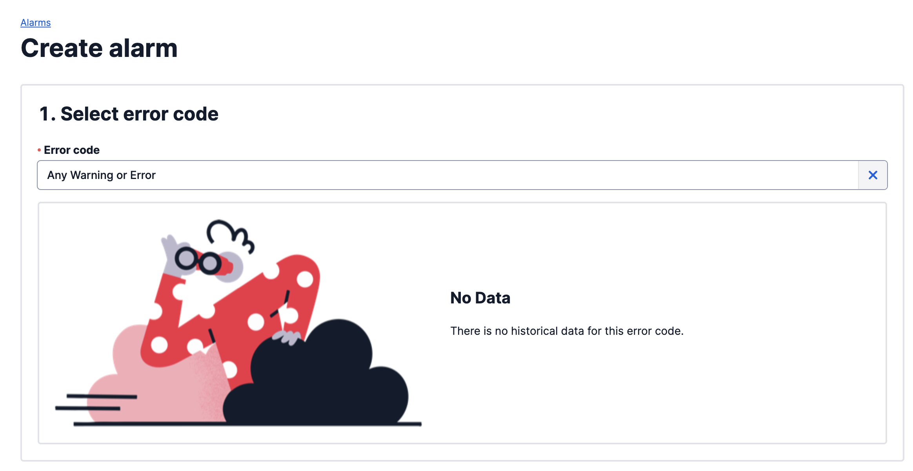

# Twilio Alarms Integration

## In ilert: Create a Twilio Alarms alert source

1.  Go to **Alert sources** --> **Alert sources** and click on **Create new alert source**

    <figure><figcaption></figcaption></figure>
2.  Search for **Twilio Alarms** in the search field, click on the Twilio Alarms tile and click on **Next**.&#x20;

    <figure><figcaption></figcaption></figure>
3. Give your alert source a name, optionally assign teams and click **Next**.
4.  Select an **escalation policy** by creating a new one or assigning an existing one.

    <figure><figcaption></figcaption></figure>
5.  Select you [Alert grouping](../alerting/alert-sources.md#alert-grouping) preference and click **Continue setup**. You may click **Do not group alerts** for now and change it later.&#x20;

    <figure><figcaption></figcaption></figure>
6. The next page show additional settings such as customer alert templates or notification prioritiy. Click on **Finish setup** for now.
7.  On the final page, an API key and / or webhook URL will be generated that you will need later in this guide.

    <figure><figcaption></figcaption></figure>

## In Twilio Alarms: Add ilert Webhook

1.  Navigate to **Monitor -> Alarms -> Manage alarms** and click on the **Create alarm** button on the top right corner.

    <figure><figcaption></figcaption></figure>
2.  Select a desired Error in the **Error code** field.

    <figure><figcaption></figcaption></figure>
3.  In the next step define an alarm threshold and a time period.

    <figure><figcaption></figcaption></figure>
4.  Select **Enable webhook** and enter the **Webhook URL** from ilert created in [this step](twilio-alarms.md#in-ilert-create-twilio-alarms-alert-source) into the field below.

    <figure><figcaption></figcaption></figure>
5. Enter a name for the alarm and click on Save.

## FAQ

**Will alerts in ilert be resolved automatically?**

No, unfortunately Twilio Alarms is not compatible with ilert's resolve event.
