# 4me Integration

## In ilert: Create a 4me alert source&#x20;

1.  Go to **Alert sources** -> **Alert sources** and click **Create new alert source**.

    <figure><figcaption></figcaption></figure>
2.  Search for **4me** in the search field, click the 4me tile, and then **Next**.&#x20;

    <figure><figcaption></figcaption></figure>
3. Give your alert source a name, optionally assign teams, and click **Next**.
4.  Select an **escalation policy** by creating a new one or assigning an existing one.

    <figure><figcaption></figcaption></figure>
5.  Select your [Alert grouping](../alerting/alert-sources.md#alert-grouping) preference and click **Continue setup**. You may click **Do not group alerts** for now and change it later.&#x20;

    <figure><figcaption></figcaption></figure>
6. The next page shows additional settings, such as customer alert templates or notification priority. Click **Finish setup** for now.
7. On the final page, an API key and/or webhook URL will be generated. You will need it later.

<figure><figcaption></figcaption></figure>

## In 4me: Create a an OAuth token

1. Click on the profile avatar -> **My Profile**.

<figure>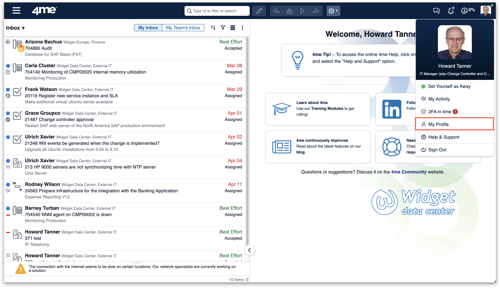<figcaption></figcaption></figure>

2. Now click on **Personal Access Tokens** -> **Generate new token**.

<figure>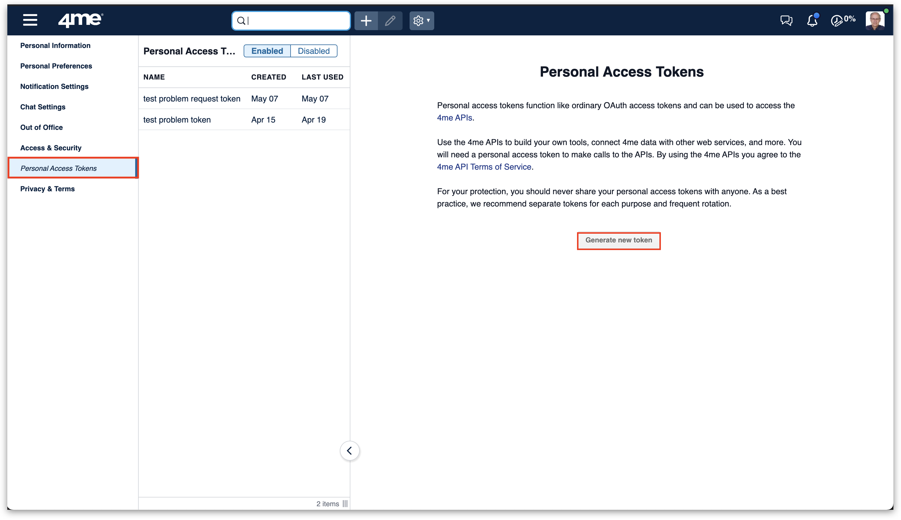<figcaption></figcaption></figure>

3. Enter a name and click on **Add record types...**.

<figure>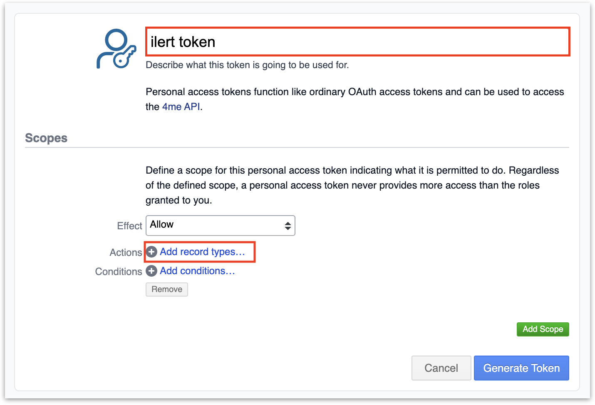<figcaption></figcaption></figure>

4. Add Problem and Request.
5. Activate all checkboxes and click on **Generate Token.**

<figure>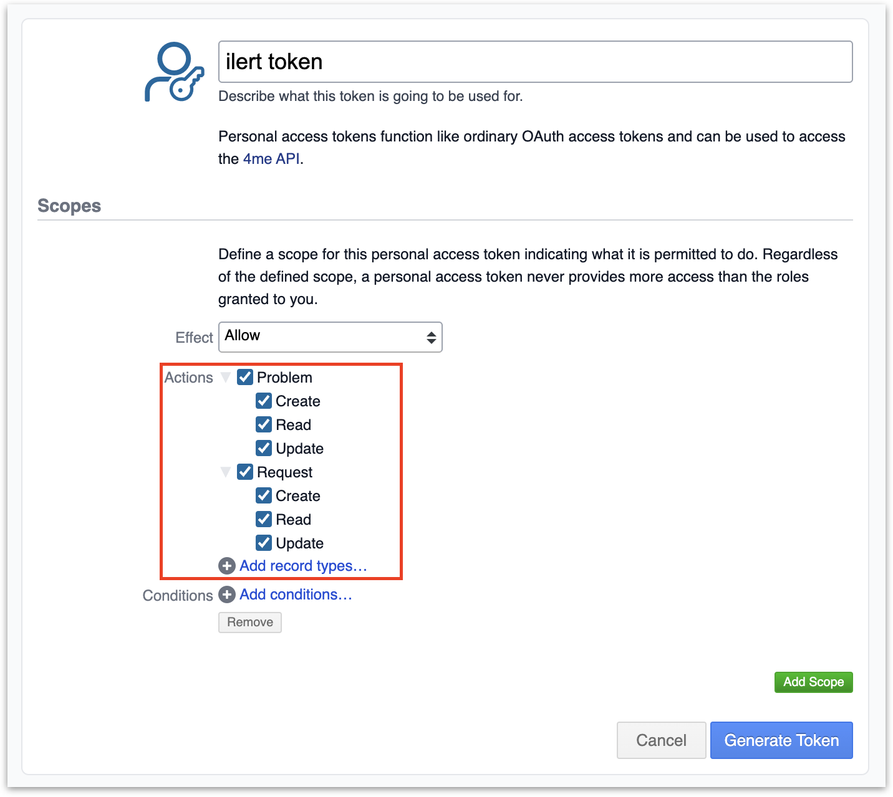<figcaption></figcaption></figure>

6. Copy the token.

## In ilert: Finish 4me alert source setup

1. Select your previously created 4me alert source and click on 4me settings.
2. Enter the 4me account name and the previously created OAuth token into the associated fields.

<figure>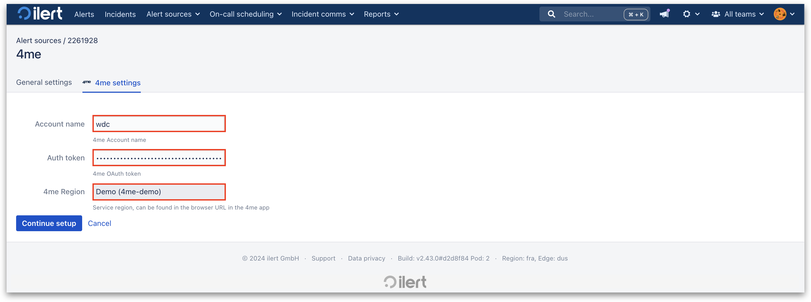<figcaption></figcaption></figure>

3. Select the 4me region. The region can be found in the URL of your 4me instance.

<figure>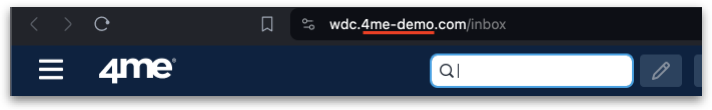<figcaption></figcaption></figure>

## In 4me: Create a webhook

1. Click on the hamburger menu on the top left corner -> settings icon.

<figure>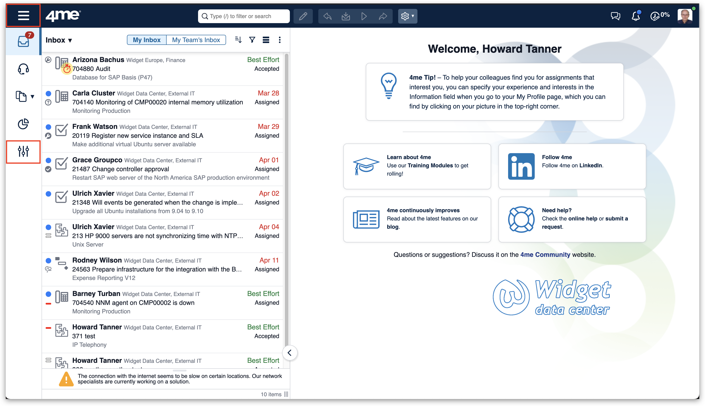<figcaption></figcaption></figure>

2. In the searchbar enter: "webhook" and click on **Webhooks** in the search result.

<figure>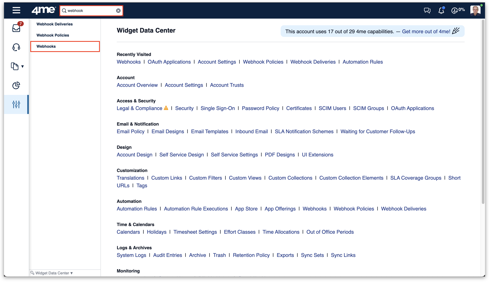<figcaption></figcaption></figure>

3. Click on the "+" to create a new webhook.

<figure><figcaption></figcaption></figure>

4. Add following webhooks each event: `problem.create`, `problem.update`, `request.create`, `request.update`.
5. Enter a name, the Event type and your 4me alert source URL.

<figure>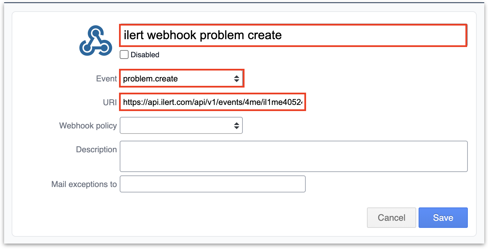<figcaption></figcaption></figure>

<figure>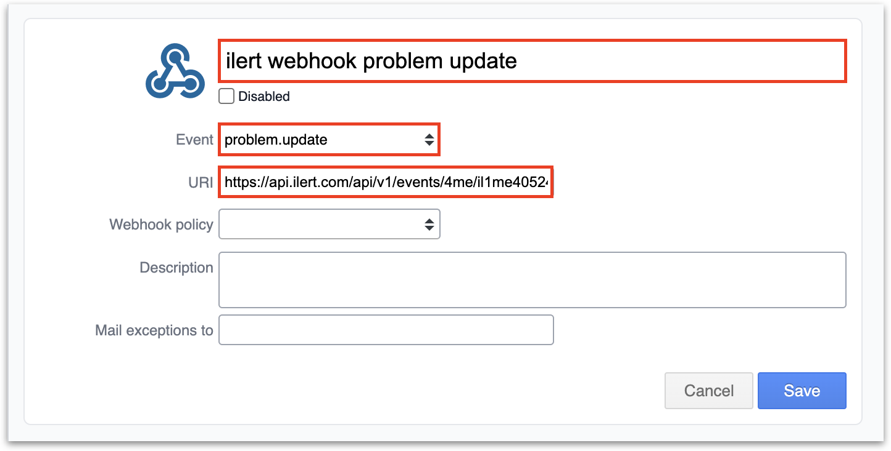<figcaption></figcaption></figure>

6. The webhook will then be verified.

<figure>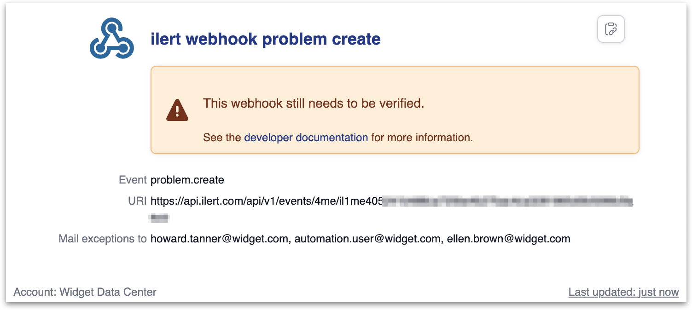<figcaption></figcaption></figure>

7. After couple seconds the webhook should update with **Last deilvery 200**.

<figure>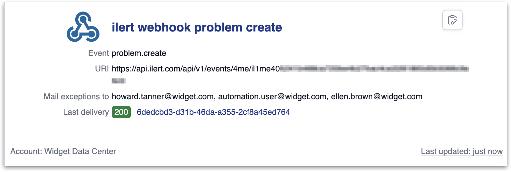<figcaption></figcaption></figure>

## FAQ 

**Will alerts in ilert be resolved automatically?**

Yes, make sure that webhooks for following events have been created: `problem.update`, `request.update`. As soon as the status of a problem or request is solved in 4me, the corresponding alert in ilert will be resolved.

**Will alerts in ilert be accepted automatically?**

Yes, make sure that webhooks for following events have been created: `problem.update`, `request.update`. As soon as the status of a problem or request is accepted in 4me, the corresponding alert in ilert will be accepted.
