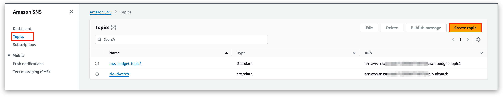
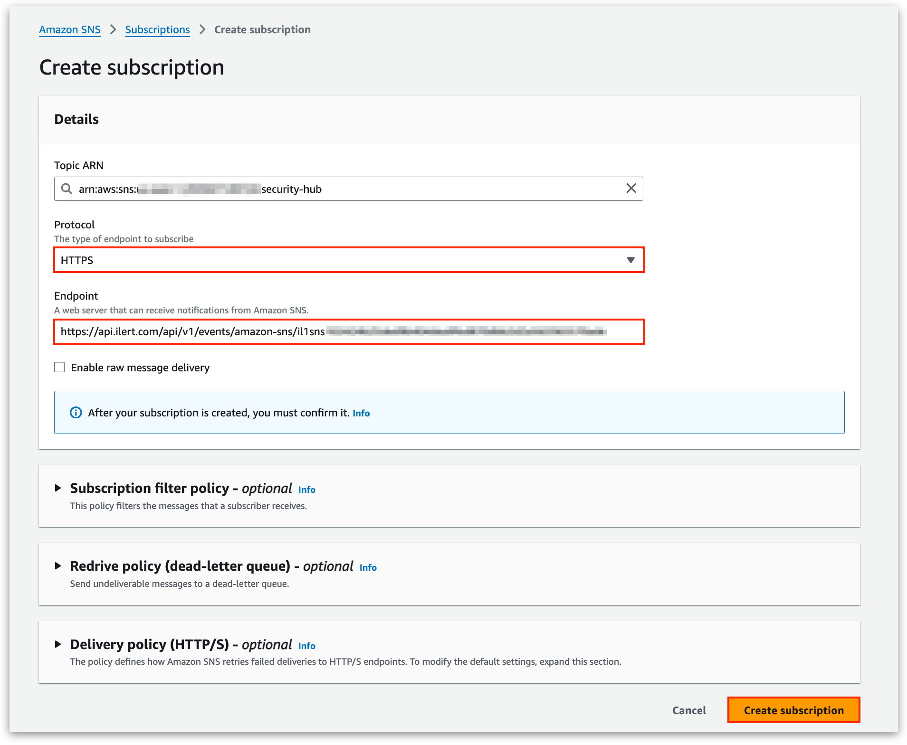
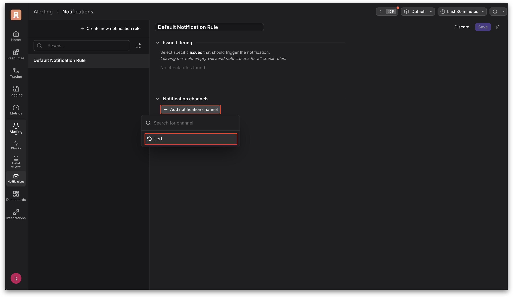
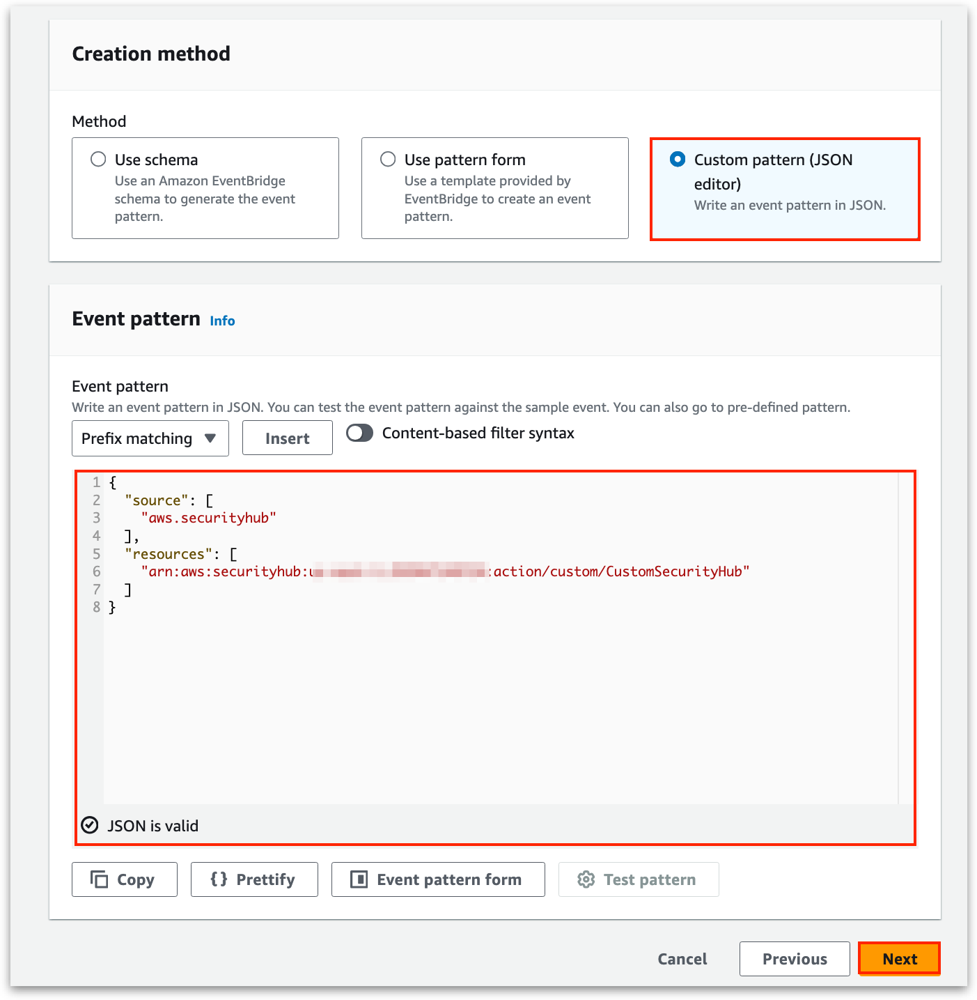
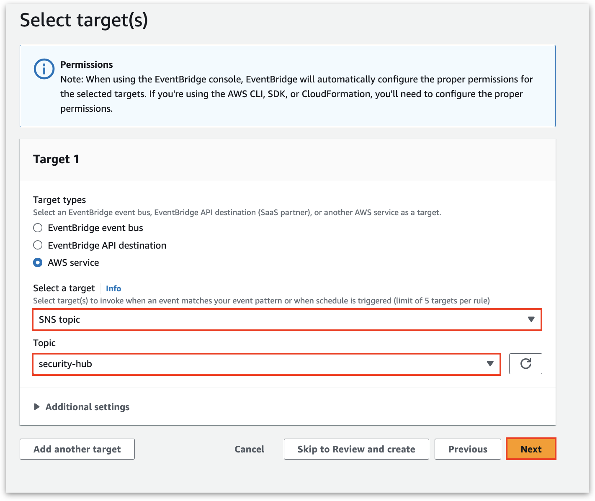
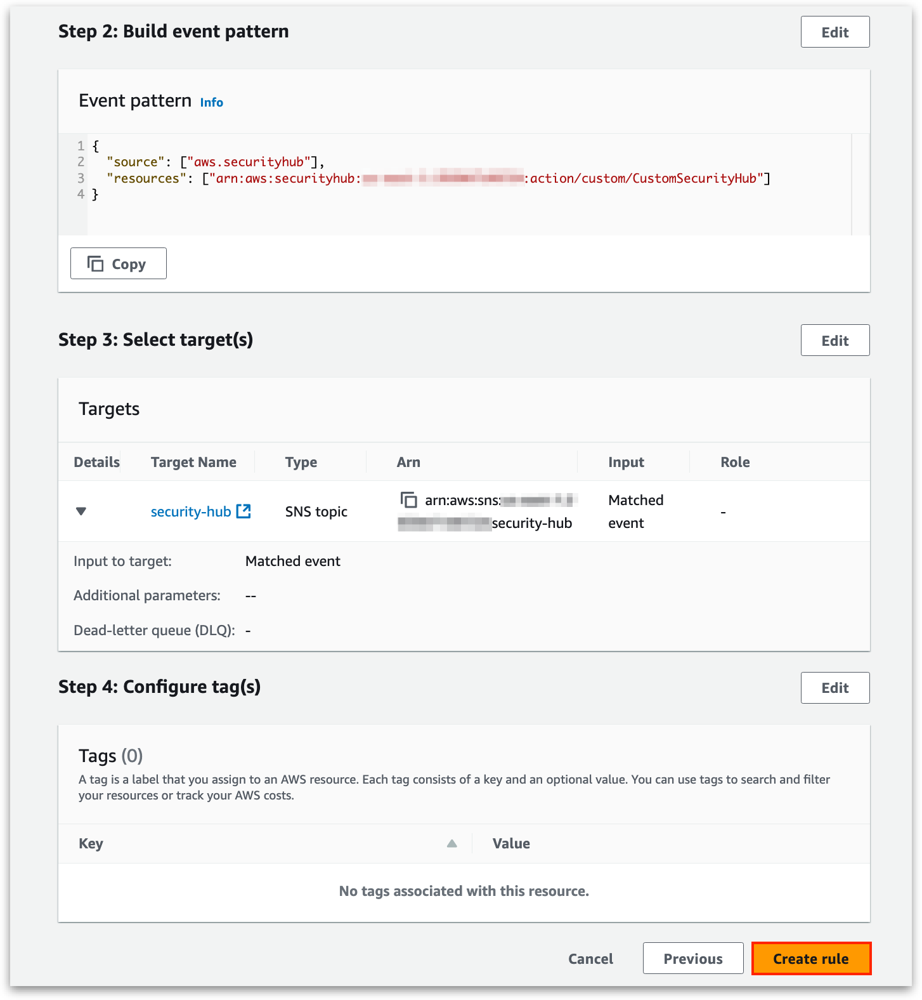

# AWS Security Hub Integration

AWS Security Hub is a security service that provides a comprehensive view of security alerts and compliance status across AWS accounts by aggregating findings from various AWS services and third-party tools. When used with ilert, Security Hub’s alerts are instantly routed to the right team members through multi-channel notifications and escalation policies, ensuring rapid response to security threats.

## How this integration works <a href="#create-alert-source" id="create-alert-source"></a>

AWS Security Hub generates finding events that are relayed by AWS EventBridge. If AWS EventBridge rules match, notifications will be published to specific Amazon Simple Notification Service (SNS) topics; the events will be sent to ilert.

## Architecture <a href="#create-alert-source" id="create-alert-source"></a>

<figure><figcaption></figcaption></figure>

## In ilert: Create an Amazon SNS alert source <a href="#create-alert-source" id="create-alert-source"></a>

1.  Go to **Alert sources** -> **Alert sources** and click on **Create new alert source**\


    <figure><figcaption></figcaption></figure>
2.  Search for **Amazon SNS** in the search field, click on the Amazon SNS tile and click on **Next**. \


    <figure><figcaption></figcaption></figure>
3. Give your alert source a name, optionally assign teams and click **Next**.
4.  Select an **escalation policy** by creating a new one or assigning an existing one.\


    <figure><figcaption></figcaption></figure>
5.  Select you [Alert grouping](../alerting/alert-sources.md#alert-grouping) preference and click **Continue setup**. You may click **Do not group alerts** for now and change it later. \


    <figure><figcaption></figcaption></figure>
6. The next page show additional settings such as customer alert templates or notification prioritiy. Click on **Finish setup** for now.
7.  On the final page, an API key and / or webhook URL will be generated that you will need later in this guide.


    <figure><figcaption></figcaption></figure>

## In AWS Security Hub: Create a Custom action <a href="#create-topic" id="create-topic"></a>

1. On the sidebar click on **Custom actions**.
2. Click on **Create custom action**.

<figure><figcaption></figcaption></figure>

3. Enter a **Action name**, **Description** and a **Custom action ID**.

<figure><figcaption></figcaption></figure>

## In AWS SNS: Create a topic and a Subscription <a href="#create-topic" id="create-topic"></a>

1. On the sidebar navigate to **Topics** and click on **Create topic**.

<figure><figcaption></figcaption></figure>

2. Select **Standard** and enter a **Name**.

<figure><figcaption></figcaption></figure>

3. Save the topic.
4. Now create a new Subscription for this topic.
5. Select HTTPS as **Protocol** and Enter the in ilert previously generated alert source url as **Endpoint**.

<figure><figcaption></figcaption></figure>

3. Click on **Create subscription**.


## In AWS EventBridge: Create an Event bus Rule <a href="#create-topic" id="create-topic"></a>

1. On the sidebar click on **Event buses** and then on **Create rule**.

<figure><figcaption></figcaption></figure>

2. Enter a Name for the rule.

<figure><figcaption></figcaption></figure>

3. Enter following Event pattern and click on **Next**:

```
{
    "source": [
        "aws.securityhub"
    ],
    "resources": [
        "< ARN OF THE CUSTOM ACTION CREATED IN SECURITY HUB >"
    ]
}
```

<figure><figcaption></figcaption></figure>

4. Select the previous created topic as target.

<figure><figcaption></figcaption></figure>

5. Click on **Create rule** to finish the setup.

<figure><figcaption></figcaption></figure>


## FAQ <a href="#faq" id="faq"></a>

**Will alerts in ilert be resolved automatically?**

No, but you can use the **eventType** custom attribute to resolve an incident in specified **incidentKey**.
