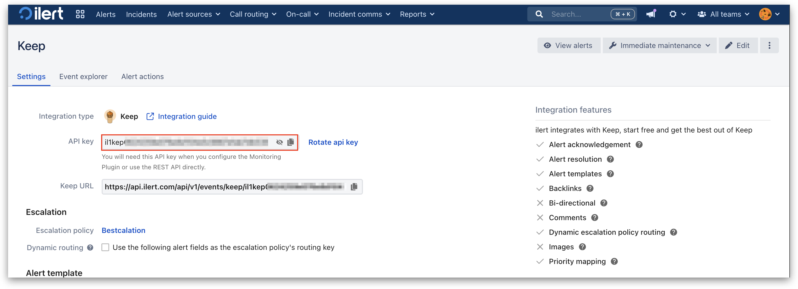

# Keep Integration

## In ilert: Create a Keep alert source 

1.  Go to **Alert sources** -> **Alert sources** and click **Create new alert source**.

    <figure><figcaption></figcaption></figure>
2.  Search for **Keep** in the search field, click on the Keep tile, and click **Next**.&#x20;

    <figure><figcaption></figcaption></figure>
3. Give your alert source a name, optionally assign teams, and click **Next**.
4.  Select an **escalation policy** by creating a new one or assigning an existing one.

    <figure><figcaption></figcaption></figure>
5.  Select your [Alert grouping](../alerting/alert-sources.md#alert-grouping) preference and click **Continue setup**. You may click **Do not group alerts** for now and change it later.&#x20;

    <figure><figcaption></figcaption></figure>
6. The next page shows additional settings, such as customer alert templates or notification priority. Click on **Finish setup** for now.
7. An API key and/or webhook URL will be generated on the final page, which you will need later in this guide.
8.

    <figure><figcaption></figcaption></figure>

## In Keep: Connect a provider

1. On the sidebar, click on **Providers**.

<figure><figcaption></figcaption></figure>

2. Now enter 'ilert' into the **Filter providers** search bar and click on the ilert tile.

<figure><figcaption></figcaption></figure>

3. Enter a Provider name and the previously created alert source API key into the **ilert API token** field.
4. Click on **Connect** to finish the setup.

<figure><figcaption></figcaption></figure>

## FAQ 

**Will alerts in ilert be resolved automatically?**

Yes, as soon as Keep sends a resolving event, the corresponding alert in ilert will be resolved.

**Will alerts in ilert be accepted automatically?**

Yes, as soon as Keep sends an accept event, the corresponding alert in ilert will be accepted.
