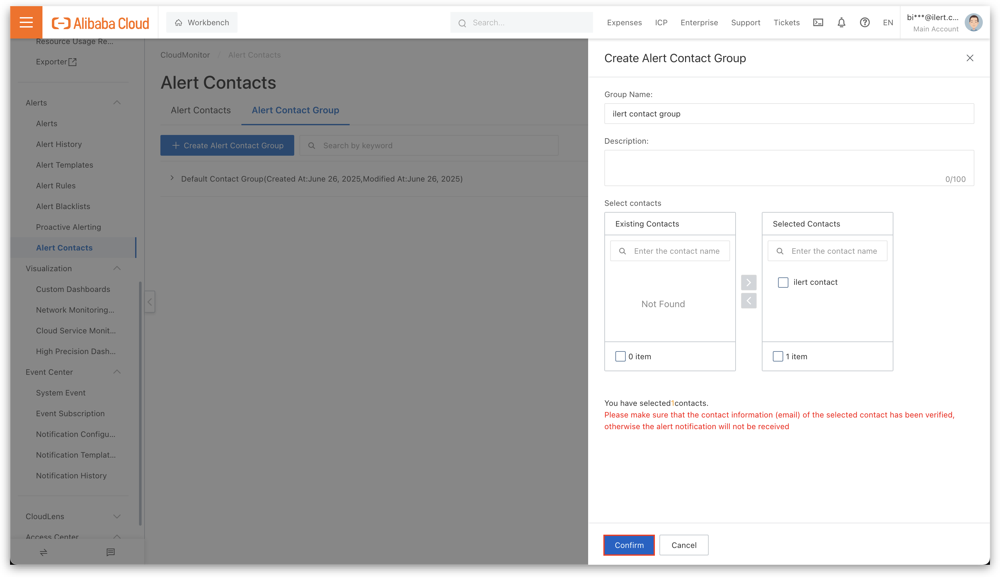
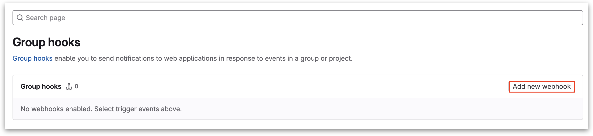

# Kibana Integration

[Kibana](https://www.elastic.co/kibana) is a powerful open-source analytics and visualization platform designed to work with Elasticsearch. It provides users with the tools to explore, visualize, and share insights into their data in real-time.

## In ilert: Create an Kibana alert source <a href="#create-alarm-source" id="create-alarm-source"></a>

1.  Go to **Alert sources** --> **Alert sources** and click **Create new alert source**.

    <figure><figcaption></figcaption></figure>
2.  Search for **Kibana** in the search field, click on the Kibana tile, and click **Next**.&#x20;

    <figure><figcaption></figcaption></figure>
3. Give your alert source a name, optionally assign teams, and click **Next**.
4.  Select an **escalation policy** by creating a new one or assigning an existing one.

    <figure><figcaption></figcaption></figure>
5.  Select your [Alert grouping](../alerting/alert-sources.md#alert-grouping) preference and click **Continue setup**. You may click **Do not group alerts** for now and change it later.&#x20;

    <figure><figcaption></figcaption></figure>
6. The next page shows additional settings, such as customer alert templates or notification priority. Click on **Finish setup** for now.
7.  On the final page, an API key and/or webhook URL will be generated, which you will need later in this guide.

    <figure><figcaption></figcaption></figure>

## In Kibana: Create a connector

1. On the sidebar, click on **Connectors** under the **Alerts and Insights** category.

<figure><figcaption></figcaption></figure>

2. Now click on **Create connector**.

<figure><figcaption></figcaption></figure>

3. Select **Webhook**.

<figure><figcaption></figcaption></figure>

4. Enter a **Connector name**.
5. Under **Connector settings**, enter the previously generated ilert Elasticsearch Kibana alert source URL into the **URL** field and change the **Method** to POST.
6. Choose None under **Authentication** and enable **Add HTTP header**.
7. Enter the following header -> `key: Content-Type value: application/json`
8. Save the connector.

<figure><figcaption></figcaption></figure>

9. Now, navigate to **Rules** under the **Alerts and Insights** category.

<figure><figcaption></figcaption></figure>

10. Click on **Create rule**.

<figure><figcaption></figcaption></figure>

11. Enter a **name** and select Webhook as the **connector type**.

<figure><figcaption></figcaption></figure>

12. Choose the previous created ilert connector as **Webhook connector**.
13. Enter the following payload into the **Body** field:



This payload contains [mustache](https://mustache.github.io/mustache.5.html) and is not valid for testing the connector.


```mustache
{
  "alert" : {{{ alert }}},
  "context" : {{{ context }}},
  "rule" : {{{ rule }}}
}
```

<figure><figcaption></figcaption></figure>

14. Save the rule.

## FAQ

**Will alerts in ilert be resolved automatically?**

No, unfortunately, Kibana is not compatible with ilert's resolve event.
