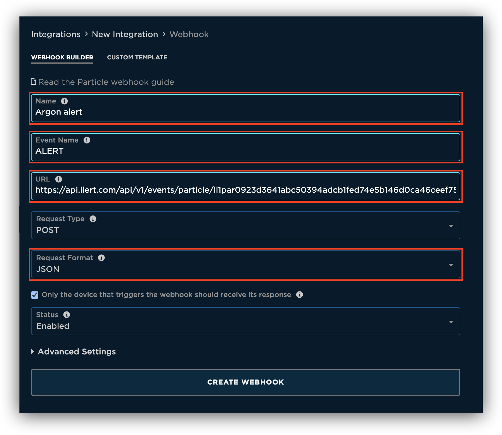
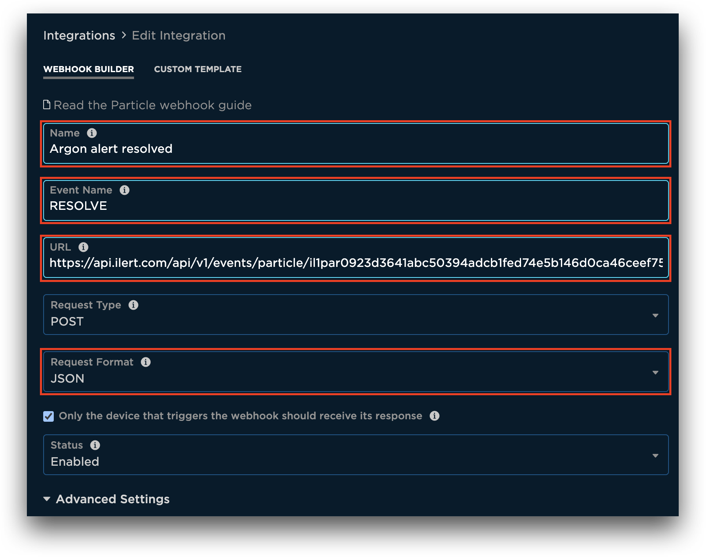
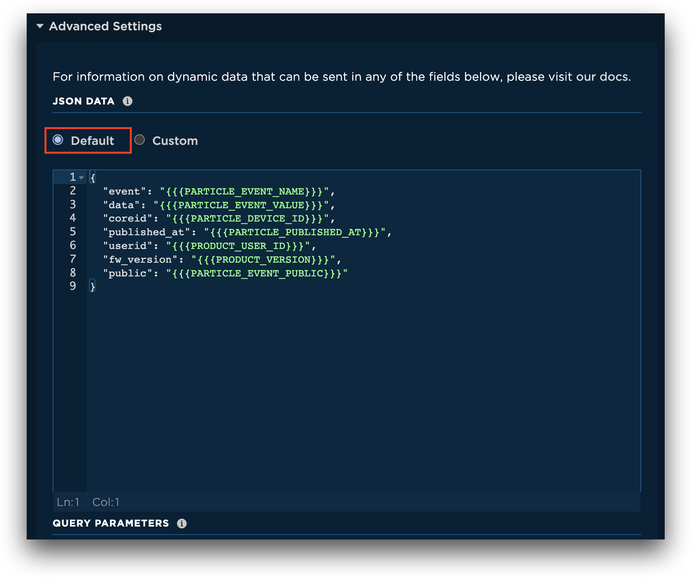
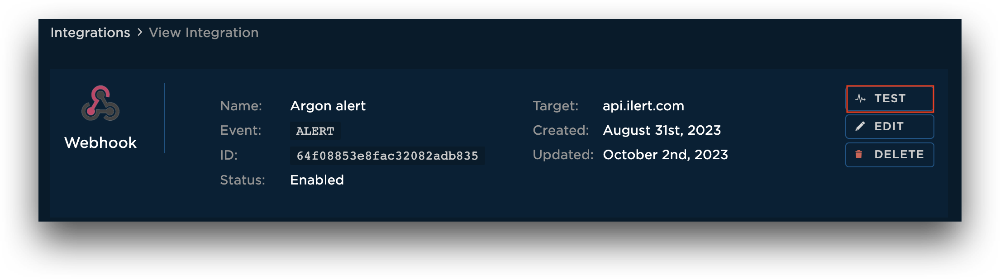
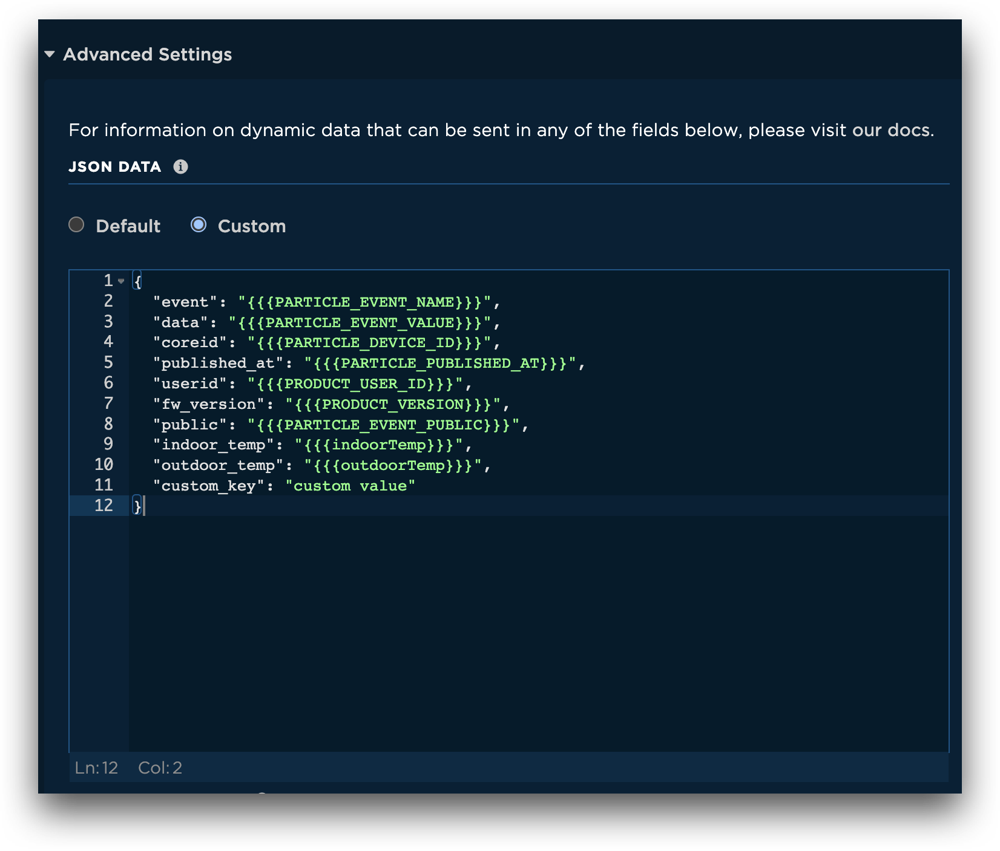
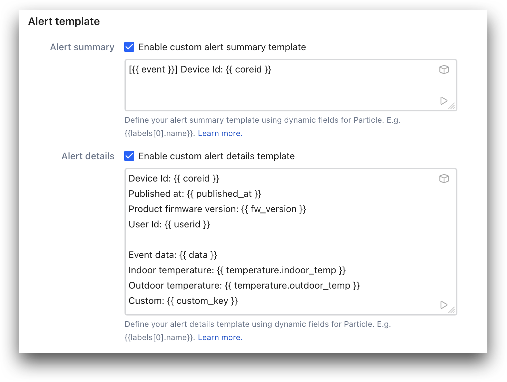

# Particle Integration

[Particle.io](https://www.particle.io) is a platform that provides everything necessary for organizations to develop, deploy, and manage their Internet of Things (IoT) products. It serves as a comprehensive ecosystem for connected device development with robust tools, APIs, and hardware kits. With Particle.io, you can build IoT devices at scale, delivering connectivity, device management, and security features out-of-the-box.

ilert's integration for Particle enables users to receive alerts from their devices via SMS, push, voice, and messenger notifications. It helps to connect Particle devices with other services and tools in the tech stack and speed up incident response.

## In ilert: Create a Particle alert source

1.  Go to **Alert sources** --> **Alert sources** and click on **Create new alert source**

    <figure><figcaption></figcaption></figure>
2.  Search for **Particle** in the search field, click on the Particle tile and click on **Next**.&#x20;

    <figure><figcaption></figcaption></figure>
3. Give your alert source a name, optionally assign teams and click **Next**.
4.  Select an **escalation policy** by creating a new one or assigning an existing one.

    <figure><figcaption></figcaption></figure>
5.  Select you [Alert grouping](../alerting/alert-sources.md#alert-grouping) preference and click **Continue setup**. You may click **Do not group alerts** for now and change it later.&#x20;

    <figure><figcaption></figcaption></figure>
6. The next page show additional settings such as customer alert templates or notification prioritiy. Click on **Finish setup** for now.
7.  On the final page, an API key and / or webhook URL will be generated that you will need later in this guide.

    <figure><figcaption></figcaption></figure>

## In Particle: Create a Webhook

1. In the sidebar click on **Integrations**.

<figure><figcaption></figcaption></figure>

2. Now click on **ADD NEW INTEGRATION**.

<figure><figcaption></figcaption></figure>

3. Click on **Webhook**, to create a new webhook integration.

<figure><figcaption></figcaption></figure>

4. Enter a **Name**, an **Event Name**(ALERT or RESOLVE) and the [previous](particle.md#in-ilert-create-a-particle-alert-source) generated ilert webhook URL into the **URL** field.
5. Change the **Request Type** to **POST** and open the **Advanced Settings**.



<figure><figcaption></figcaption></figure>



<figure><figcaption></figcaption></figure>



6. Select **Default**. (for custom json data follow this [step](particle.md#in-particle-custom-json-data))

<figure><figcaption></figcaption></figure>

7. Click on **SAVE**.
8. Optional: Click on **TEST** to test the integration.

<figure><figcaption></figcaption></figure>

## Custom Webhooks

### In Particle: Custom json data

1. Under Advanced Settings choose **Custom** for **JSON DATA**.
2. Create a template using the Particle [documentation](https://docs.particle.io/reference/cloud-apis/webhooks/). (it is also possible to add own customized values)

<figure><figcaption></figcaption></figure>

### In ilert: Create a custom template

1. Go to the alert source edit view.
2. Under **Alert template** enable **Alert summary** and **Alert details**.
3. For a detailed guide on how to use our alert templating click [here](https://docs.ilert.com/alerting/alert-sources#customize-your-alerts-with-alert-templates).
4. Use the payload keys created in this [step](particle.md#in-particle-custom-json-data) to create the alert template.

<figure><figcaption></figcaption></figure>

## FAQ 

**Will alerts in ilert be resolved automatically?**

Yes, as soon as a webhook integration is sending an RESOLVE event, the alert in ilert will be fixed. To create RESOLVE events, follow the [guide](particle.md#in-particle-create-a-webhook) and use RESOLVE as Event Name.
