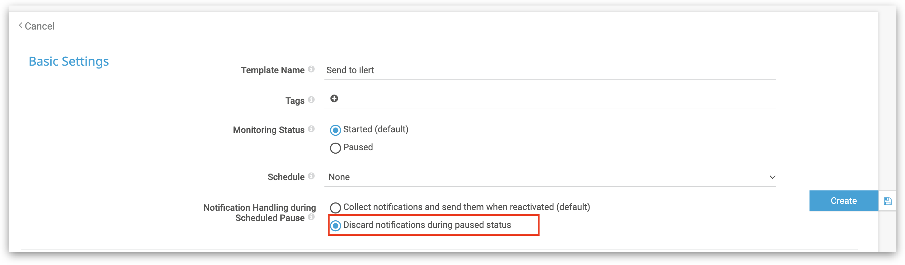

# PRTG Network Monitor Integration

[PRTG Network Monitor](https://www.paessler.com/prtg) is a network monitoring software developed by the German company Paessler AG. It allows system administrators and other IT professionals to manage and monitor their entire IT infrastructure, including servers, routers, switches, bandwidth usage, and more. With PRTG integration, you can easily integrate PRTG with ilert and extend your existing PRTG monitoring with SMS, push and voice notifications as well as on-call schedules from ilert.

## In ilert: Create a PRTG alert source 

1.  Go to **Alert sources** --> **Alert sources** and click on **Create new alert source**

    <figure><figcaption></figcaption></figure>
2.  Search for **PRTG** in the search field, click on the PRTG tile and click on **Next**.&#x20;

    <figure><figcaption></figcaption></figure>
3. Give your alert source a name, optionally assign teams and click **Next**.
4.  Select an **escalation policy** by creating a new one or assigning an existing one.

    <figure><figcaption></figcaption></figure>
5.  Select you [Alert grouping](../alerting/alert-sources.md#alert-grouping) preference and click **Continue setup**. You may click **Do not group alerts** for now and change it later.&#x20;

    <figure><figcaption></figcaption></figure>
6. The next page show additional settings such as customer alert templates or notification prioritiy. Click on **Finish setup** for now.
7.  On the final page, an API key, webhook URL and PRTG Postdata will be generated that you will need later in this guide.

    <figure><figcaption></figcaption></figure>

## In PRTG: Create a new notification 

1.  Got to **Setup** --> **Account Settings** --> **Notification Templates**\

    <figure><figcaption></figcaption></figure>
2. Click on **Add Notification Template**&#x20;
3. As notification method select **Execute HTTP ACTION**
4.  Copy the **URL** and **Postdata** fields from the ilert alert source above and paste them in **URL** and **Payload** fields of the HTTP Action.\
    \

    <figure><figcaption></figcaption></figure>
5. Click on **Create**
6.  Next, we will use the ilert notification template in PRTG. To do this, switch to the **Root** group in the device overview and select the **Notification Triggers** tab.

    <figure><figcaption></figcaption></figure>
7.  Create the following **Notification Triggers**. Note: We recommend to make use of the option **repeat every x minutes** in case your internet connection goes down.

    <figure><figcaption></figcaption></figure>

    \
    You may adjust the trigger to fit your needs, e.g. adjust the time that PRTG waits before it sends a notification to ilert.

## &#x20;

## FAQ 

**Will alerts in ilert be resolved automatically?**

Yes, as soon as the condition of a sensor in PRTG is OK again, the associated alert is resolved in ilert.

**What if an alert is acknowledged in PRTG, is the associated alert also acknowledged in ilert?**

No, in PRTG it is unfortunately not possible to send notifications for acknowledgements.

**What if my internet connection is interrupted? Are the events generated in PRTG lost?**

No, events will not be lost if you enable the "repeat every x minutes" option in PRTG (see above). In addition, we recommend that you monitor your Internet connection with ilert's [heartbeat monitoring](../alerting/heartbeat-monitoring/).

**Can I link PRTG to multiple alert sources in ilert?**

Yes, create multiple ilert notifications in PRTG. You can then associate them with objects in the PRTG object hierarchy.

**PRTG still sends alerts while a monitor is in a paused state. How can i discard paused notifications in PRTG?**

To discard paused notifications, go to the notification template settings and select "Discard notifications during paused status" in the "Notification Handling during Scheduled Pause" field.

<figure><figcaption></figcaption></figure>

**The integration does not work. How do I find the issue?**

If you can not find the error, please contact our support at [support@ilert.com](https://github.com/iLert/docs/tree/dfe03283a452516a115a55f8c20942698e279d7b/integrations/support@ilert.com).
