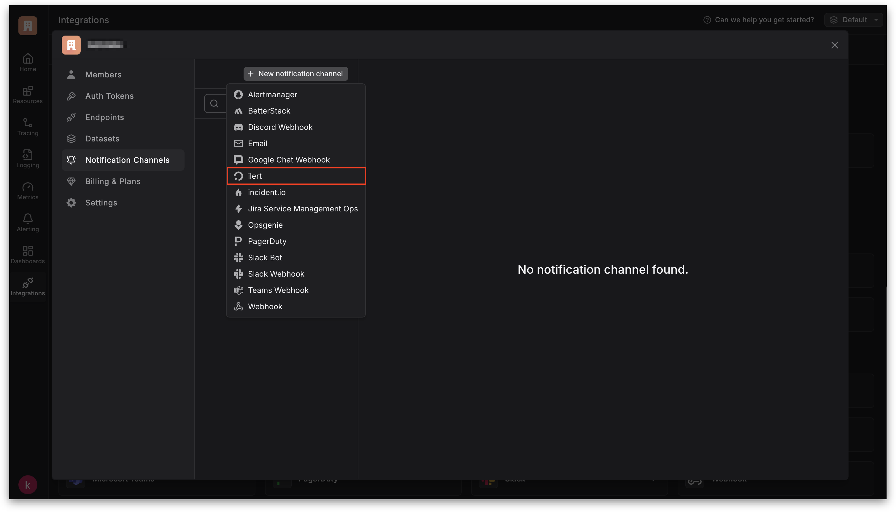

# Samsara Integration

Samsara's platform helps you to monitor and track your devices

## In ilert: Create a Samsara alert source

1.  Go to **Alert sources** --> **Alert sources** and click on **Create new alert source**

    <figure><figcaption></figcaption></figure>
2.  Search for **Samsara** in the search field, click on the Samsara tile and click on **Next**.&#x20;

    <figure><figcaption></figcaption></figure>
3. Give your alert source a name, optionally assign teams and click **Next**.
4.  Select an **escalation policy** by creating a new one or assigning an existing one.

    <figure><figcaption></figcaption></figure>
5.  Select you [Alert grouping](../alerting/alert-sources.md#alert-grouping) preference and click **Continue setup**. You may click **Do not group alerts** for now and change it later.&#x20;

    <figure><figcaption></figcaption></figure>
6. The next page show additional settings such as customer alert templates or notification prioritiy. Click on **Finish setup** for now.
7.  On the final page, an API key and / or webhook URL will be generated that you will need later in this guide.

    <figure><figcaption></figcaption></figure>

## In Samsara: Create a webhook

1. In the sidebar, click on the Alert bell icon.

<figure><figcaption></figcaption></figure>

2. On the next screen, click on **Create Alert**.

<figure><figcaption></figcaption></figure>

3. Now select a desired **Trigger**.

<figure><figcaption></figcaption></figure>

4. Now open the **Add Action** menu and choose **Send Webhook**.

<figure><figcaption></figcaption></figure>

5. A new tab will open. Now click on **Manage**.

<figure><figcaption></figcaption></figure>

6. Click on **Add Webhook**.

<figure><figcaption></figcaption></figure>

7. Enter a **Name**, the ilert alert source URL created in this [step](samsara.md#in-ilert-create-a-samsara-alert-source) into the **Payload URL** field and select some desired **Event Subscriptions**.
8. Click on **Create** to finish the webhook setup.

<figure><figcaption></figcaption></figure>

9. Optional: Click on the **Test** button to send a test alert to ilert.

<figure><figcaption></figcaption></figure>

## FAQ 

**Are alerts in ilert automatically resolved?**

Yes, as soon as an alert is resolved in Samsara, the corresponding Alert is automatically resolved in ilert.

