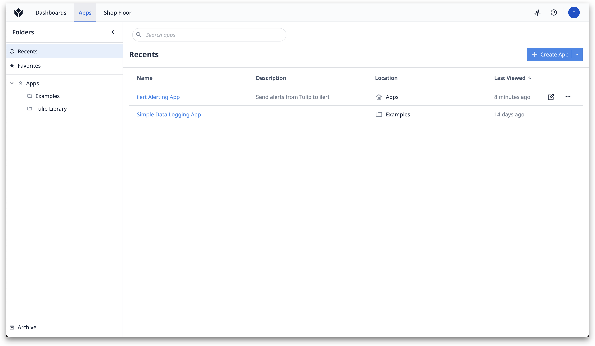
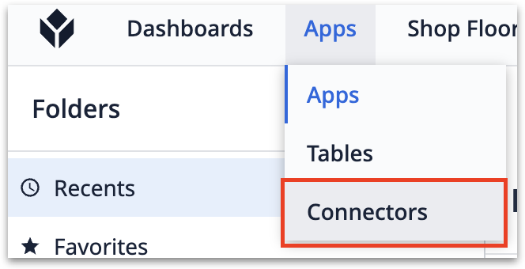
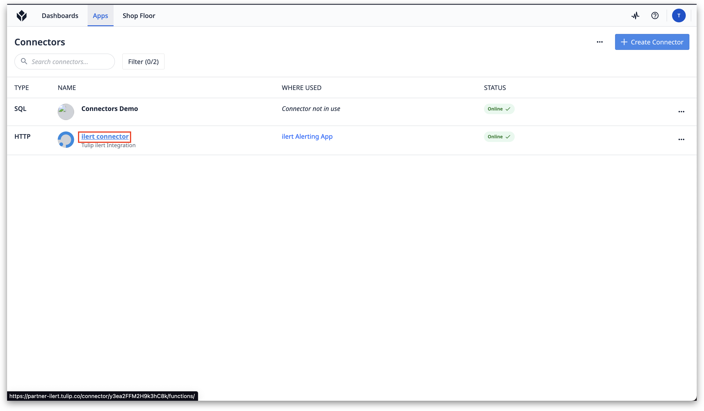
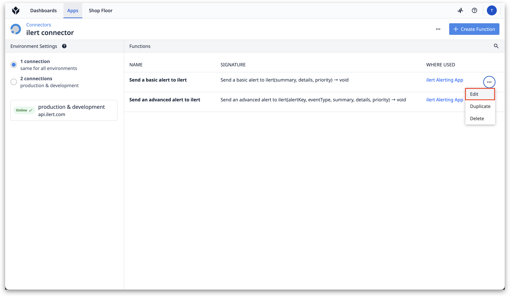
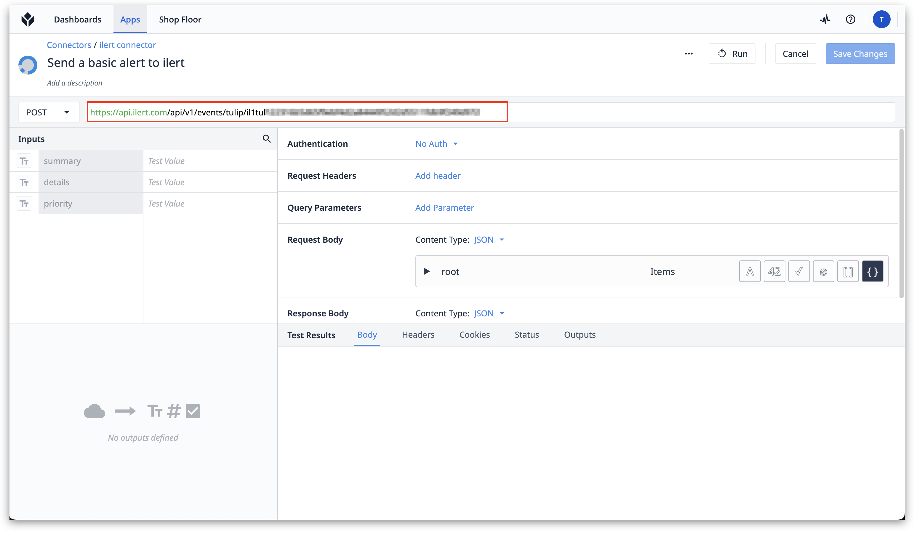
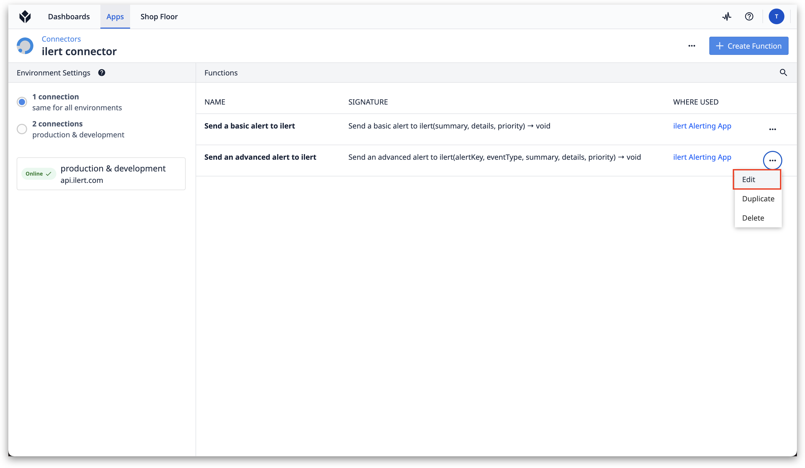
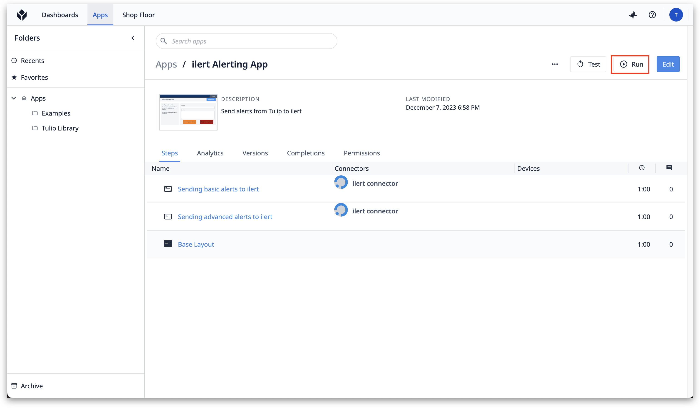
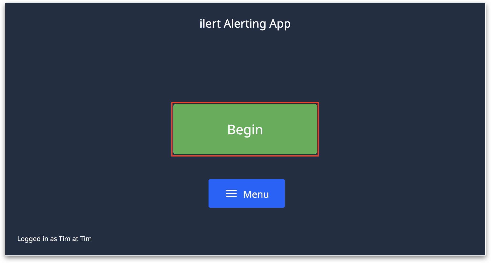
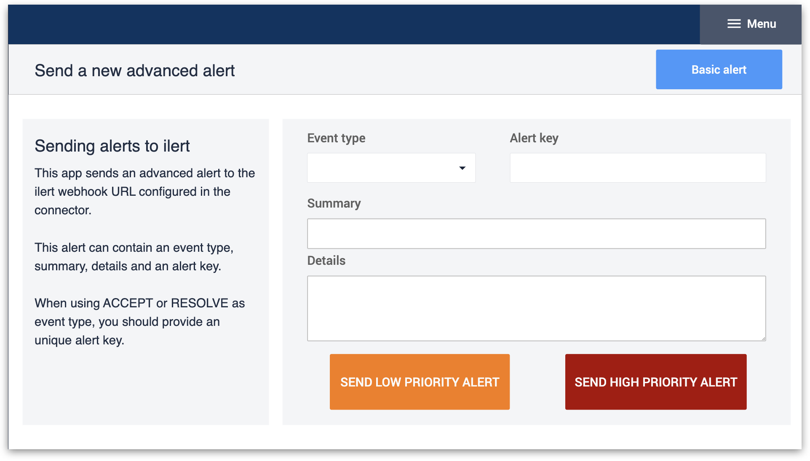

# Tulip Integration

[Tulip.co](https://tulip.co/) is a platform dedicated to providing innovative solutions for manufacturing operations. At the heart of Tulip's offerings is its no-code platform, enabling frontline engineers and operators to create custom apps tailored to their specific needs without needing extensive programming skills. These apps can seamlessly integrate with existing tools and data sources, providing real-time insights and analytics to optimize manufacturing processes.

ilert also offers an app for Tulip. This app allows users to send alerts to their ilert incident management platform, enabling them to notify on-call team members through various channels — including voice, push, SMS, or messenger notifications — about critical issues.

## In ilert: Create a Tulip alert source 

1.  Go to **Alert sources** -> **Alert sources** and click on **Create new alert source**\

    <figure><figcaption></figcaption></figure>
2.  Search for **Tulip** in the search field, click on the Tulip tile, and click on **Next**. \

    <figure><figcaption></figcaption></figure>
3. Give your alert source a name, optionally assign teams, and click **Next**.
4.  Select an **escalation policy** by creating a new one or assigning an existing one.\

    <figure><figcaption></figcaption></figure>
5.  Select your [Alert grouping](../alerting/alert-sources.md#alert-grouping) preference and click **Continue setup**. You may click **Do not group alerts** for now and change it later. \

    <figure><figcaption></figcaption></figure>
6. The next page shows additional settings such as customer alert templates or notification prioritiy. Click on **Finish setup** for now.
7.  On the final page, an API key and / or webhook URL will be generated that you will need later in this guide.

    <figure><figcaption></figcaption></figure>

## In Tulip: Add and edit the ilert Tulip app 

1. Search for the ilert App in the [Tulip App Library](https://tulip.co/library-search/?desc=ilert).

<figure><figcaption></figcaption></figure>

2. Go to **Apps** **-> Connectors**.

<figure><figcaption></figcaption></figure>

3. Select the ilert connector.

<figure><figcaption></figcaption></figure>

4. In Tulip, we can now configure basic and advanced alerts.\
   **Basic alert:** Plain alert containing a summary and some details.\
   **Advanced alert:** Contains more information such as event types and alerting key. Alerts have associations and can be accepted or resolved.



1. Select the "Send a basic alert to ilert" connector and click on **Edit**.

<figure><figcaption></figcaption></figure>

2. Enter the previously created Alertsource URL into the URL field on the top.

<figure><figcaption></figcaption></figure>



1. Select the "Send an advanced alert to ilert" connector and click on **Edit**.

<figure><figcaption></figcaption></figure>

2. Enter the previously created Alertsource URL into the URL field on the top.

<figure><figcaption></figcaption></figure>



4. Switch back to Apps and Select "ilert Alerting App."
5. Click on **Run** to run the application.

<figure><figcaption></figcaption></figure>

6. Click on **Begin**.

<figure><figcaption></figcaption></figure>


To use this feature, you need to set up the "Send an advanced alert to ilert" connector in Step 3.


7. If you want to switch to advanced alerting, click on **Advanced alert**.


Providing the **Event types** ACCEPT or RESOLVE requires to enter any unique **Alert key**. Associated alert with the same Alert key will then change its status.


<figure><figcaption></figcaption></figure>

## FAQ

**Will alerts in ilert be resolved automatically?**

Yes, as soon as the ilert Alerting App in Tulip sends a "RESOLVE" alert, the associated alert is automatically resolved in ilert.

**Will alerts in ilert be accepted automatically?**

Yes, as soon as the ilert Alerting App in Tulip sends an "ACCEPT" alert, the associated alert is automatically resolved in ilert.
