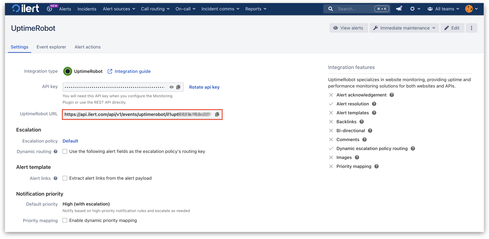

# UptimeRobot Integration

With the UptimeRobot integration, you can easily integrate UptimeRobot notifications into ilert. So you can easily expand UptimeRobot with push and voice notification and duty rosters from ilert. Incidents are created in ilert and automatically closed again as soon as the problem has been resolved.

## In ilert: Create an UptimeRobot alert source 

1.  Go to **Alert sources** --> **Alert sources** and click on **Create new alert source**

    <figure><figcaption></figcaption></figure>
2.  Search for **UptimeRobot** in the search field, click on the UptimeRobot tile and click on **Next**.&#x20;

    <figure><figcaption></figcaption></figure>
3. Give your alert source a name, optionally assign teams and click **Next**.
4.  Select an **escalation policy** by creating a new one or assigning an existing one.

    <figure><figcaption></figcaption></figure>
5.  Select you [Alert grouping](../alerting/alert-sources.md#alert-grouping) preference and click **Continue setup**. You may click **Do not group alerts** for now and change it later.&#x20;

    <figure><figcaption></figcaption></figure>
6. The next page show additional settings such as customer alert templates or notification prioritiy. Click on **Finish setup** for now.
7.  On the final page, an API key and / or webhook URL will be generated that you will need later in this guide.

    <figure><figcaption></figcaption></figure>

## In UptimeRobot: Add ilert Webhook 

1. On the sidebar, click on **Integrations & API**.

 (1) (1) (1).png>)

2. Under the **Webhook** section, click on **Add**, to add a new webhook.

 (1) (1).png>)

3. Now enter the integration url created in ilert into the **Webhook URL** field and enable **As query string of webhook URL**.
4. Click on **Create Integration** to finish.

.png>)

5. The integration is now set up and the new Webhook can be activated in your monitors.

## In UptimeRobot: Connect integrations to a monitor 

1. In the monitor view, click on **Edit**.

<figure><figcaption></figcaption></figure>

2. On the next page, click on **Integrations & Team**.

<figure><figcaption></figcaption></figure>

3. In the **Connect Integrations** section, tick the checkbox of the desired webhook. Click on **Save Changes** to finish.

<figure><figcaption></figcaption></figure>

## FAQ 

**Are alerts automatically resolved in ilert?**

Yes, as soon as an alert is resolved with "ok" in UptimeRobot, the associated alert is automatically resolved in ilert.

**Can I link UptimeRobot to multiple alert sources in ilert?**

Yes, create an **webhook** for this in UptimeRobot for each alert source.
