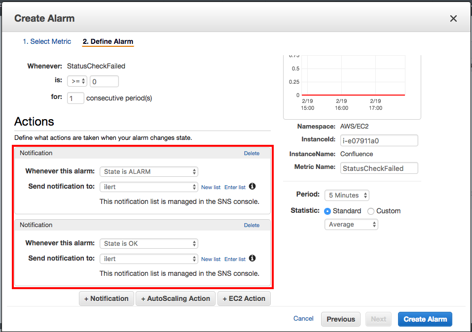

# Amazon CloudWatch Integration

[Amazon CloudWatch](https://aws.amazon.com/cloudwatch/) is a monitoring service for AWS cloud resources and applications running in the AWS Cloud. Amazon CloudWatch can monitor AWS resources, such as EC2 instances, Amazon DynamoDB tables, and Amazon RDS DB instances, as well as application and service generated metrics and log files.

With ilert's CloudWatch integration, you can automatically create alerts in ilert from CloudWatch alarms. That way, you will never miss a critical alert and always alert the right person using ilert's on-call schedules, automatic escalation, and multiple alerting channels. When CloudWatch creates an alarm, ilert will alert the on-call person through their preferred channel, including SMS, phone calls, push notifications and Slack. ilert will automatically escalate to the next person, if the alert is not acknowledged. ilert also lets you define alerting rules based on support hours and delay alerts until your support hours start.

## In ilert: Create a CloudWatch alert source 

1.  Go to **Alert sources** -> **Alert sources** and click on **Create new alert source**\

    <figure><figcaption></figcaption></figure>
2.  Search for **Amazon Cloudwatch** in the search field, click on the Amazon Cloudwatch tile and click on **Next**. \

    <figure><figcaption></figcaption></figure>
3. Give your alert source a name, optionally assign teams and click **Next**.
4.  Select an **escalation policy** by creating a new one or assigning an existing one.\

    <figure><figcaption></figcaption></figure>
5.  Select you [Alert grouping](../alerting/alert-sources.md#alert-grouping) preference and click **Continue setup**. You may click **Do not group alerts** for now and change it later. \

    <figure><figcaption></figcaption></figure>
6. The next page show additional settings such as customer alert templates or notification prioritiy. Click on **Finish setup** for now.
7.  On the final page, an API key and / or webhook URL will be generated that you will need later in this guide.

    <figure><figcaption></figcaption></figure>

## In AWS SNS: Create topic 


If you have already created an SNS topic for your CloudWatch alarms that you want to reuse, you can proceed to step 3.


1.  In the SNS Dashboard click on "Create topic"\

    
2.  Name the topic and click on "Create topic".\

    
3.  Click on "Create subscription" on the Topic Detail page

    
4.  Select "HTTPS" as the protocol and copy the webhook URL from the above created alert source to ilert at Endpoint and click on "Create subscription".\

    
5.  The subscription is automatically confirmed by ilert when it is created. After updating the overview, the status "PendingConfirmation" should disappear and the ID should be displayed.\

    

## In AWS CloudWatch: Create alarm and link to topic 

You can now link any CloudWatch alarm to the topic you have created. The following section describes how to create an alarm and make the link.

1. In CloudWatch, on the Alarms tab, click Create Alarm and select a metric

2.  Click on "+ Notification" to add two "Notification Actions": one for the states ALARM and OK. In the "Send notification to:" box, select the topic created above.\

    

    

## FAQ 

**Will alerts in ilert be resolved automatically?**

Yes, as soon as the condition of an alarm is OK again in CloudWatch, the alert in ilert will be fixed.

**Can I link CloudWatch to multiple alert sources in ilert?**

Yes, create an SNS topic in CloudWatch for each alert source. You can then select for each alert in CloudWatch which topic you want to use for alerting.
