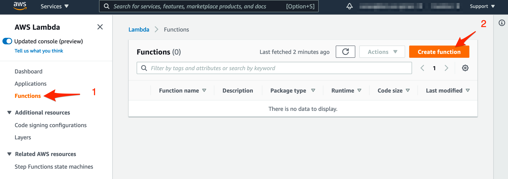
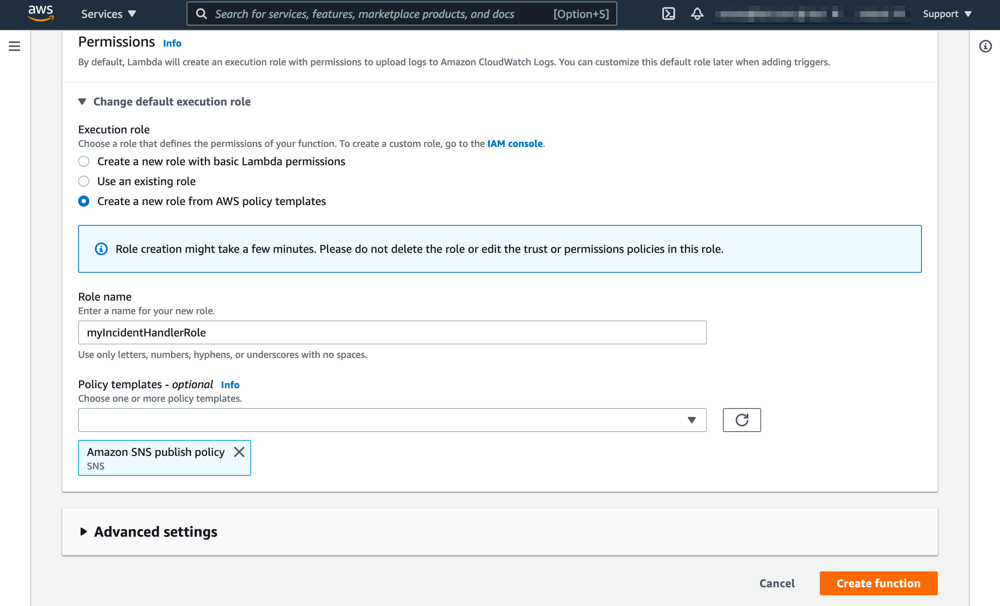
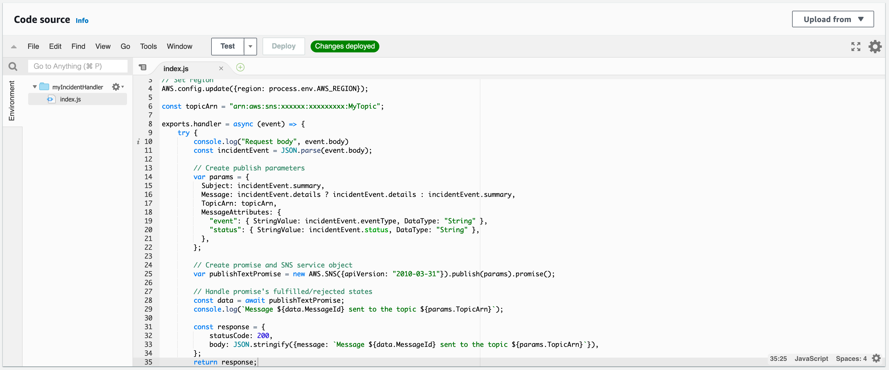

# Amazon SNS Outbound via AWS Lambda

[Amazon Simple Notification Service](https://aws.amazon.com/sns/) \(Amazon SNS\) is a fully managed messaging service for both application-to-application \(A2A\) and application-to-person \(A2P\) communication.

The A2A pub/sub functionality provides topics for high-throughput, push-based, many-to-many messaging between distributed systems, microservices, and event-driven serverless applications. Using Amazon SNS topics, your publisher systems can fanout messages to a large number of subscriber systems including Amazon SQS queues, AWS Lambda functions and HTTPS endpoints, for parallel processing, and Amazon Kinesis Data Firehose. The A2P functionality enables you to send messages to users at scale via SMS, mobile push, and email.

## In AWS Console <a id="in-aws-console"></a>

### Create a AWS Lambda function for Amazon SNS <a id="create-sns-topic-subscription"></a>


To set up the integration, you must have an Amazon SNS topic and the arn string for it.


1. Go to the AWS Console and then to **Amazon Lambda**, then click on the **Functions** link and on the **Create function** button**.**



2. On the next page, choose **Author from scratch**, name the function e.g. myIncidentHandler and scroll down


**3. In the Change** default execution role section, choose **Create a new role from AWS policy template**, name the new role e.g. myIncidentHandlerRole, in the **Policy templates** section, choose **Amazon SNS publish policy** and click on the **Create function** button



3. On the next page, change Code source as follows:

```javascript
// Load the AWS SDK for Node.js
var AWS = require('aws-sdk');
// Set region
AWS.config.update({region: process.env.AWS_REGION});

const topicArn = "arn:aws:sns:xxxxxxxxx:xxxxxxxxxx:MyTopic";

exports.handler = async (event) => {
    try {
        const incidentEvent = JSON.parse(event.body);
        
        // Create publish parameters
        var params = {
          Subject: incidentEvent.summary,
          Message: incidentEvent.details ? incidentEvent.details : incidentEvent.summary,
          TopicArn: topicArn,
          MessageAttributes: {
            "event": { StringValue: incidentEvent.eventType, DataType: "String" },
            "status": { StringValue: incidentEvent.status, DataType: "String" },
          },
        };
        
        // Create promise and SNS service object
        var publishTextPromise = new AWS.SNS({apiVersion: '2010-03-31'}).publish(params).promise();
        
        // Handle promise's fulfilled/rejected states
        const data = await publishTextPromise;
      
        const response = {
            statusCode: 200,
            body: JSON.stringify({message: `Message ${data.MessageId} sent to the topic ${params.TopicArn}`}),
        };
        return response;
    } catch(err) {
        const response = {
            statusCode: 500,
            body: JSON.stringify({message: err ? err.toString() : "An error occurred"}),
        };
        return response;
    }
};

```

4. Change the **topicArn** variable to the Amazon SNS topic arn and click on the **Deploy** button



5. In the **Function overview** section, click on the **Add trigger** button


6. On the next page, choose **API Gateway** as trigger type, in the **API** section choose **Create an API**, in the **API type** section choose **REST API**, in the **Security** section choose **API key** and click on the **Add** button


7. On the next page an **API endpoint** and an **API key** are generated. You will need this URL and key below when setting up the AWS Lambda connector in iLert.


## In iLert <a id="in-ilert"></a>

### Create the AWS Lambda Connector and link it to the alert source


**Admin permission required**

To set up the integration, you must have admin rights in iLert.


1. ****Click the gear icon and then click on the **Connectors** link


2. Click the **Add Connector** button


3. On the next page, choose **AWS Lambda** as type, name the connector, paste the **API key** that you generated in AWS Lambda and click on the **Save** button


4. Go to the alert sources tab and open the alert source whose incidents you want to publish to Amazon SNS. Click on the **Incident actions** tab and then on the **Add new incident action** button


6. On the next page choose **AWS Lambda** as the type, choose the connector created in step 3, name it, choose **Trigger mode,**  paste the **API URL** that you generated in AWS Lambda and click on the **Save** button.


7. Finished! Now an Amazon SNS notification will be created  for each incident in automatic trigger mode or via manual incident action.

