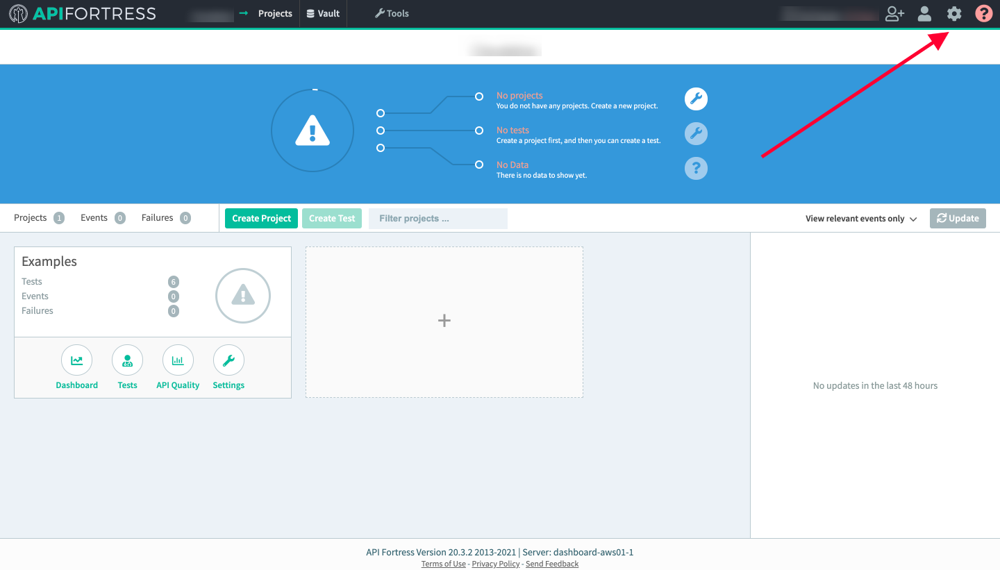
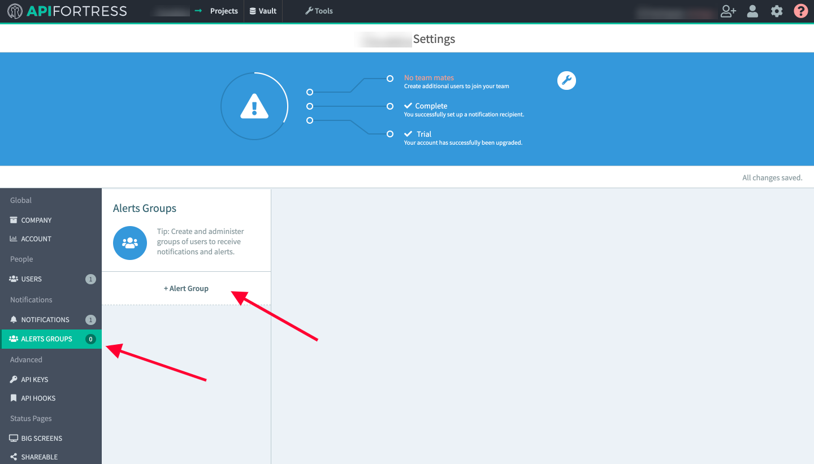
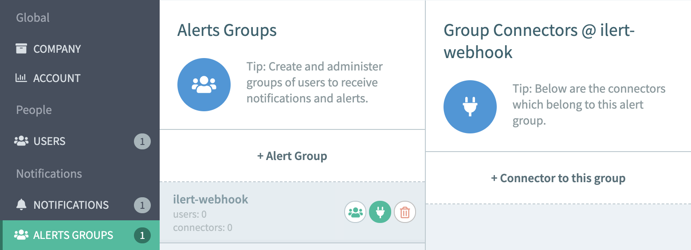
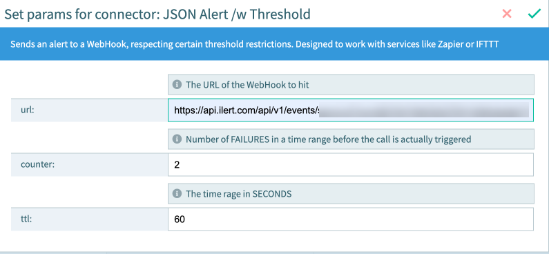
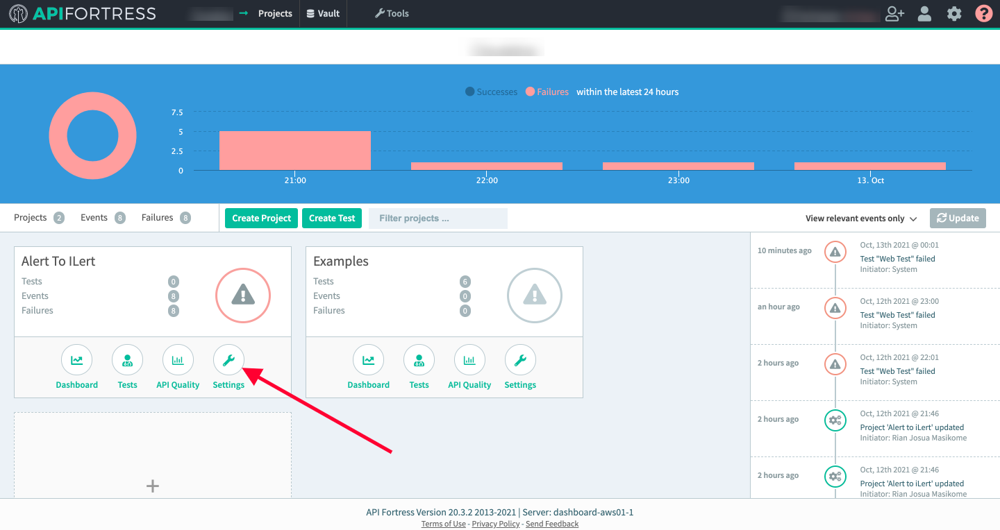
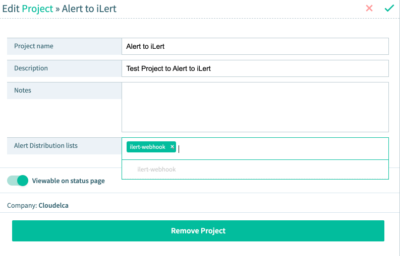

# API Fortress Integration

## In ilert

* Go to the "**Alert sources**" tab and click "**Create new alert source**"

.png>)

* Enter a name and select your desired escalation policy.  &#x20;
* Select "**API Fortress**" as the **Integration Type** and click **Save**.

* On the next page, an **API Fortress URL** is generated. You will need the URL for the webhook configuration

## In API Fortress

* Click the gear icon in the top right corner to access the settings menu&#x20;

* Navigate to "**Alert groups**" and create a new alert group if no Alert Group exists yet

* Click "**Socket icon**" -> "**+ Connector to this group**"

* Select "**JSON Alert**" or "**JSON Alert /w threshold**", in this case we chose "JSON Alert /w threshold"&#x20;

* Put the URL Settings based on the API Fortress URL that we've got earlier in ilert Dashboard

More Details for "JSON Alert /w threshold" configs

**URL:** Webhook URL

**Counter:** Number of error before the alert is sent out&#x20;

**TTL:** Time window in seconds before the alert is sent out (Ex. 2 errors counter over a time window of 60sec - 1 Minute)

* Save the Config and go back to main dashboard

* Click "**Settings**" on the project and assign the alert group&#x20;
* Upon meeting the alert criteria, JSON payload will be sent to the webhook URL, and Incident will be created in ilert
