# AppDynamics Integration

AppDynamics provides application performance management \(APM\) and IT operations analytics across cloud computing environments as well as inside the data center.

With ilert's AppDynamics integration, you can automatically create alerts in ilert based on custom thresholds from AppDynamics. That way, you will never miss a critical alert and always alert the right person using ilert's on-call schedules, automatic escalation, and multiple alerting channels. When a threshold in AppDynamics is exceeded, ilert will alert the on-call person through their preferred channel, including SMS, phone calls, push notifications and Slack. ilert will automatically escalate to the next person, if the alert is not acknowledged. ilert also lets you define alerting rules based on support hours and delay alerts until your support hours start.

## In ilert: create an AppDynamics alert source <a id="create-alert-source"></a>

1. Go to the "Alert sources" tab and click "Create new alert source"
2. Enter a name and select your desired escalation policy. Select "AppDynamics" as the **Integration Type**.

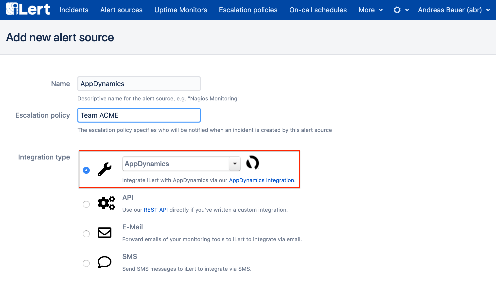

1. Click **Save**. You're going to need the alert source's API key in AppDynamics.  

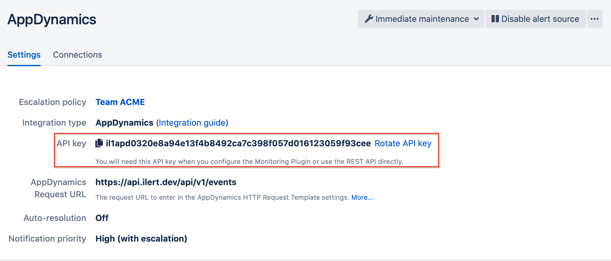

## In AppDynamics <a id="in-appdynammics"></a>

### Create HTTP Request Template

1. Go to **Alert & Respond** --&gt; **HTTP Request Templates** and click on **New** to add a new template  

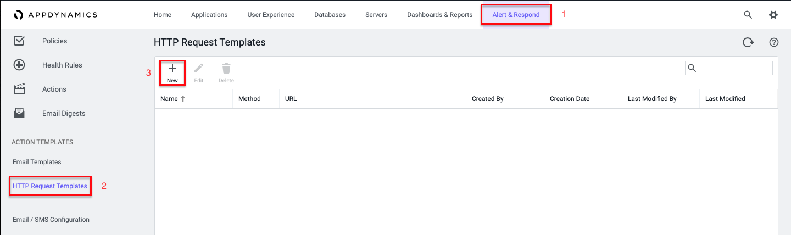

1. Give the template a name \(e.g. "ilert Notification"\) and add the following **Custom Templating Variables**:
2. `ilertApiKey` - set it to the alert sources's API key from above
3. `ilertEventType` - set it to `ALERT`
4. In the **Request URL** section, set the the **Method** to `POST` and the **Raw URL** to `https://api.ilert.com/api/v1/events`

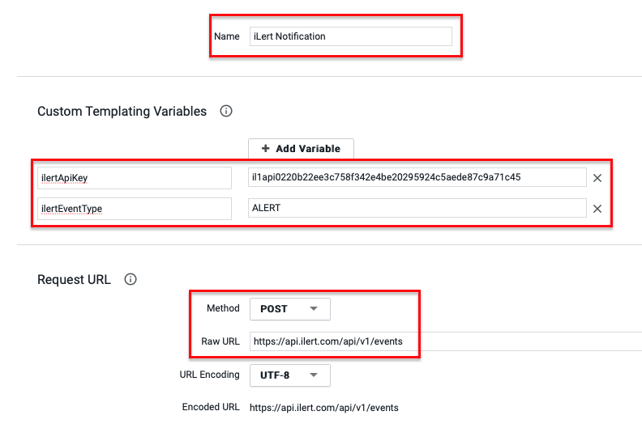

1. In the **Custom Request Headers** section, add the following header `Accept`: `application/json`
2. In the _Payload_ section, set the MIME type to `application/json` and copy and paste the following JSON payload:

```text
{
"apiKey": "${ilertApiKey}",
"eventType": "${ilertEventType}",
"incidentKey": "${latestEvent.node.name} - ${latestEvent.application.name}",
"summary": "${latestEvent.displayName} on ${latestEvent.node.name}"
}
}
```


1. In the **Response Handling Criteria** section, add the following **Success Criteria**

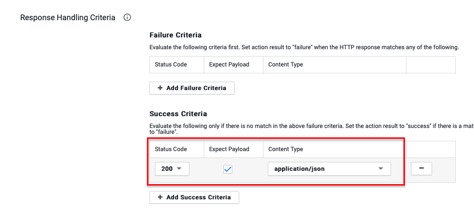

1. Under **Settings**, check **One Request Per Event** and click on **Save**

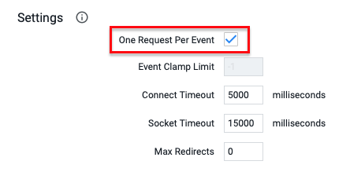

\*\*\*\*

### Test the HTTP Request Template

You can now test the template to make sure an alert is created in ilert.

1. Click the _Test_ button at the bottom of the page
2. Click _Add Event Type_ and select any event and then click _Run Test_.

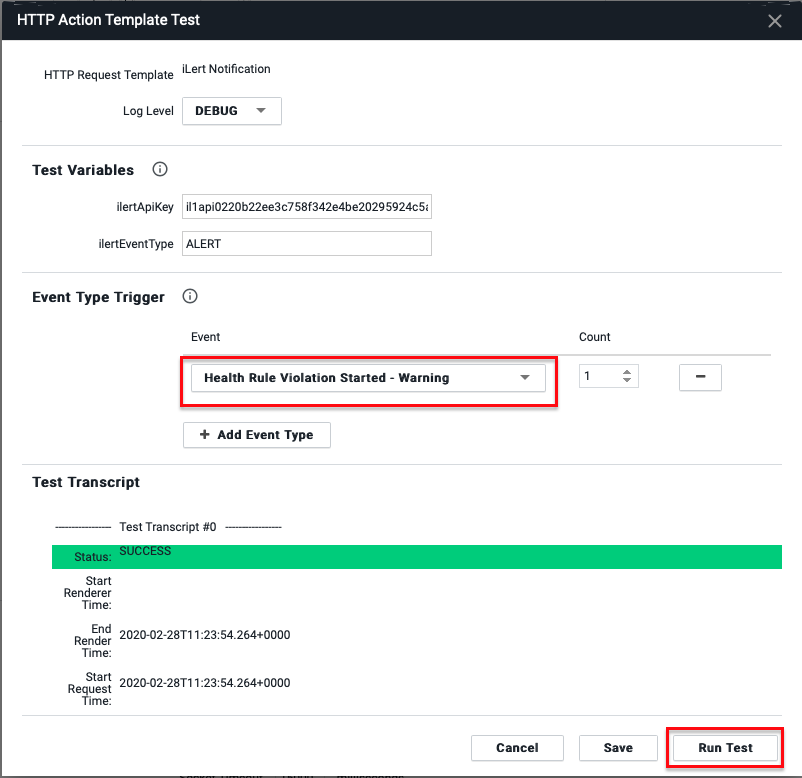

1. Go to ilert and check that an alert has been created by AppDynamics.

### Create action

1. Go to **Actions** in the left navigation menu, select an application, server or database to create the action for, and click **Create**

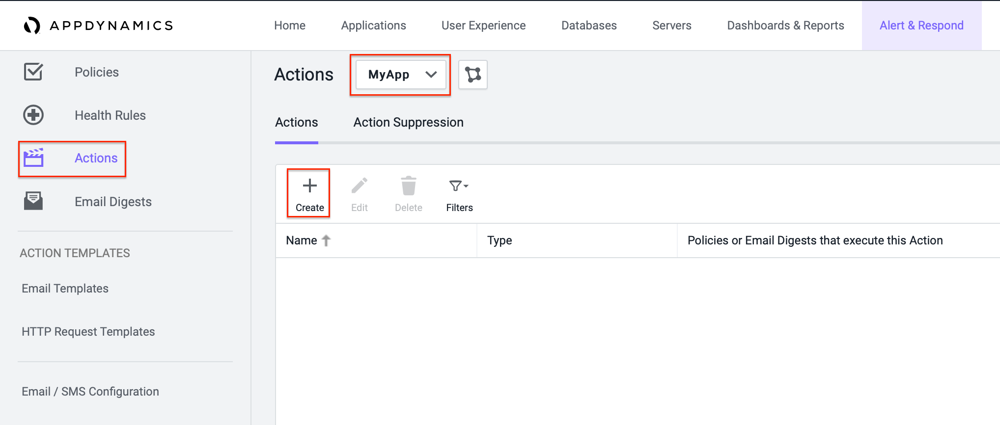

1. Select **HTTP Request** from the list and click **OK**.

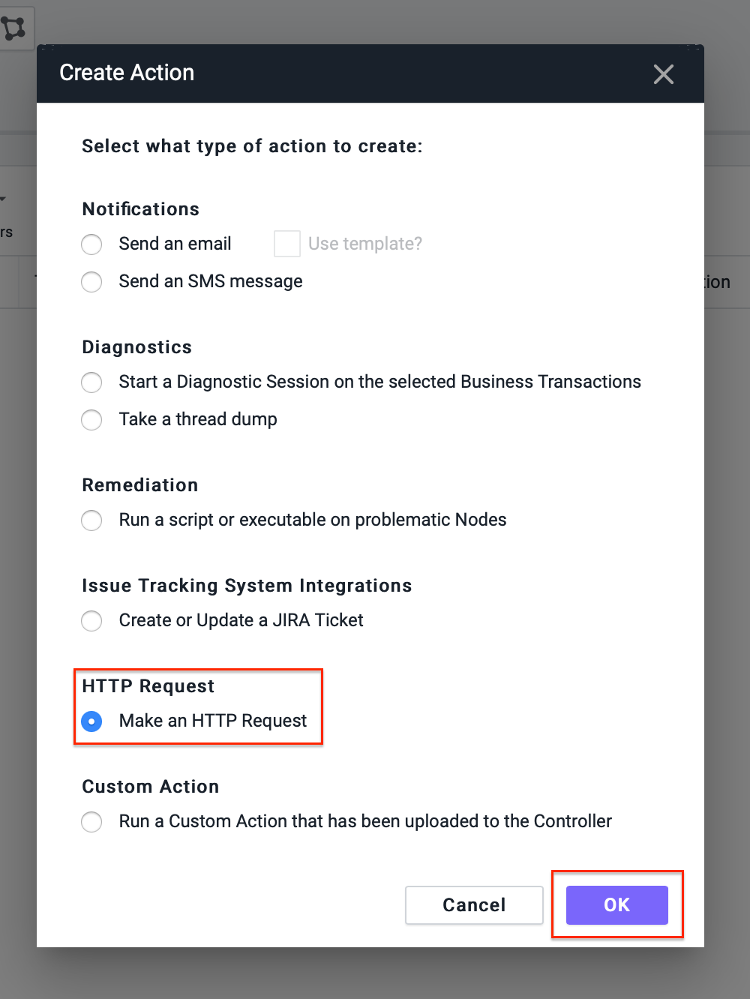

1. Give the action a name, e.g. "ilert Alert" and select the ilert **HTTP Request Template** from above and click on **Save**.

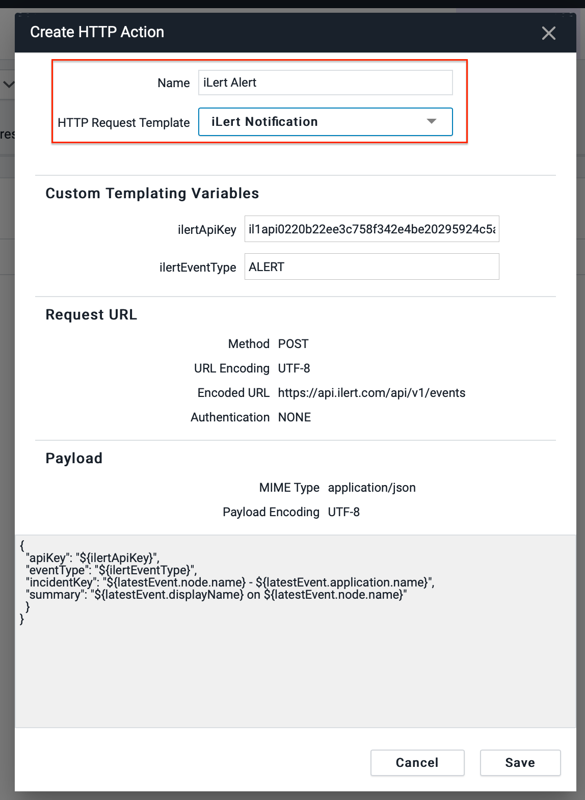

1. Create another action that will be used to resolve alerts in ilert. Give the action a name \(e.g. “ilert Resolve”\) and select the same HTTP template again. Change the `iLertEventType` from `ALERT` to `RESOLVE`, then click **Save**.

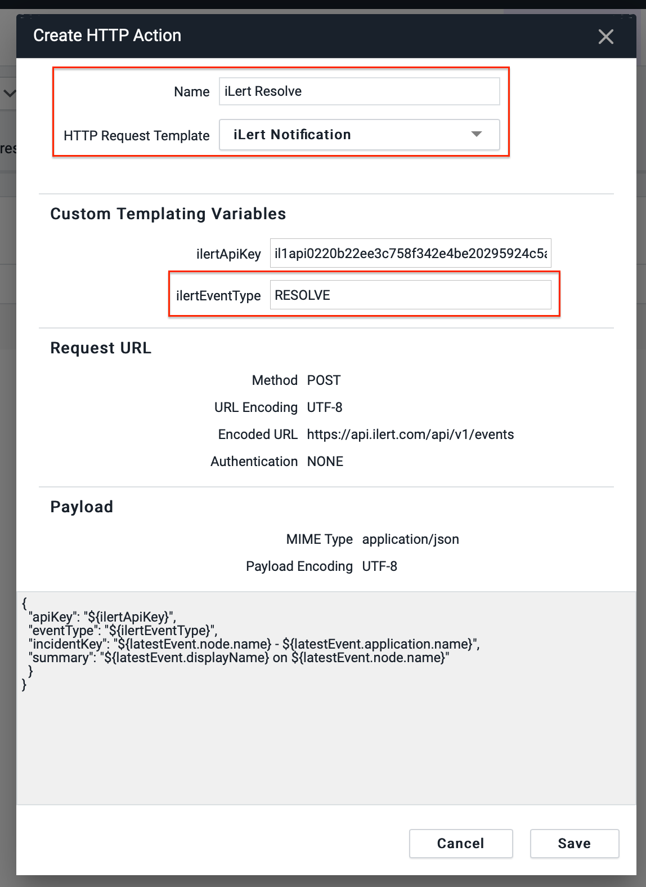

### Create policy

1. You can use the above actions in your policies. Go to **Policies** in the left navigation menu, select an application, server or database to create the policy for, and click **Create**

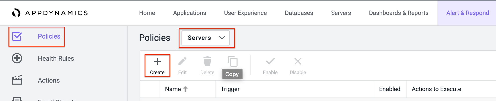

1. On the **Triggers** tab, create a new policy with the settings that should create alerts in ilert.

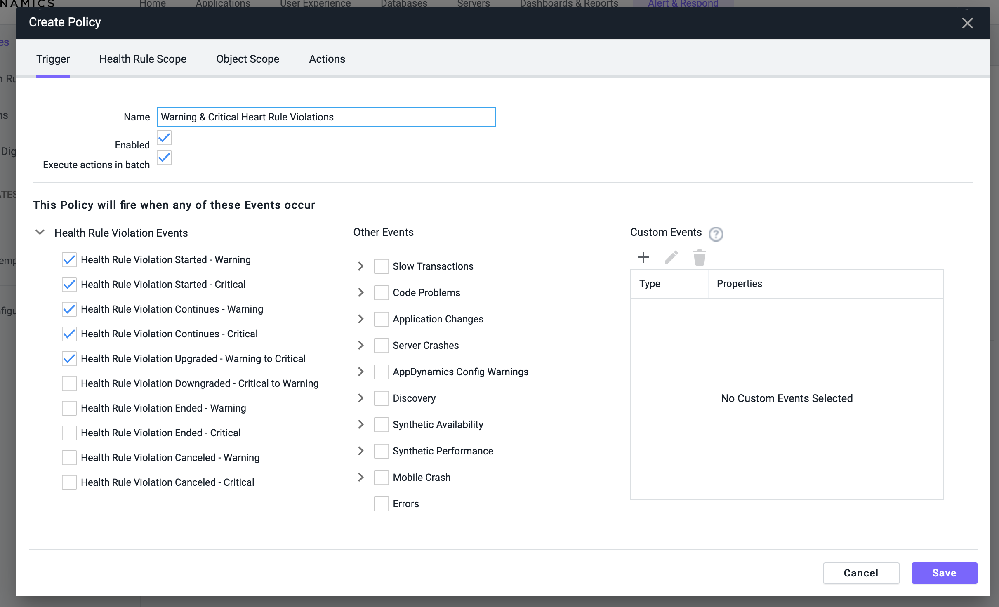

1. Switch to the **Actions** tab and add the **ilert Alert** that you've created above. Then, click on **Save**. 

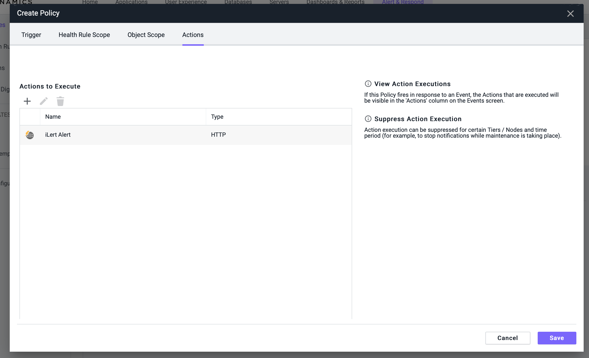

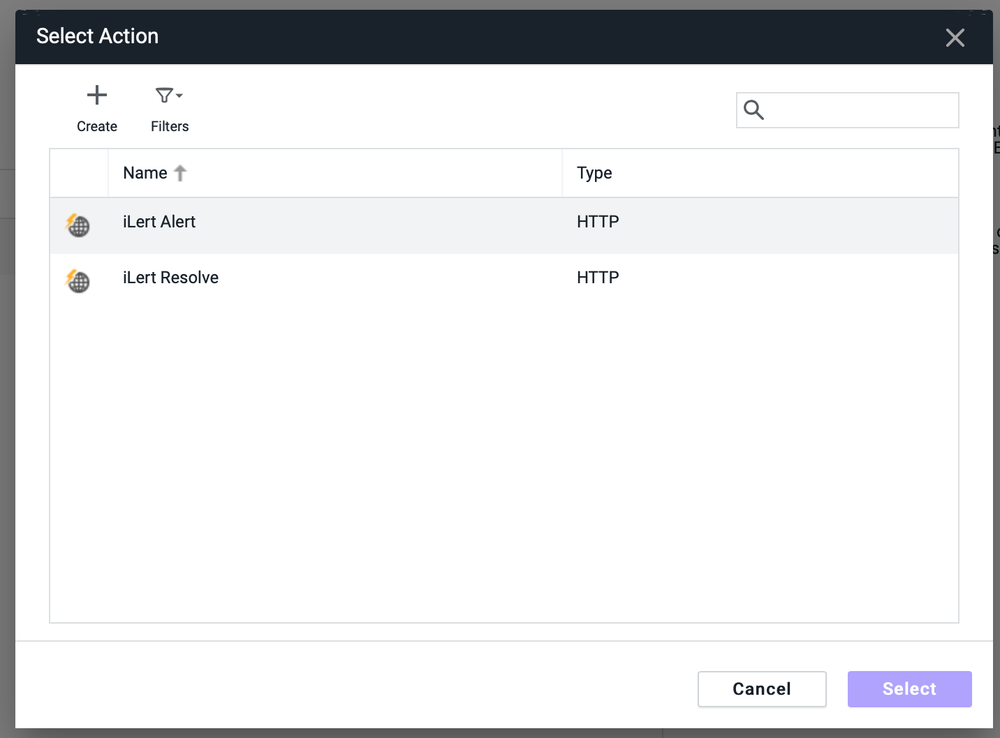

1. Now repeat the last 3 steps with your desired recovery conditions to have alerts in ilert close automatically when your application, server or database in AppDynamics recovers.

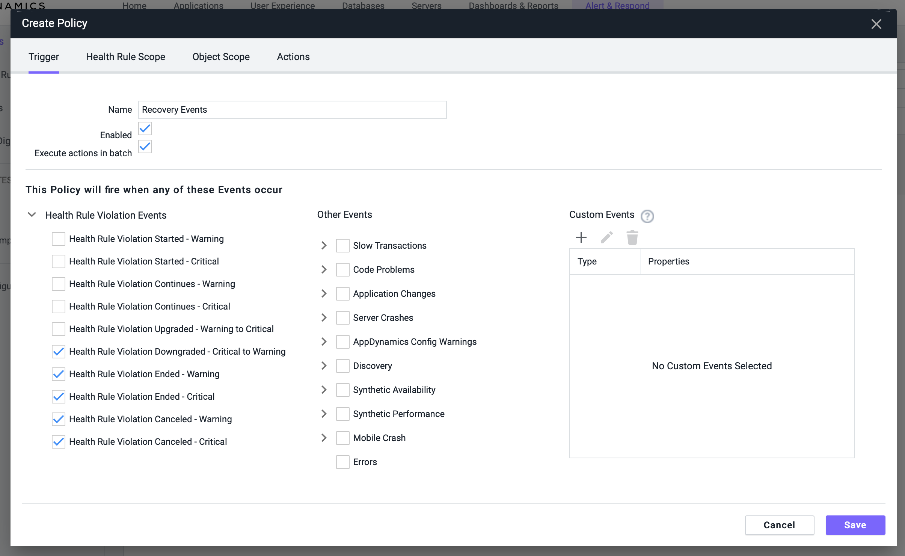

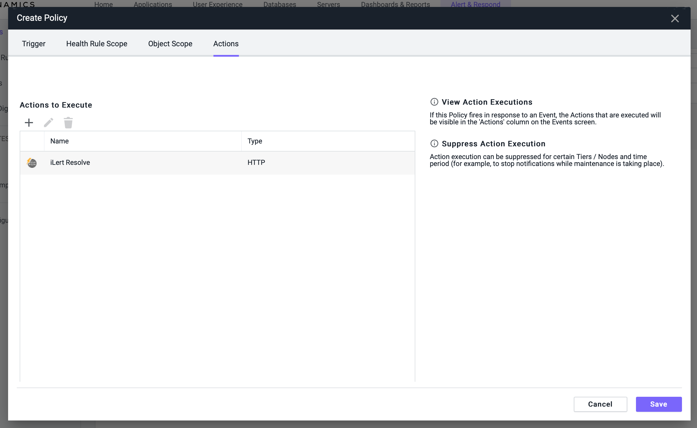

## FAQ <a id="faq"></a>

**Will alerts in ilert be resolved automatically?**

Yes, as soon as the recovery conditions of application, server or database are met, the alert in ilert will be resolved automatically.

**Can I use AppDynamics with multiple alert sources from ilert?**

Yes, you can create arbitrary mappings between your applications in AppDynamics and alert sources in ilert. Simply create additional actions in AppDynamics using the same HTTP Request Template with a different `ilertApiKey`.

**Can I customize the alert messages?**

Yes, you can customize the events sent to ilert by changing the JSON payload in the **Payload** section of the **HTTP Request Template**.

