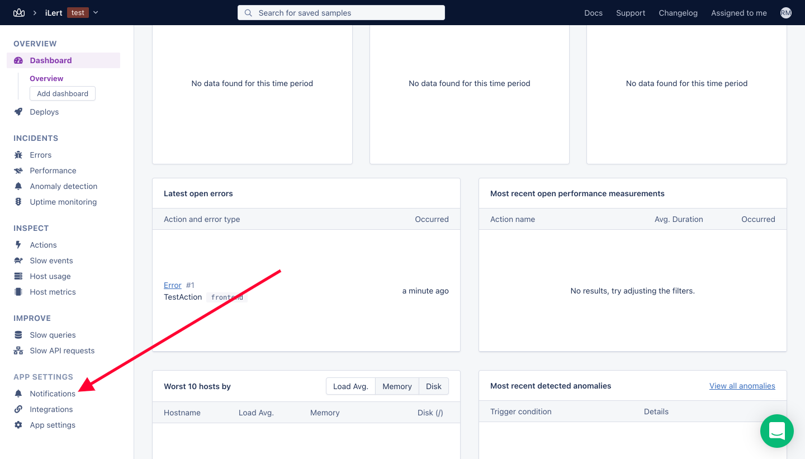
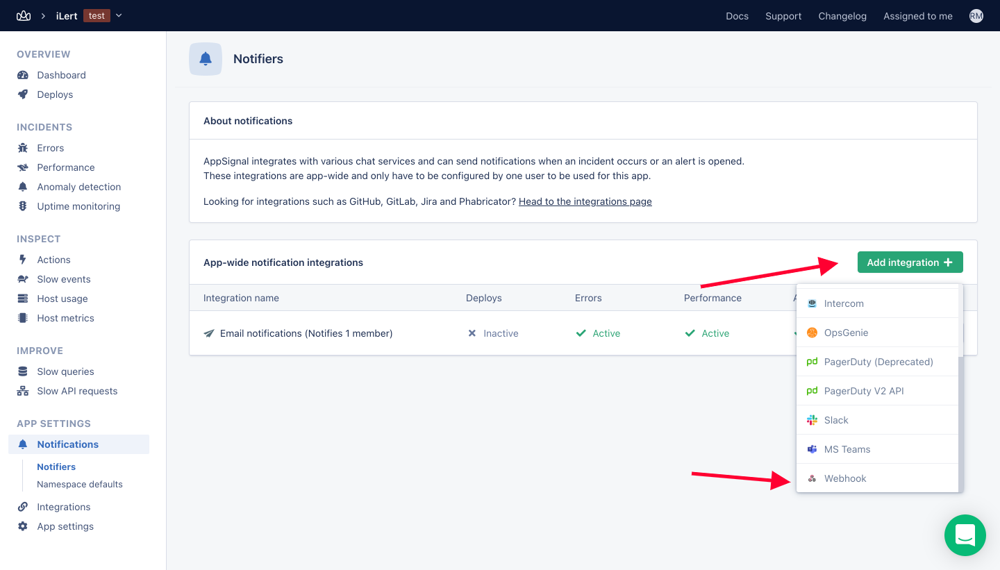
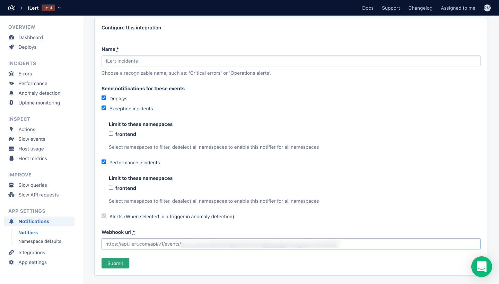

# AppSignal Integration

## In iLert

* Go to the "**Alert sources**" tab and click "**Create new alert source**"

.png>)

* Enter a name and select your desired escalation policy.  &#x20;
* Select "**AppSignal**" as the **Integration Type** and click **Save**.

* On the next page, an **AppSignal URL** is generated. You will need the URL for the webhook configuration

## In AppSignal

* Navigate to the "**App Settings**" -> "**Notifications**" on the left side of AppSignal Dashboard

* Create Webhook by clicking "**Add Integration**" -> "**Webhook**"  &#x20;

* You can check on the event that will create Incident on iLert, in this case we checked all, and put **AppSignal URL** that we got from iLert in "**Webhook url**"

* Upon the event trigger, for example Errors or Exception, incidents will be created on iLert's side.
* In order to trigger this test, the error needs to be sent to AppSignal, for more information please refer to [https://docs.appsignal.com/](https://docs.appsignal.com/)
