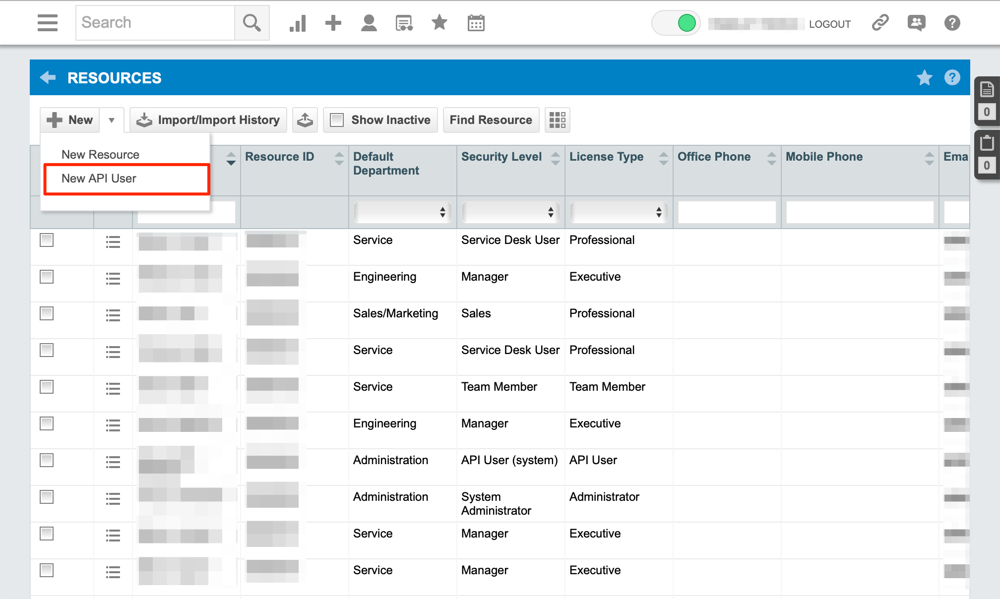
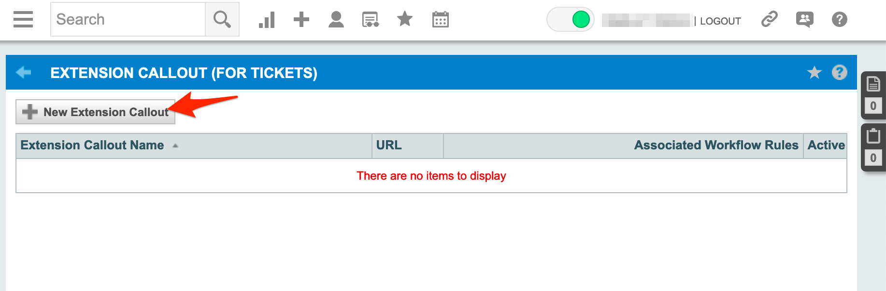
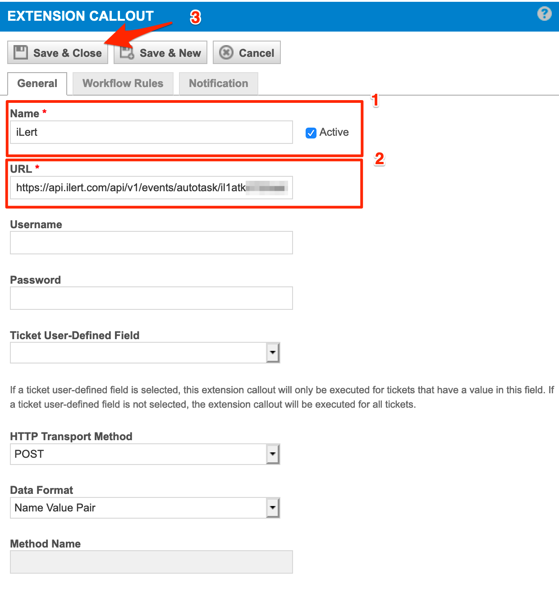
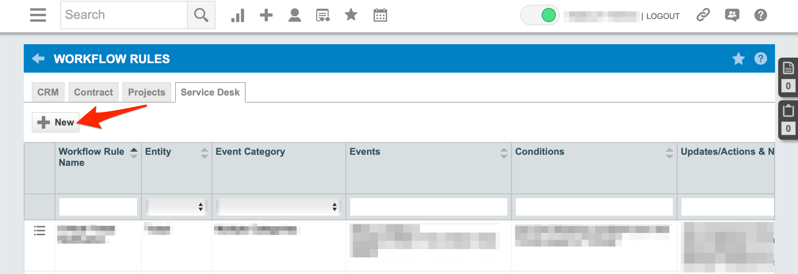
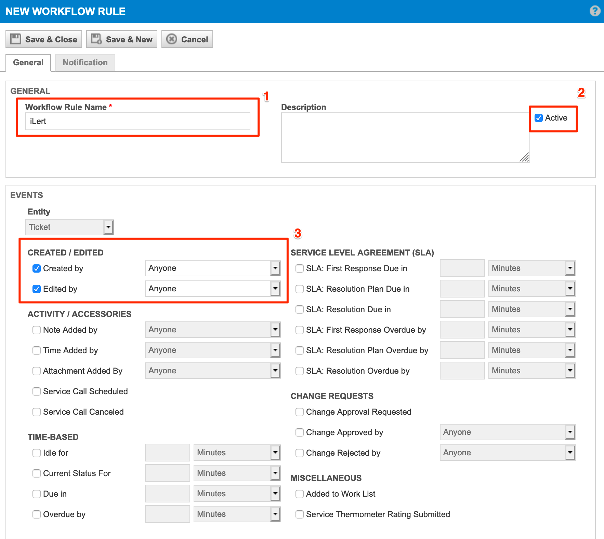

# Autotask Integration

With the iLert Autotask integration, you can create incidents in iLert based on alerts from Autotask.

## In Autotask: Create an API user 

1. Go to autotask and then to **Admin -> Resources (Users)**

2. Click the **New** button and then to the **New API User**

3. In the **First Name** section, enter a first name eg. iLert

4. In the **Last Name** section, enter a last name eg. API

5. In the **Email** section, enter a email eg. support@ilert.com

6. Click the **Generate key** button to generate a username and then the **Generate Secret** button to generate a password. You will need **Username**, **Secret** and **API Integration Code** below when setting up the alert source.

> Note: If you does not have the **API Integration Code** please contact Autotask support team.

7. In the **Integration Vendor** section, choose iLert or your custom internal integration

## In iLert: Create a Autotask alert source 

1. Go to the "Alert sources" tab and click "Create new alert source"

2. In the **Name** section, enter a name eg. iLert

3. In the **Integration Type** section, choose "Autotask"

4. In the **Autotask Settings -> Autotask Instance** section, choose your Autotask Server eg. America East 2 [14]

5. In the **Autotask Settings -> Username** section, paste the API user username generated above

6. In the **Autotask Settings -> Secret** section, paste the API user secret generated above

7. In the **Autotask Settings -> API Integration Code** section, enter your api code

8. select your desired escalation policy and click **Save** button

9. On the next page, a Webhook URL is generated. You will need this URL below when setting up the extension callout in Autotask.

## In Autotask: Create Extension Callout 

1. Go to autotask and then to **Admin -> Extensions & Integrations**

2. Click the **Other Extensions & Tools** panel and then click the **Extension Callout (Tickets)** link

3. Click the **New Extension Callout** button

4. In the **Name** section, enter a name eg. iLert

5. In the **URL** section, paste the **Webhook URL** that you generated in iLert

6. Ensure that the **Active** is selected and click the **Save & Close** button

## In Autotask: Create Workflow Rule 

1. Go to autotask and then to **Admin -> Workflow Rules**

2. Click the **New** button

3. In the **General -> Workflow Rule Name** section, enter a name eg. iLert

4. Ensure that the **Active** is selected

5. In the **Events -> CREATED/EDITED** section, activate the **Create by** and the **Edited by** fields and choose **Anyone**

7. Scroll down to the **Actions** panel and in the **Then Execute Extension Callout** section choose the **iLert Callout** that you create above

8. Click the **Save & Close** button

## FAQ 

**Will incidents in iLert be resolved automatically?**

Yes, as soon as the Autotask Ticket is completed, the incident in iLert will be resolved automatically.

**Can I connect Autotask with multiple alert sources from iLert?**

Yes, simply create more Extension Callouts in Autotask.

**Can I customize the incident messages?**

No.
