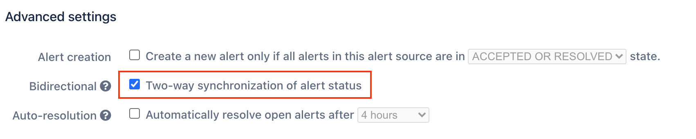

# Autotask Inbound Integration

With the iLert Autotask inbound integration, you can create alerts in iLert based on tickets from Autotask.

## In Autotask: Create an API user 

1. Sign in to Autotask and then go to **Admin -> Resources (Users)**

.png>)

1. Click the **New** button and then navigate to **New API User**

.png>)

1. In the **First Name** section, enter a first name eg. iLert
2. In the **Last Name** section, enter a last name eg. API
3. In the **Email** section, enter an email
4. Click the **Generate key** button to generate a username and then the **Generate Secret** button to generate a password. You will need **Username** and **Secret** below when setting up the alert source.
5. In the **Integration Vendor** section, choose iLert or your custom internal integration

.png>)

## In iLert: Create an Autotask alert source 

1. Go to the "Alert sources" tab and click on "Create new alert source"

.png>)

1. In the **Name** section, enter a name eg. iLert
2. In the **Integration Type** section, choose "Autotask"
3. In the **Autotask Settings -> Username** section, paste the API user username generated above
4. In the **Autotask Settings -> Secret** section, paste the API user secret generated above
5. select your desired escalation policy and click the **Save** button

.png>)

1. On the next page, a Webhook URL is generated. You will need this URL below when setting up the extension callout in Autotask.

.png>)

## In Autotask: Create Extension Callout 

1. Go to Autotask and then to **Admin -> Extensions & Integrations**

.png>)

1. Click the **Other Extensions & Tools** panel and then click on the **Extension Callout (Tickets)** link

.png>)

1. Click on **New Extension Callout**&#x20;

.png>)

1. In the **Name** section, enter a name eg. iLert
2. In the **URL** section, paste the **Webhook URL** that you generated in iLert
3. Ensure that **Active** is selected and click the **Save & Close** button

.png>)

## In Autotask: Create Workflow Rule 

1. Go to Autotask and then to **Admin -> Workflow Rules**

.png>)

1. Click the **New** button

.png>)

1. In the **General -> Workflow Rule Name** section, enter a name eg. iLert
2. Ensure that **Active** is selected
3. In the **Events -> CREATED/EDITED** section, activate the **Created by** and the **Edited by** fields and choose **Anyone**

.png>)

1. Scroll down to the **Actions** panel and in the **Then Execute Extension Callout** section choose the **iLert Callout** that you created above
2. Click on the **Save & Close** button

.png>)

## Autotask Alert Lifecycle

| **When Autotask creates a ticket with status ...**                                                                                                                                                                                                                                                                                                             | **... then an iLert alert ...**                                       |
| -------------------------------------------------------------------------------------------------------------------------------------------------------------------------------------------------------------------------------------------------------------------------------------------------------------------------------------------------------------- | --------------------------------------------------------------------- |
| 
<code>New</code> or <code>In Progress</code>
                                                                                                                                                                                                                                                                                                         | is created                                                            |
| 
<code>Complete</code> or 

<code>Denied</code> or

<code>Waiting Customer</code> or 

<code>Waiting Materials</code> or

<code>Scheduled</code> or 

<code>Escalate</code> or

<code>Waiting Vendor</code> or 

<code>Waiting Approva</code>l or

<code>Waiting Dispatch</code> or 

<code>Approved</code>
 | 
will not be created and a

400 (bad request) error occurs
 |
| any other status                                                                                                                                                                                                                                                                                                                                               | is created                                                            |

| **When Autotask updates a ticket with status ...**                                                                                                                                                                                                                                                                                                             | .**.. and the iLert alert ...** | **... then the/an iLert alert ...**                                   |
| -------------------------------------------------------------------------------------------------------------------------------------------------------------------------------------------------------------------------------------------------------------------------------------------------------------------------------------------------------------- | ------------------------------- | --------------------------------------------------------------------- |
| 
<code>New</code> or <code>In Progress</code>
                                                                                                                                                                                                                                                                                                         | does not exist                  | is created                                                            |
| 
<code>Complete</code> or 

<code>Denied</code> or

<code>Waiting Customer</code> or 

<code>Waiting Materials</code> or

<code>Scheduled</code> or 

<code>Escalate</code> or

<code>Waiting Vendor</code> or 

<code>Waiting Approva</code>l or

<code>Waiting Dispatch</code> or 

<code>Approved</code>
 | does not exist                  | 
will not be created and a

400 (bad request) error occurs
 |
| any other                                                                                                                                                                                                                                                                                                                                                      | does not exist                  | is created                                                            |
| `New`                                                                                                                                                                                                                                                                                                                                                          | exists                          | doesn't change                                                        |
| 
<code>Complete</code> or 

<code>Denied</code>
                                                                                                                                                                                                                                                                                                     | exists                          | change status to **Resolved** if not already resolved                 |
| 
<code>Waiting Customer</code> or 

<code>In Progress</code> or

<code>Waiting Materials</code> or 

<code>Scheduled</code> or

<code>Escalate</code> or 

<code>Waiting Vendor</code> or

<code>Waiting Approval</code> or

<code>Waiting Dispatch</code> or 

<code>Approved</code>
                            | exists                          | change status to **Accepted** if not already accepted                 |
| any other status                                                                                                                                                                                                                                                                                                                                               | exists                          | doesn't change                                                        |

## Mapping Autotask ticket priority to iLert alert priority

| Autotask ticket priority                      | iLert alert priority  |
| --------------------------------------------- | --------------------- |
| 1 - Low                                       | Low                   |
| 
2 - High 3 - Medium 4 - Critical
 | High                  |

## Bidirectional alert synchronisation

When providing credentials you may choose to activate bidirectional mode on the Autotask ticket source. This will cause your alert source to be automatically linked with an outbound connector and alert action. This way status changes to iLert alerts will synchronize to Autotask ticket.

<figure><figcaption></figcaption></figure>

When saving the Autotask alert source with bidirectional setting enabled, it will automatically create an outbound connector for you and take you to the creation page of the necessary alert action, please make sure to continue with the setup of the action to finish your bidirectional alert source setup.

## FAQ 

**Will alerts in iLert be resolved automatically?**

Yes, as soon as an Autotask Ticket is completed, the alert in iLert will be resolved automatically.

**Can I connect Autotask with multiple alert sources from iLert?**

Yes, simply create more Extension Callouts in Autotask.

**Can I customize the alert messages?**

No.
