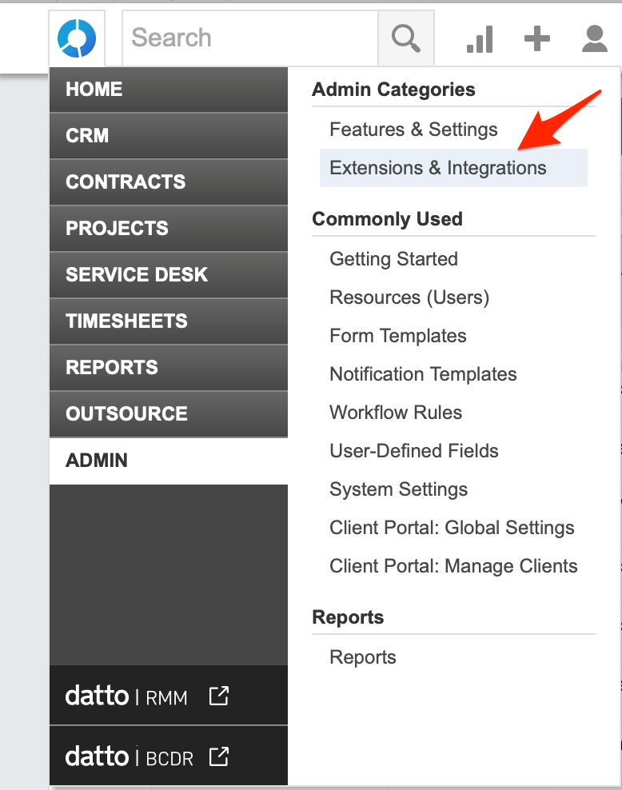

# Autotask Inbound Integration

With the iLert Autotask inbound integration, you can create incidents in iLert based on tickets from Autotask.

## In Autotask: Create an API user 

1. Sign in to Autotask and then go to **Admin -&gt; Resources \(Users\)**

1. Click the **New** button and then navigate to **New API User**

1. In the **First Name** section, enter a first name eg. iLert
2. In the **Last Name** section, enter a last name eg. API
3. In the **Email** section, enter an email
4. Click the **Generate key** button to generate a username and then the **Generate Secret** button to generate a password. You will need **Username** and **Secret** below when setting up the alert source.
5. In the **Integration Vendor** section, choose iLert or your custom internal integration

## In iLert: Create an Autotask alert source 

1. Go to the "Alert sources" tab and click on "Create new alert source"

1. In the **Name** section, enter a name eg. iLert
2. In the **Integration Type** section, choose "Autotask"
3. In the **Autotask Settings -&gt; Username** section, paste the API user username generated above
4. In the **Autotask Settings -&gt; Secret** section, paste the API user secret generated above
5. select your desired escalation policy and click the **Save** button

1. On the next page, a Webhook URL is generated. You will need this URL below when setting up the extension callout in Autotask.

## In Autotask: Create Extension Callout 

1. Go to Autotask and then to **Admin -&gt; Extensions & Integrations**

1. Click the **Other Extensions & Tools** panel and then click on the **Extension Callout \(Tickets\)** link

1. Click on **New Extension Callout** 

1. In the **Name** section, enter a name eg. iLert
2. In the **URL** section, paste the **Webhook URL** that you generated in iLert
3. Ensure that **Active** is selected and click the **Save & Close** button

## In Autotask: Create Workflow Rule 

1. Go to Autotask and then to **Admin -&gt; Workflow Rules**

1. Click the **New** button

1. In the **General -&gt; Workflow Rule Name** section, enter a name eg. iLert
2. Ensure that **Active** is selected
3. In the **Events -&gt; CREATED/EDITED** section, activate the **Created by** and the **Edited by** fields and choose **Anyone**

1. Scroll down to the **Actions** panel and in the **Then Execute Extension Callout** section choose the **iLert Callout** that you created above
2. Click on the **Save & Close** button

## Autotask Incident Lifecycle

<table>
  <thead>
    <tr>
      <th style="text-align:left">When I create an Autotask ticket with status...</th>
      <th style="text-align:left">...then an iLert Incident...</th>
    </tr>
  </thead>
  <tbody>
    <tr>
      <td style="text-align:left"><b>New</b>
      </td>
      <td style="text-align:left">is created</td>
    </tr>
    <tr>
      <td style="text-align:left"><b>In Progress</b>
      </td>
      <td style="text-align:left">is created</td>
    </tr>
    <tr>
      <td style="text-align:left">Any other</td>
      <td style="text-align:left">is created</td>
    </tr>
    <tr>
      <td style="text-align:left"><b>Complete</b> or <b>Denied</b>
      </td>
      <td style="text-align:left">
        
will not be created and a

        
400 (bad request) error occurs

      </td>
    </tr>
    <tr>
      <td style="text-align:left">
        
<b>Waiting Customer</b> or <b>Waiting Materials </b>or<b> </b>
        

        
<b>Scheduled </b>or<b> Escalate</b> or

        
<b>Waiting Vendor</b> or <b>Waiting Approval</b> or

        
<b>Waiting Dispatch</b> or <b>Approved</b>
        

      </td>
      <td style="text-align:left">
        
will not be created and a

        
400 (bad request) error occurs

      </td>
    </tr>
  </tbody>
</table>

<table>
  <thead>
    <tr>
      <th style="text-align:left">When I update an Autotask ticket with status...</th>
      <th style="text-align:left">...and the<b> </b>iLert incident...</th>
      <th style="text-align:left">...then the/an iLert Incident...</th>
    </tr>
  </thead>
  <tbody>
    <tr>
      <td style="text-align:left"><b>New</b>
      </td>
      <td style="text-align:left">does not exist</td>
      <td style="text-align:left">is created</td>
    </tr>
    <tr>
      <td style="text-align:left"><b>Complete</b> or <b>Denied</b>
      </td>
      <td style="text-align:left">does not exist</td>
      <td style="text-align:left">
        
will not be created and a

        
400 (bad request) error occurs

      </td>
    </tr>
    <tr>
      <td style="text-align:left">
        
<b>Waiting Customer</b> or <b>Waiting Materials </b>or<b> </b>
        

        
<b>Scheduled </b>or<b> Escalate</b> or

        
<b>Waiting Vendor</b> or <b>Waiting Approval</b> or

        
<b>Waiting Dispatch</b> or <b>Approved</b>
        

      </td>
      <td style="text-align:left">does not exist</td>
      <td style="text-align:left">
        
will not be created and a

        
400 (bad request) error occurs

      </td>
    </tr>
    <tr>
      <td style="text-align:left"><b>In Progress</b>
      </td>
      <td style="text-align:left">does not exist</td>
      <td style="text-align:left">is created</td>
    </tr>
    <tr>
      <td style="text-align:left">Any other</td>
      <td style="text-align:left">does not exist</td>
      <td style="text-align:left">is created</td>
    </tr>
    <tr>
      <td style="text-align:left"><b>New</b>
      </td>
      <td style="text-align:left">exists</td>
      <td style="text-align:left">doesn&apos;t change</td>
    </tr>
    <tr>
      <td style="text-align:left"><b>Complete</b> or <b>Denied</b>
      </td>
      <td style="text-align:left">exists</td>
      <td style="text-align:left">change status to <b>Resolved</b> if not already resolved</td>
    </tr>
    <tr>
      <td style="text-align:left">
        
<b>Waiting Customer</b> or <b>In Progress</b> or

        
<b>Waiting Materials </b>or<b> Scheduled </b>or<b> </b>
        

        
<b>Escalate</b> or <b>Waiting Vendor</b> or

        
<b>Waiting Approval</b> or

        
<b>Waiting Dispatch</b> or <b>Approved</b>
        

      </td>
      <td style="text-align:left">exists</td>
      <td style="text-align:left">change status to <b>Accepted</b> if not already accepted</td>
    </tr>
    <tr>
      <td style="text-align:left">Any other</td>
      <td style="text-align:left">exists</td>
      <td style="text-align:left">doesn&apos;t change</td>
    </tr>
  </tbody>
</table>

## FAQ 

**Will incidents in iLert be resolved automatically?**

Yes, as soon as an Autotask Ticket is completed, the incident in iLert will be resolved automatically.

**Can I connect Autotask with multiple alert sources from iLert?**

Yes, simply create more Extension Callouts in Autotask.

**Can I customize the incident messages?**

No.

