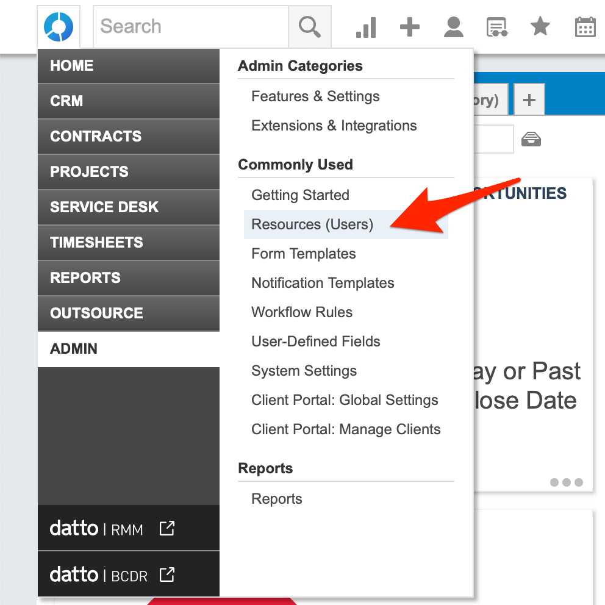

# Autotask Outbound Integration

[Datto’s Autotask](https://www.datto.com/products/autotask-psa) Professional Services Automation \(PSA\) is a powerful and intuitive cloud-based PSA platform providing a singular view of the entire business - enabling MSPs to centralize business operations and make data-driven decisions to improve service, productivity and profitability.

## In Autotask 

### Create an API user

1. Sign in to Autotask and then go to **Admin -&gt; Resources \(Users\)**

1. Click the **New** button and then navigate to **New API User**

1. In the **First Name** section, enter a first name eg. iLert
2. In the **Last Name** section, enter a last name eg. API
3. In the **Email** section, enter an email
4. Click the **Generate key** button to generate a username and then the **Generate Secret** button to generate a password. You will need **Username** and **Secret** below when setting up the connector.
5. In the **Integration Vendor** section, choose iLert or your custom internal integration

## In iLert

### Create a Autotask Connector and Link to alert source

1. Click on the gear icon and then on **Connectors** button

2. Click on **Add Connector**

3. Select **Autotask** as **type** and fill in all fields. Enter a name and the username/password pair that you created in the last step.

4. Go to the alert sources tab and open the alert source whose incidents you want to publish in Autotask. Click on **Incident actions** and then on **Create incident action**.

5. Select **Autotask** as the **type**, select the connector created in step 3, fill in all fields. In the **Label** field, specify the incident action name.

6. Finished! You can now test the incident action by clicking on the button **Test this connection**. Then a test ticket will be created in Autotask.

## FAQ 

**Are updates to an incident published in Autotask?**

Yes.

**Can Autotask alert sources use Autotask connections?**

No, please create a different alert source.

\*\*\*\*

