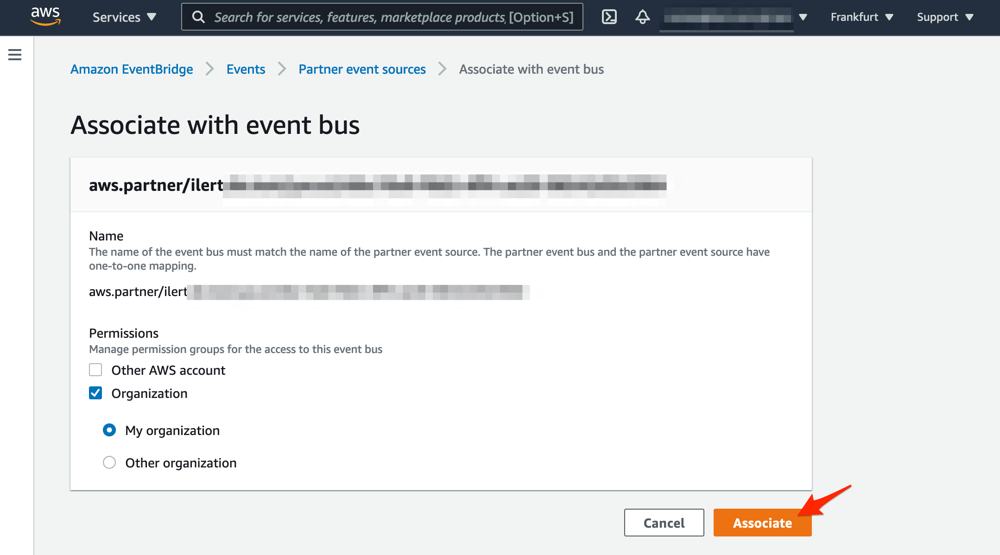

# Amazon EventBridge Integration

[Amazon EventBridge](https://aws.amazon.com/eventbridge/) is a serverless event bus that makes it easier to build event-driven applications at scale using events generated from your applications, integrated Software-as-a-Service \(SaaS\) applications, and AWS services.

## In iLert 

### Create the Amazon EventBridge Incident Action

1. ****Go to the alert sources tab and open the alert source whose incidents you want to publish to Amazon EventBridge. Click on the **Incident actions** tab and then on the **Add new incident action** button

2. On the next page choose **Amazon EventBridge** as the type, name it, choose **Trigger mode**, enter your AWS **account ID**, choose AWS **region** and click on the **Save** button.

## In AWS Console 

### Create an Amazon EventBridge event source 

1. Go to the AWS Console and then to **Amazon EventBridge**, then click on the **Partner event sources** link and on the **Event Source** that you created in the previous step**.**

2. On the next page, click on the **Associate with event bus** button

3. On the next page in the permissions section, choose **Organization** and **My organization** - ****then click on the **Associate** button

4. To finished the configuration, you need to create a rule for the new event bus e.g. a rule for Amazon SQS. To do that, go to the **EventBridge Rules,** choose the **Event bus** and click on the **Create rule** button

5. On the next page in the **New and description** section, name the rule, e.g. my-rule and scroll down

6. In the **Define pattern** section, choose **Pre-defined pattern by service**, in the **Service provider** section choose **All Events** and scroll down

7. In the **Select targets** section, choose **SQS queue** as target type and choose your queue, then scroll down and click on the **Create** button

7. Finished! Now an Amazon EventBridge notification will be created for each incident that is created to the linked alert source in iLert.

## FAQ 

**Can I link multiple Amazon EventBridge sources to an iLert account?**

Yes.

**Can I choose which updates to an incident will be published in Amazon EventBridge?**

Yes.

**How can I remove the Partner Event Source?**

The partner event source will be automatically removed with the incident action.

##  

