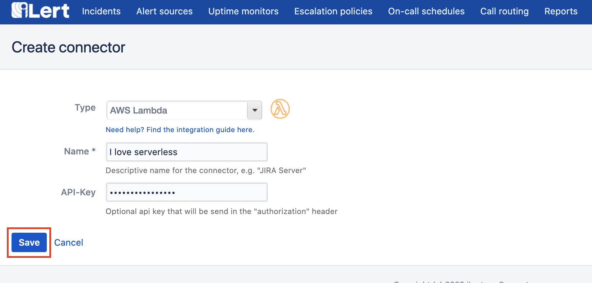
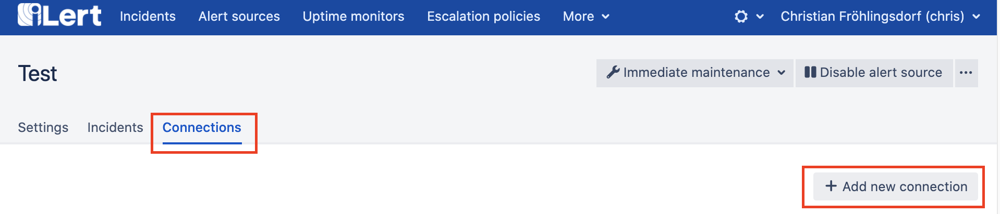

# AWS Lambda Integration

Beforehand make sure that you have created an AWS lambda function in your AWS project and got its public `URL` handy. You might also create an additional authorization value e.g. a secure random string that you are evaluating in the HTTP request `Authorization` header when you function is invoked by iLert, we acutally suggest using this.

## Create the connector 

Go to the connectors tab of your account.

And create a new connector. Choose AWS lambda as type \(you may add the additional `Authorization` parameter as stated in the beginning of this doc.\)

Click on save to save the connector.

## Create the connection 

Visit the alert source \(view\) whose incidents should trigger your serverless function. Navigate to the connections tab and create a new connection.

Choose AWS lambda as type and select your previously created connector. Enter a name and the url targeting your public function. You may also customize the HTTP request body that is used to invoke your function.

Click on save to create the connection, you may test the connection in the following screen.

