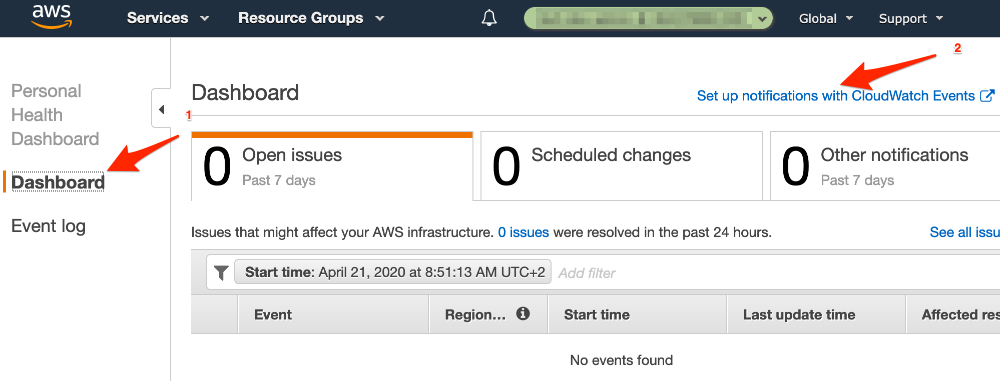

# AWS Personal Health Dashboard Integration

[AWS Personal Health Dashboard](https://aws.amazon.com/premiumsupport/technology/personal-health-dashboard/) provides alerts and remediation guidance when AWS is experiencing events that may impact you.

With ilert's AWS Personal Health Dashboard integration, you can automatically create alerts in ilert from problems in AWS Personal Health Dashboard. That way, you will never miss a critical alert and always alert the right person using ilert's on-call schedules, automatic escalation, and multiple alerting channels. When AWS Personal Health Dashboard reports an issue, ilert will alert the on-call person through their preferred channel, including SMS, phone calls, push notifications and Slack. ilert will automatically escalate to the next person, if the alert is not acknowledged. ilert also lets you define alerting rules based on support hours and delay alerts until your support hours start.

## In ilert: Create an AWS Personal Health Dashboard alert source 

1.  Go to **Alert sources** --> **Alert sources** and click on **Create new alert source**

    <figure><figcaption></figcaption></figure>
2.  Search for **AWS Personal Health Dashboard** in the search field, click on the AWS Personal Health Dashboard tile and click on **Next**.

    <figure><figcaption></figcaption></figure>
3. Give your alert source a name, optionally assign teams and click **Next**.
4.  Select an **escalation policy** by creating a new one or assigning an existing one.

    <figure><figcaption></figcaption></figure>
5.  Select you [Alert grouping](https://docs.ilert.com/alerting/alert-sources#alert-grouping) preference and click **Continue setup**. You may click **Do not group alerts** for now and change it later.

    <figure><figcaption></figcaption></figure>
6. The next page show additional settings such as customer alert templates or notification prioritiy. Click on **Finish setup** for now.
7.  On the final page, an API key and / or webhook URL will be generated that you will need later in this guide.​

    <figure><figcaption></figcaption></figure>

## In AWS: Create a SNS topic

> If you have already created an SNS topic for your AWS Personal Health Dashboard that you want to reuse, you can proceed to step 3.

1. In the SNS Dashboard click on **Create topic**

2. Name the topic and click on **Create topic**

3. Click on **Create subscription** on the Topic Detail page

4. In the **Topic ARN** section, ensure that the **SNS Topic** that you generated is selected
5. In the **Protocol** section, choose the **HTTPS** protocol
6. In the **Endpoint** section, paste the **Webhook URL** that you generated in ilert
7. In the **Enable raw message delivery** section, ensure that the checkbox is unchecked
8. Click on **Create subscription**

9. The subscription is **automatically confirmed by ilert** when it is created. After updating the overview, the status "PendingConfirmation" should disappear, and the ID should be displayed.

### Personal Health Dashboard: Create rule and link to topic 

You can now link any AWS Personal Health Dashboard rule to the topic you have created. The following section describes how to create a rule and make the link.

1. In AWS, click on **Alerts** icon and select **View all alerts**

2. In the AWS Personal Health Dashboard click on **Dashboard** and then click on **Set up notifications with CloudWatch Events** to add a rule

3. In the **Event Source** section, choose the **Event Pattern**
4. In the **Service Name** section, choose the **Health** service
5. In the **Event Type** section, choose the **Specific Health events** service
6. In the next section, choose **Any service** to receive an health update for each AWS service or choose **Specific service(s)** and select a service that interests you
7. In the **Targets** section, choose the **SNS Topic** and select the SNS topic that you generated before
8. Click on the **Configure details** button

9. On the next page in the **Name** section, enter a name for the rule
10. Click on the **Create rule** button

## FAQ 

**Will alerts in ilert be resolved automatically?**

Yes, as soon as the Personal Health Issue is solved in AWS, the alert in ilert will be closed.

**Can I link AWS Personal Health Dashboard to multiple alert sources in ilert?**

Yes, create an SNS topic subscription in AWS for each alert source.
