# AWS Personal Health Dashboard Integration

AWS Personal Health Dashboard provides alerts and remediation guidance when AWS is experiencing events that may impact you.

With iLert AWS Personal Health Dashboard Integration, you can receive AWS Personal Health Dashboard issues through iLert and easily extend AWS Personal Health Dashboard functionality with SMS, push, voice, and iLert on-call schedules.

## In iLert 

### Create AWS Personal Health Dashboard alert source 

1. Go to the "Alert sources" tab and click "Create new alert source"

2. Enter a name and select your desired escalation policy. Select "AWS Personal Health Dashboard" as the **Integration Type** and click on **Save**.

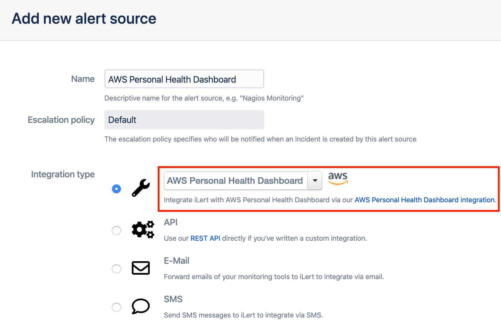

3. On the next page, a **Webhook URL** is generated. You will need this URL below when setting up the SNS topic subscription in AWS.

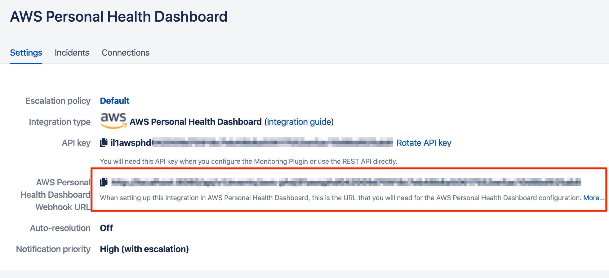

## In AWS

### Create an SNS topic 

> If you have already created an SNS topic for your AWS Personal Health Dashboard that you want to reuse, you can proceed to step 3.

1. In the SNS Dashboard click on **Create topic**

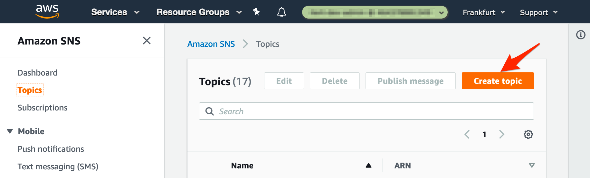

2. Name the topic and click on **Create topic**

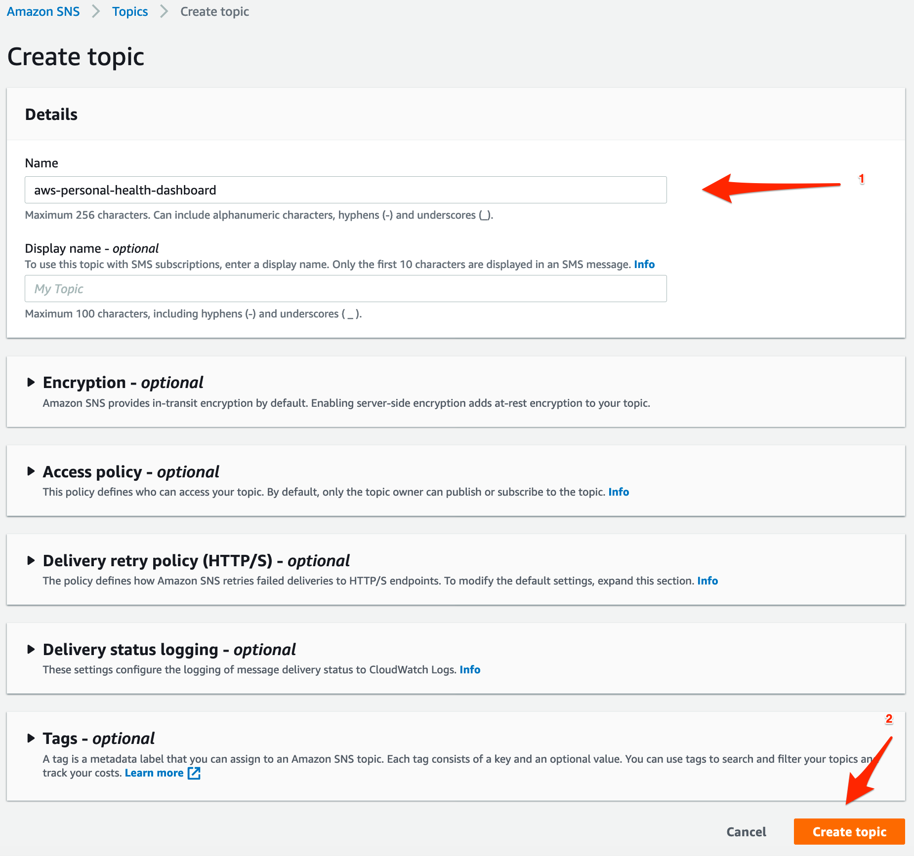

3. Click on **Create subscription** on the Topic Detail page

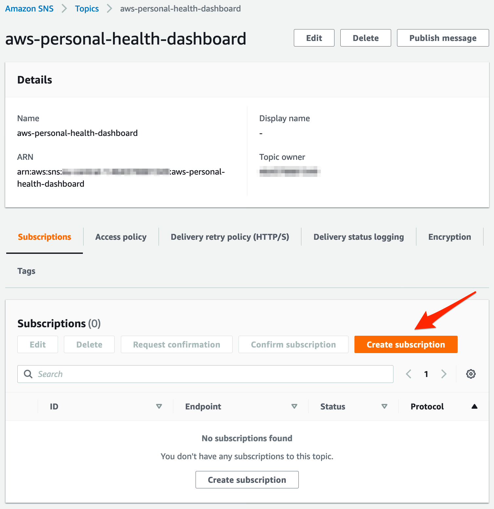

4. In the **Topic ARN** section, ensure that the **SNS Topic** that you generated is selected

5. In the **Protocol** section, choose the **HTTPS** protocol

6. In the **Endpoint** section, paste the **Webhook URL** that you generated in iLert

7. In the **Enable raw message delivery** section, ensure that the checkbox is unchecked

8. Click on **Create subscription**

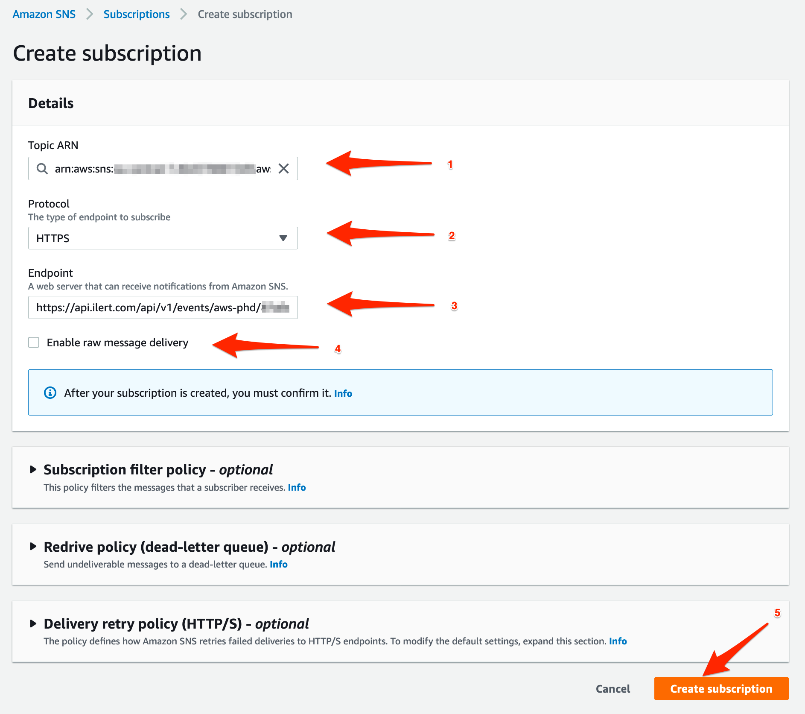

9. The subscription is **automatically confirmed by iLert** when it is created. After updating the overview, the status "PendingConfirmation" should disappear, and the ID should be displayed.

### Personal Health Dashboard: Create rule and link to topic 

You can now link any AWS Personal Health Dashboard rule to the topic you have created. The following section describes how to create a rule and make the link.

1. In AWS, click on **Alerts** icon and select **View all alerts**

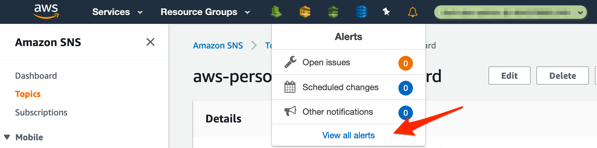

2. In the AWS Personal Health Dashboard click on **Dashboard** and then click on **Set up notifications with CloudWatch Events** to add a rule

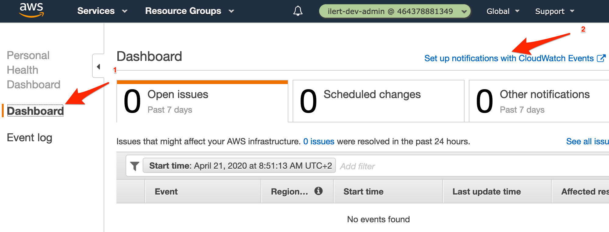

3. In the **Event Source** section, choose the **Event Pattern**

4. In the **Service Name** section, choose the **Health** service

5. In the **Event Type** section, choose the **Specific Health events** service

6. In the next section, choose **Any service** to receive an health update for each AWS service or choose **Specific service\(s\)** and select a service that interests you

7. In the **Targets** section, choose the **SNS Topic** and select the SNS topic that you generated before

8. Click on the **Configure details** button

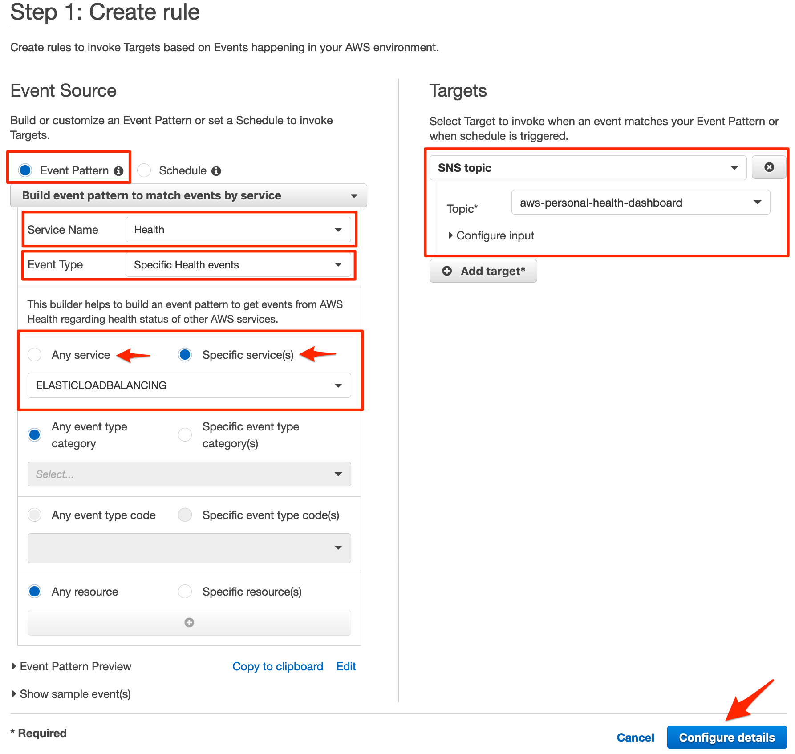

9. On the next page in the **Name** section, enter a name for the rule

10. Click on the **Create rule** button

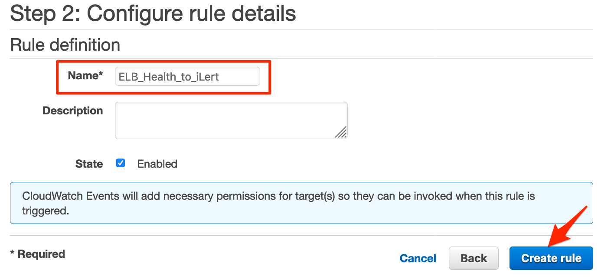

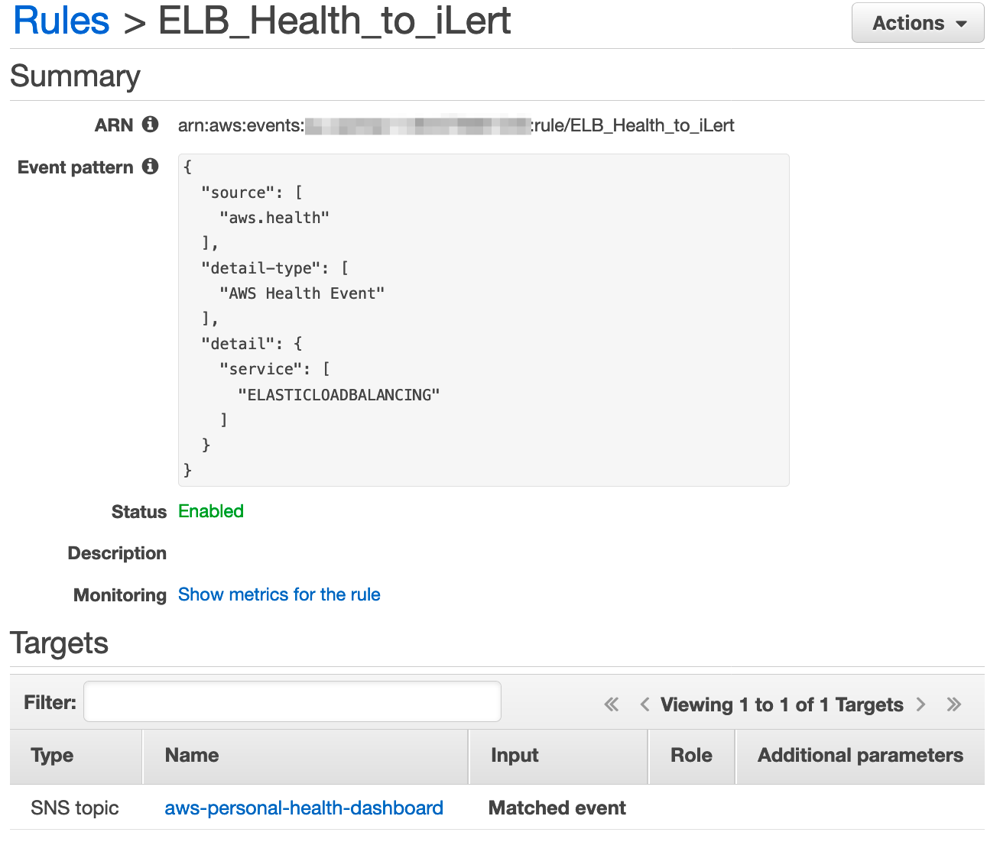

## FAQ 

**Will incidents in iLert be resolved automatically?**

Yes, as soon as the Personal Health Issue is solved in AWS, the incident in iLert will be closed.

**Can I link AWS Personal Health Dashboard to multiple alert sources in iLert?**

Yes, create an SNS topic subscription in AWS for each alert source.

