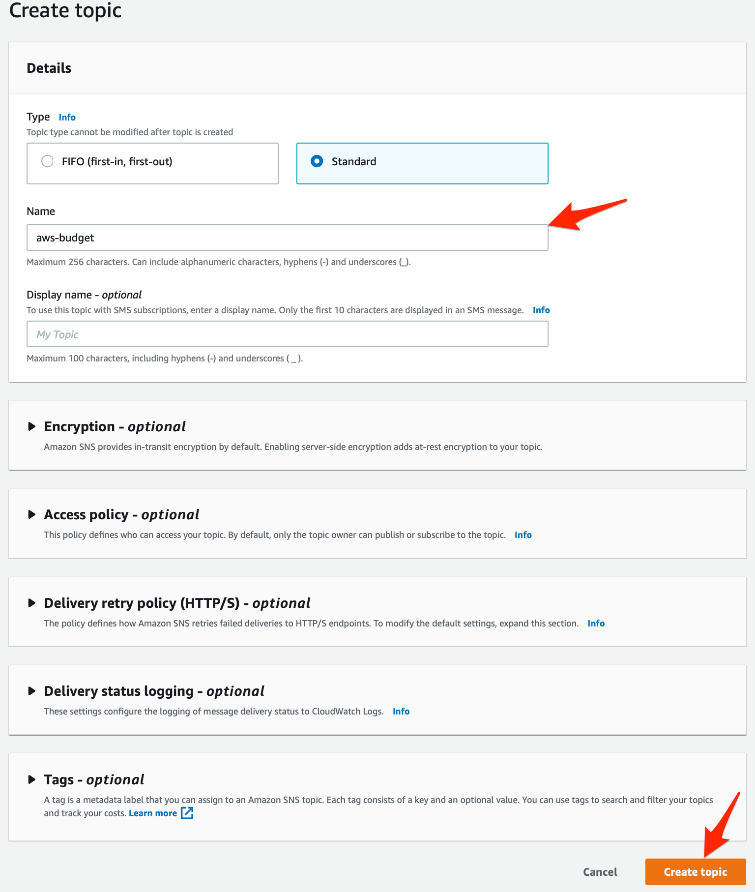
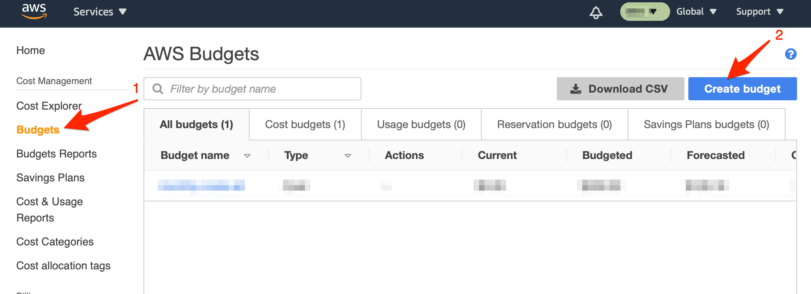

# AWS Budget Integration

[AWS Budgets](https://aws.amazon.com/aws-cost-management/aws-budgets/) allows you to set custom budgets to track your cost and usage from the simplest to the most complex use cases.

With iLert AWS Budget Integration, you can receive AWS Budget alert through iLert and easily extend AWS Budget functionality with SMS, push, voice, and iLert on-call schedules.

## In iLert 

### Create an AWS Budget alert source 

1. Go to the "Alert sources" tab and click "Create new alert source"

2. Enter a name and select your desired escalation policy. Select "**AWS Budget**" as the **Integration Type** and click on **Save**.

3. On the next page, a **Webhook URL** is generated. You will need this URL below when setting up the SNS topic subscription in AWS.

## In AWS

### Create an SNS topic 

> If you have already created an SNS topic for your AWS Budget, that you want to reuse, you can proceed to step 3.

1. On the SNS Dashboard click on **Create topic**

2. Give the topic a name and click on **Create topic**

3. Click on **Create subscription** on the Topic Detail page

4. In the **Topic ARN** section, ensure that the **SNS Topic** that you generated is selected

5. In the **Protocol** section, choose the **HTTPS** protocol

6. In the **Endpoint** section, paste the **Webhook URL** that you generated in iLert

7. In the **Enable raw message delivery** section, ensure that the checkbox is unchecked

8. Click on **Create subscription**

9. The subscription is **automatically confirmed by iLert** when it is created. After updating the overview, the status "PendingConfirmation" should disappear, and the ID should be displayed.

### Billing Dashboard: Create budget and link to topic 

You can now link any AWS Budget to the topic you have created. The following section describes how to create a budget and make the link.

1. In AWS, click on the **Profile Menu** icon and select **My Billing Dashboard**

2. In the AWS Billing Dashboard click on **Budgets** and then click on **Create budget** to add a budget

3. On the **Select budget type** page, choose a budget type that interests you and click on **Set your budget**

4. On the **Set your budget** page, choose the settings according to your liking and click on **Configure thresholds**

5. On the **Configure thresholds** page, in the **Amazon SNS** section, paste the **SNS ARN** that you generated before and make sure that you configured the right topic permissions \(you should see ✅ sign\), then click on **Confirm budget**

6. On the **Config budget** page click on **Create**

## FAQ 

**Will incidents in iLert be resolved automatically?**

No.

**Can I link AWS Budget to multiple alert sources in iLert?**

Yes, create an SNS topic subscription in AWS for each alert source.

