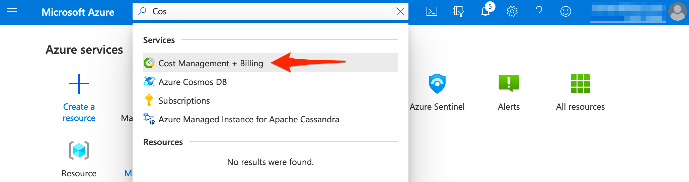
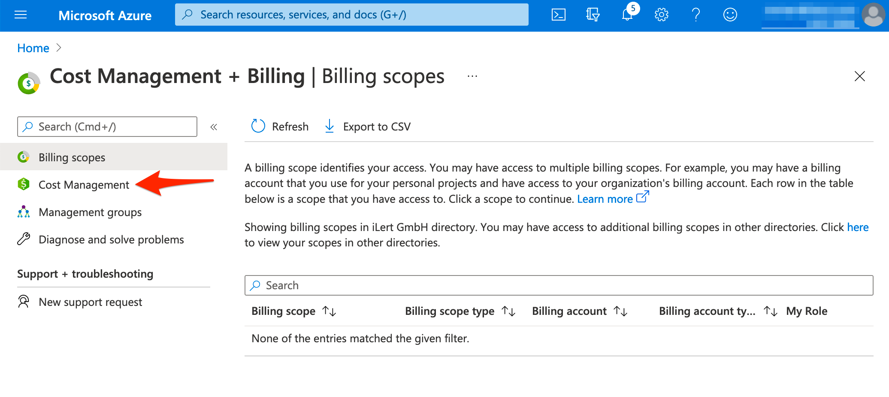
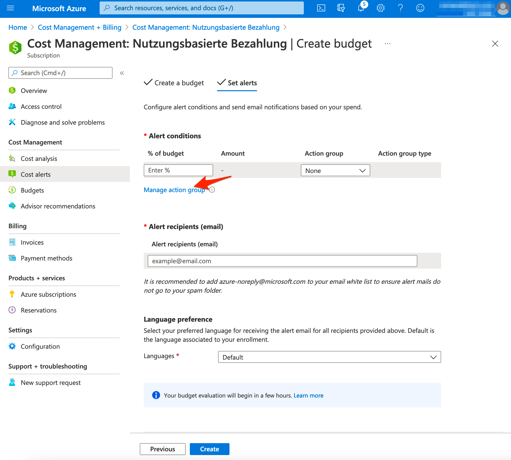
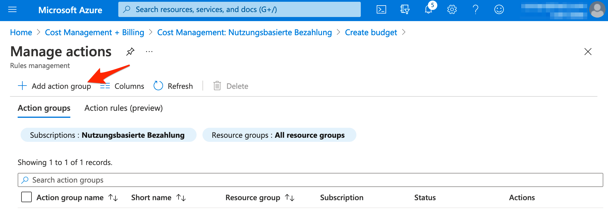

# Budget Alert

## In iLert 

### Create a Azure Alerts alert source 

1. Go to the "Alert sources" tab and click **Create new alert source**

2. Enter a name and select your desired escalation policy. Select "Azure Alerts" as the **Integration Type** and click on **Save**.

3. On the next page, a Webhook URL is generated. You will need this URL below when setting up the alert action in Azure Alerts.

## In Azure 

### Create an alert 

1. Go to [**Azure Portal**](https://portal.azure.com) and then to **Cost Management + Billing.** 

2. Then go to **Cost Management**

3. In the **Cost Management** section click on the **Cost alerts** tab and then click on the **Add** button**.**

4. On the next page, **name** the budget e.g. MyBudget, enter budget **amount** and click on the **Next** button

5. On the next page click on the **Manage action group** button

6. On the next page, click on the **Add action group** button

7. On the next page name the group e.g. **iLert** and click on the **Actions** tab.

8. ****On the **Actions** tab**,** click on the **Action type** and choose **Webhook.**

9. ****On the modal window ****in the **URI** section and ****paste the **Webhook URL** that you generated in iLert and click on **OK**. Name the action e.g. **ilert** and click on the **Review + create** button.

10. On the next page click on the **Create** button.

11. On the next page, enter the **% of budget** value and click on the **Create** button.

Finished! Your Azure Activity Logs alerts will now create alerts in iLert.

## FAQ 

**Will alerts in iLert be resolved automatically?**

No, unfortunately Azure Budget alert do not fire resolve events.

**Can I connect Azure Alerts with multiple alert sources from iLert?**

Yes, simply create more alert rules in Azure Alerts

