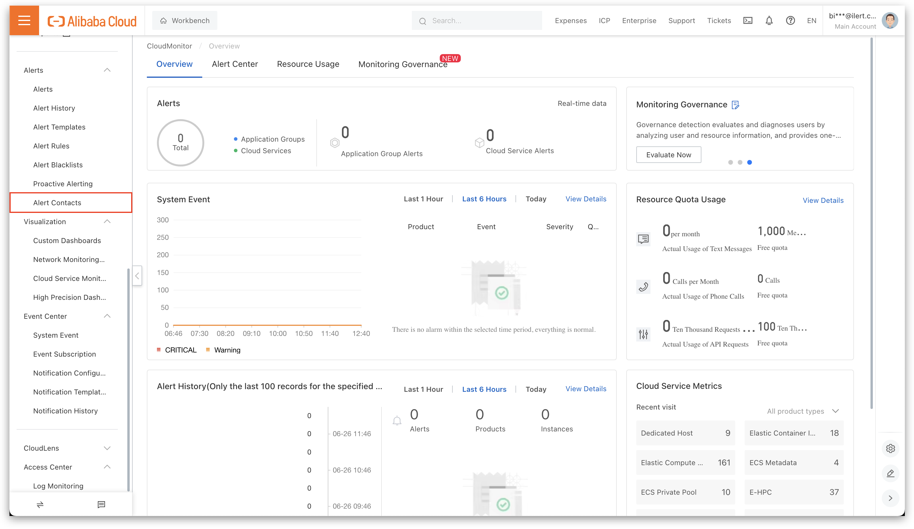

# Azure Logs

## In iLert 

### Create a Azure Alerts alert source 

1. Go to the "Alert sources" tab and click **Create new alert source**

2. Enter a name and select your desired escalation policy. Select "Azure Alerts" as the **Integration Type** and click on **Save**.

3. On the next page, a Webhook URL is generated. You will need this URL below when setting up the alert action in Azure Alerts.

## In Azure 

### Create a query 

1. Go to [**Azure Portal**](https://portal.azure.com) and then to **Monitor.** 

2. Then go to **Logs** and create a query for which you’d like to create an alert.

3. Then click on the **New alert rule** button**.**

4. On the next page change the **Condition** for the alerts and click on the **Add action groups.**

5. On the modal window click on the **Create action group** button.

6. On the next page name the group e.g. **iLert** and click on the **Actions** tab.

7. ****On the **Actions** tab**,** click on the **Action type** and choose **Webhook.**

8. ****On the modal window ****in the **URI** section and ****paste the **Webhook URL** that you generated in iLert and click on **OK**. Name the action e.g. **ilert** and click on the **Review + create** button.

9. On the next page click on the **Create** button.

10. On the next page scroll down to the **Alert rule details** section, name the alert rule and click on the **Create alert rule** button.

Finished! Your Azure Logs alerts will now create incidents in iLert.

## FAQ 

**Will incidents in iLert be resolved automatically?**

No, unfortunately Azure Log alert do not fire resolve events.

**Can I connect Azure Sentinel with multiple alert sources from iLert?**

Yes, simply create more alert rules in Azure Alerts

