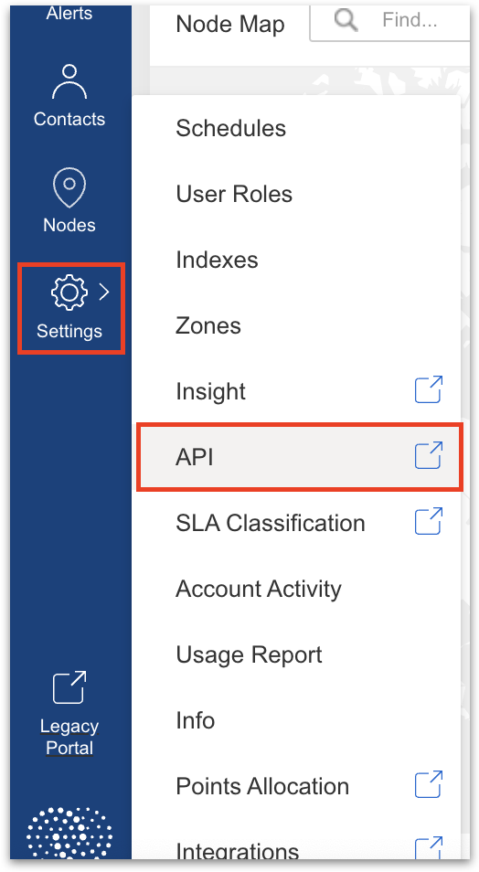
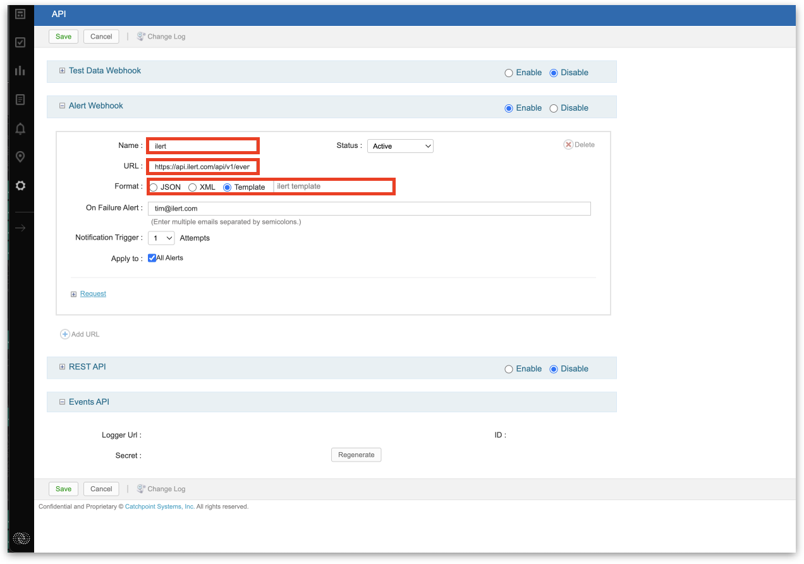
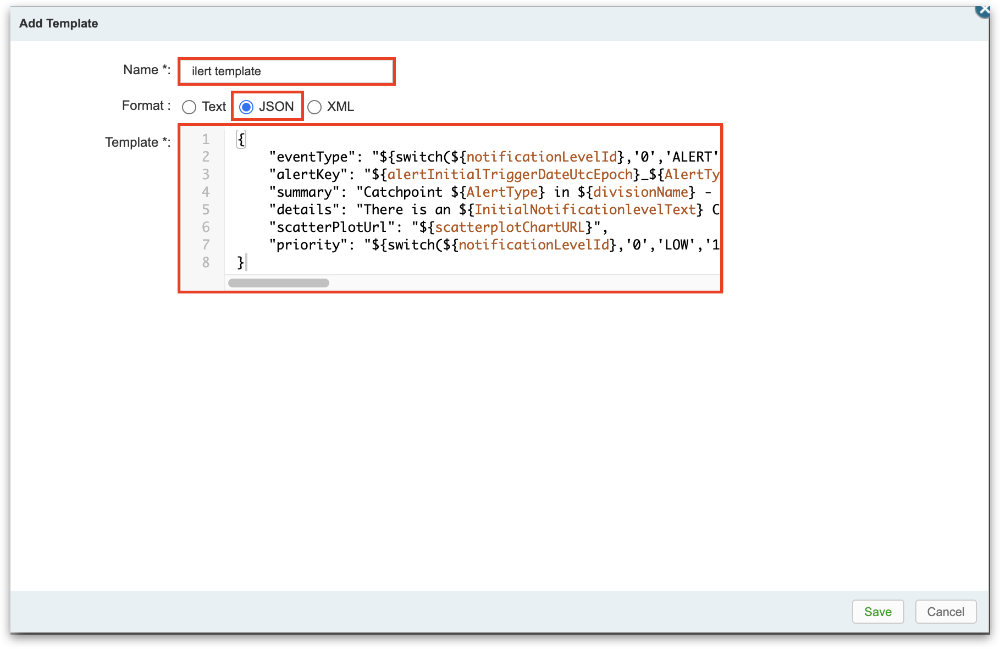

# Catchpoint Integration

[Catchpoint](https://www.catchpoint.com) is a comprehensive platform offering a suite of internet performance monitoring tools designed to provide complete, actionable insights and visibility into an organization's entire digital ecosystem.

With ilert integration for Catchpoin, you can enable multi-channel alerting for Catchpoint issues, assign them to specific team members, and use on-call schedules for uninterrupted observation of your system.

## In ilert: Create a Catchpoint alert source

1.  Go to **Alert sources** --> **Alert sources** and click on **Create new alert source**

    <figure><figcaption></figcaption></figure>
2.  Search for **Catchpoint** in the search field, click on the Catchpoint tile and click on **Next**.&#x20;

    <figure><figcaption></figcaption></figure>
3. Give your alert source a name, optionally assign teams and click **Next**.
4.  Select an **escalation policy** by creating a new one or assigning an existing one.

    <figure><figcaption></figcaption></figure>
5.  Select you [Alert grouping](../alerting/alert-sources.md#alert-grouping) preference and click **Continue setup**. You may click **Do not group alerts** for now and change it later.&#x20;

    <figure><figcaption></figcaption></figure>
6. The next page show additional settings such as customer alert templates or notification prioritiy. Click on **Finish setup** for now.
7.  On the final page, an API key and / or webhook URL will be generated that you will need later in this guide.

    <figure><figcaption></figcaption></figure>

## In Catchpoint: Add an alert webhook

1. In the sidebar click on **Settings** -> **API**.

<figure><figcaption></figcaption></figure>

2. Enable **Alert Webhook**.
3. Enter a **Name** and the previous generated alert source **URL** into the fields.
4. Select Template as **Format**.

<figure><figcaption></figcaption></figure>

5. Add a new template.
6. Enter a **Name** for the template.
7. Select JSON as **Format**.
8. Copy and paste following payload into the **Template** field:

```
{
    "eventType": "${switch(${notificationLevelId},'0','ALERT','1','ALERT','3','RESOLVE')}",
    "alertKey": "${alertInitialTriggerDateUtcEpoch}_${AlertType}_${divisionName}_${productName}_${testName}",
    "summary": "Catchpoint ${AlertType} in ${divisionName} - ${testName} ${if(${AlertTypeId} != '7', - [${nodeDetails(${nodePageFailureErrorCode})}] - ${nodeDetails(${nodePageFailureErrorCodeDesc})})}",
    "details": "There is an ${InitialNotificationlevelText} Catchpoint ${AlertType} in\nDivision: ${divisionName}\nProduct: ${productName}\nTestName: ${testName}\nStatus: ${switch('${notificationLevelId}','0','WARNING','1','CRITICAL','3','IMPROVED')}\n Scatterplot: ${scatterplotChartURL}",
    "scatterPlotUrl": "${scatterplotChartURL}",
    "priority": "${switch(${notificationLevelId},'0','LOW','1','HIGH','')}"
}
```

<figure><figcaption></figcaption></figure>

9. Save the alert webhook.

## FAQ <a href="#faq" id="faq"></a>

#### **Will alerts in ilert be resolved automatically?**

Yes, as soon as a test or an alert in Catchpoint is resolved, the associated alert in ilert will be resolved automatically.&#x20;

