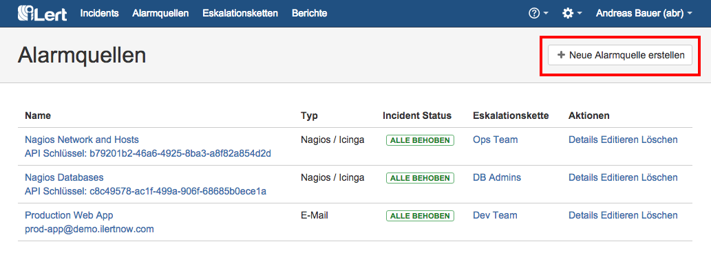
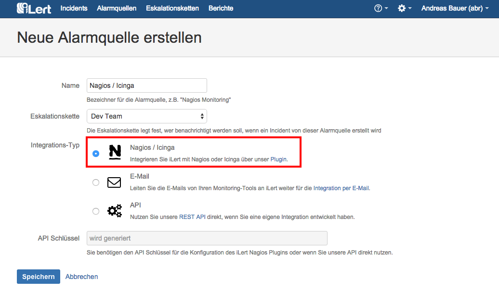
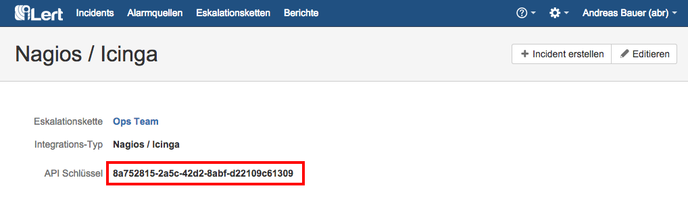
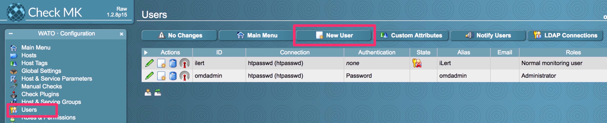
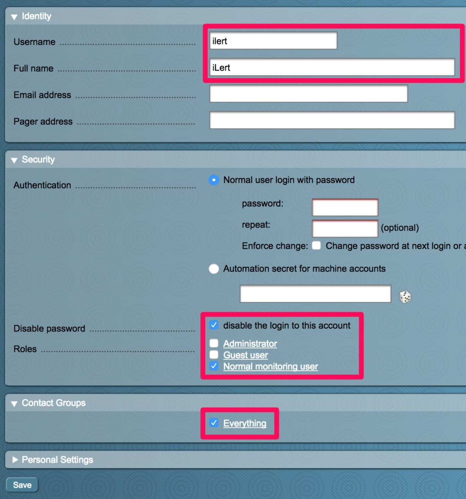
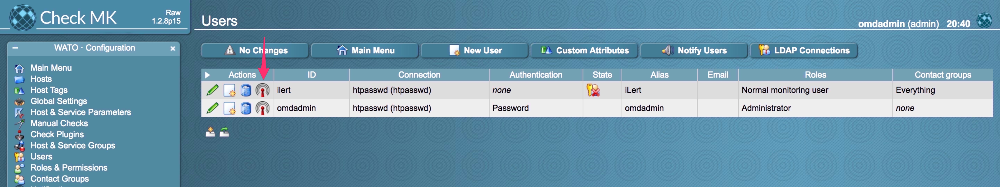
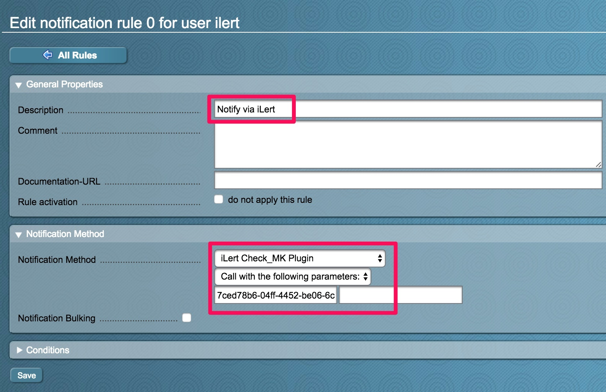
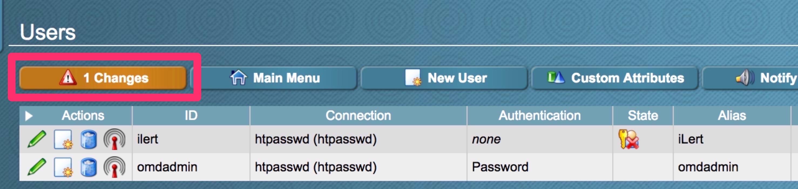
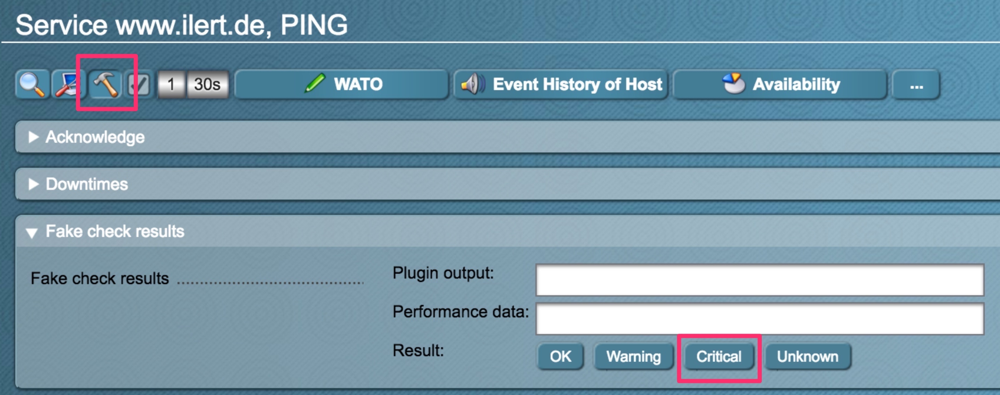

# checkmk Integration \(legacy\)

With the iLert checkmk notification plugin you can easily integrate checkmk into iLert and extend your existing checkmk system with SMS, push and voice notifications as well as on-call schedules from iLert. The screenshots below are based on the checkmk Raw Edition \(CRE\) 1.2.8. The iLert checkmk plugin is compatible with all checkmk versions.

## In iLert: create alert source <a id="create-alarm-source"></a>

1. Create a new alert source in iLert



2. Select the type **Nagios / Icinga** and click save.



3. An API key is generated. You will need the API conclusions below when setting up the plugin.



## In checkmk: configure iLert Plugin <a id="configure-ilert-plugin"></a>

Download the [checkmk](https://github.com/iLert/ilert-nagios) plugin package and unzip it:

```text
> wget https://github.com/iLert/ilert-nagios/archive/v1.5.zip
> unzip ilert-nagios-1.5.zip
```

For checkmk you need the two files `ilert_nagios.py` and `ilert_check_mk.sh`. You can delete the remaining files in the directory. Move the plugin file `ilert_nagios.py` into the directory `/usr/local/bin` . Both files must be executable by both checkmk and the cron daemon:

```text
> mv ilert_nagios.py /usr/local/bin
> chmod 755 /usr/local/bin/ilert_nagios.py
> chmod 755 ilert_check_mk.sh
```

### 



If you are using the standalone version of checkmk, follow the instructions below. If you are using the OMD version, please go the tab **OMD version of** checkmk.

```text
> crontab -u nagios -e
```

Add the following entry:

```text
* * * * * /usr/local/bin/ilert_nagios.py -m send
```

Via this cron job, events are sent to iLert every minute that failed in the first send attempt \(e..g due to a network error\).

Move the iLert alerting script to the notifications directory of checkmk:

```text
> mv ilert_check_mk.sh /usr/share/check_mk/notifications
```



If you are using the OMD version of checkmk, follow the instructions below.

```text
> su - {site-name}
```

Create a file named `ilert` under the `cron.d` directory of your monitoring instance \(e.g. `/omd/sites/{site-name}/etc/cron.d`\). The file should contain the following content:

```text
* * * * * /usr/local/bin/ilert_nagios.py -m send
```

Execute the following command for the changes to take effect:

```text
> omd reload crontab 
> exit
```

Move the iLert alerting script to the `notifications` directory of checkmk:

```text
> mv ilert_check_mk.sh /omd/sites/{site-name}/local/share/check_mk/notifications
```



Log in to checkmk's web GUI and continue there.

1. Navigate to the "Users" menu and click on "New User".



2. Fill in the fields marked below. Add the user to the contact groups to which the hosts or services that you want to be alerted for. Click on "Save".



3. Go to the notification settings of this user \(by clicking on the "Notifications" icon\).    



4. Click on "New Rule" and select iLert checkmk Plugin as the "Notification Method". Enter your iLert API key \(see above\) as a parameter.    



5. Go back to the user list and activate your changes by clicking on "1 Changes":    



## Test the integration <a id="test"></a>

You can test the integration directly in checkmk to verify that everything is working. To do this, open a host or service check in the Web GUI and click on the "Execute" icon \(Hammer Icon\). In "Fake check results" you can manually set the state of a host or service. Click on "Down" \(for a host\) or "Critical" \(for a service\) and then confirm with "Yes!". You should now see an alert in iLert.



## FAQ <a id="faq"></a>

**Which alarm types \(Notification Types\) are processed by the plugin?**

The plugin processes the notification types `PROBLEM` , `ACKNOWLEDGEMENT` and `RECOVERY`. The remaining Notification Types \(including `FLAPPING*` and `DOWNTIME*`\) are ignored.

checkmk has the following alarm types:

| Types | Description |
| :--- | :--- |
| PROBLEM | Normal host or service problem |
| RECOVERY | Host / service goes UP / OK again |
| ACKNOWLEDGMENT | Acknowledgment of a problem |
| FLAPPINGSTART | A host / service begins to be discontinuous |
| FLAPPINGSTOP | End of discontinuity |
| DOWNTIMESTART | Start of scheduled maintenance. |
| DOWNTIMEEND | Normal end of maintenance |
| DOWNTIMECANCELLED | Premature termination of maintenance |
| CUSTOM | Alarm triggered manually by command |
| ALERT HANDLER | Alerthandler execution \(CEE from 1.4.0i2\) |

**What happens if my internet connection is lost? Are the events generated in checkmk lost?**

No, events won't be lost. The plugin stores the events locally in a temporary directory \(by default in /tmp/ilert\_nagios\) and tries to send them to iLert every minute. This means that as soon as your connection is available again, cached events will be sent to iLert. In addition, we recommend that you monitor your Internet connection using our uptime monitoring feature.

**Will alerts in iLert be resolved automatically?**

Yes, as soon as the state of a host / service is UP or OK again in checkmk, the associated alert is resolved in iLert. If a problem is acknowledged in checkmk, the associated alert in iLert is set to the status Accepted.

**Can I link checkmk to multiple alert sources in iLert?**

Yes, create a checkmk user for each alert source in checkmk. Proceed as described above in the instructions.

**The plugin does not work. How do I find the issue?**

Please look first in the log file. The plugin uses the Unix / Linux system log for logging \(eg under /var/log/messages or /var/log/syslog \). If you can not find the error, please contact our support at [support@ilert.com](mailto:support@ilert.com) .

Please also have a look at the checkmk documentation, where additional log files related to alerting are documented: [The course of a notification from beginning to end](https://checkmk.com/cms_notifications.html#The%20course%20of%20a%20notification%20from%20beginning%20to%20end)

