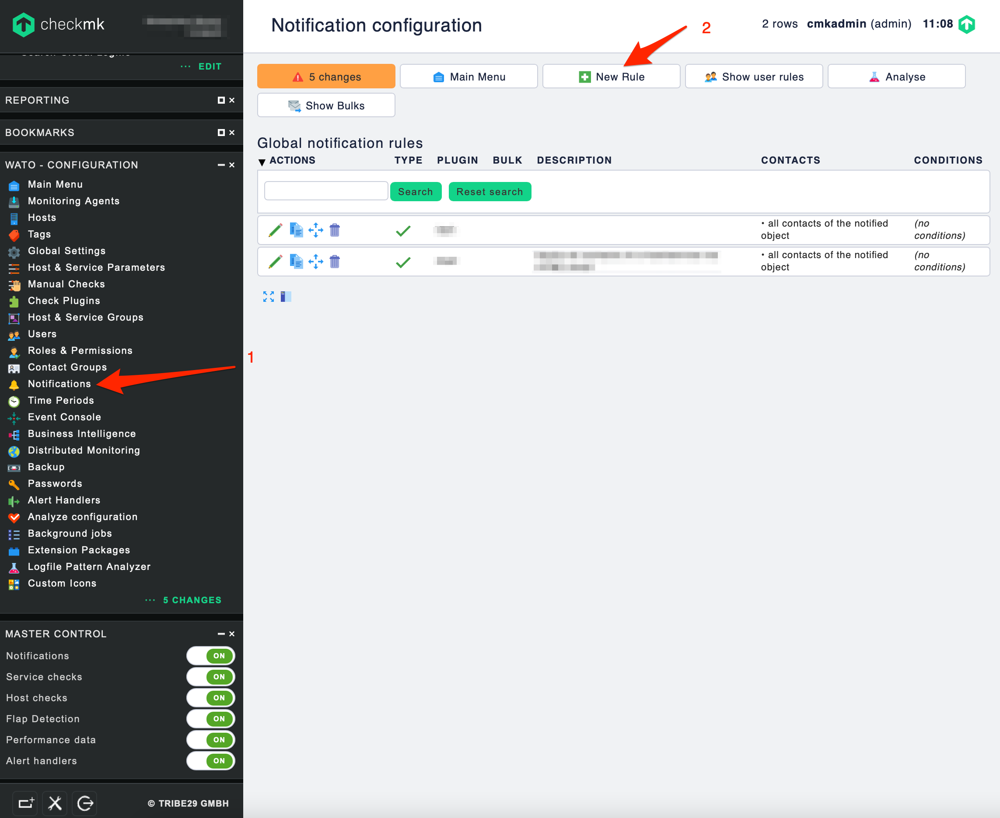
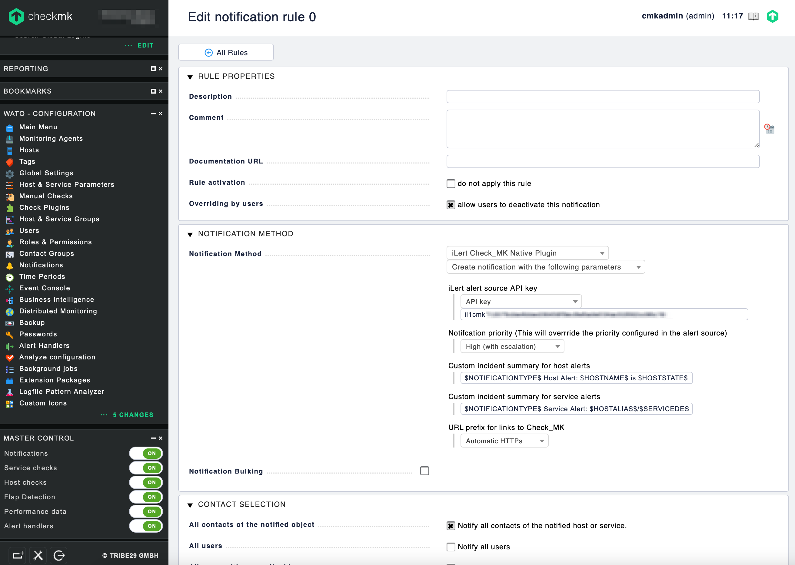

# checkmk Integration \(native\)

With the iLert checkmk notification plugin you can easily integrate checkmk into iLert and extend your existing checkmk system with SMS, push and voice notifications as well as on-call schedules from iLert. 

## In iLert: create alert source 

1. Create a new alert source in iLert

2. Enter a name \(e.g. "checkmk server"\) and select your desired escalation policy.

3. Select the type **checkmk** and click save.

3. An API key is generated. You will need it below when setting up the notification configuration in checkmk.

## In checkmk: configure iLert notification 

1. Navigate to the **Notifications** menu and click on **New Rule**.

2. In the **Notification Method** section choose iLert method. Enter enter the **API key** and click on **Save**.

## FAQ 

**Which alarm types \(Notification Types\) are processed?**

The plugin processes the notification types `PROBLEM` , `ACKNOWLEDGEMENT` and `RECOVERY`. The remaining Notification Types \(including `FLAPPING*` and `DOWNTIME*`\) are ignored.

checkmk has the following alarm types:

| Types | Description |
| :--- | :--- |
| PROBLEM | Normal host or service problem |
| RECOVERY | Host / service goes UP / OK again |
| ACKNOWLEDGMENT | Acknowledgment of a problem |
| FLAPPINGSTART | A host / service begins to be discontinuous |
| FLAPPINGSTOP | End of discontinuity |
| DOWNTIMESTART | Start of scheduled maintenance. |
| DOWNTIMEEND | Normal end of maintenance |
| DOWNTIMECANCELLED | Premature termination of maintenance |
| CUSTOM | Alarm triggered manually by command |
| ALERT HANDLER | Alerthandler execution \(CEE from 1.4.0i2\) |

**Will incidents in iLert be resolved automatically?**

Yes, as soon as the state of a host / service is UP or OK again in checkmk, the associated incident is resolved in iLert. If a problem is acknowledged in checkmk, the associated incident in iLert is set to the status Accepted.

**Can I link checkmk to multiple alert sources in iLert?**

Yes, create a checkmk user for each alert source in checkmk. Proceed as described above in the instructions.

