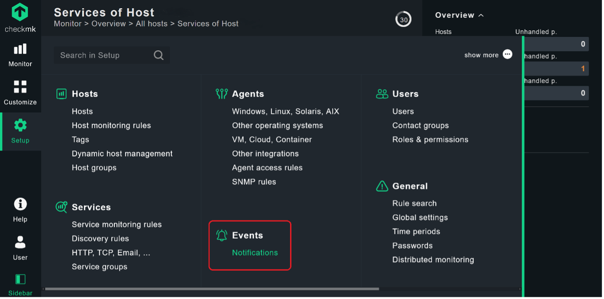
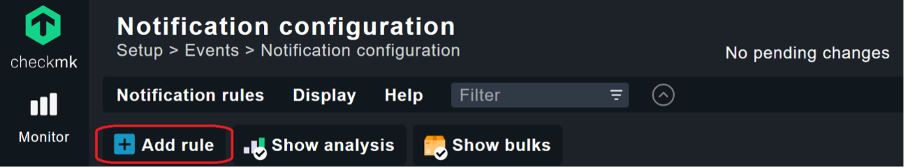
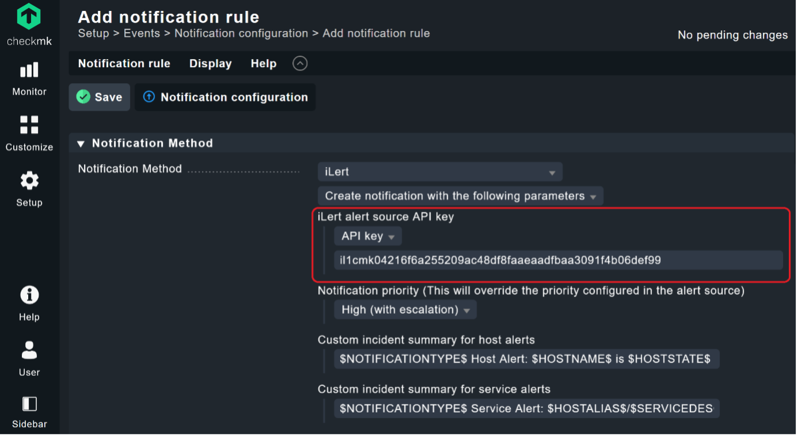

# Checkmk Integration \(v 2.0+ \)

With the native iLert notification integration in Checkmk, you can automatically create alerts in iLert from Checkmk alerts. That way, you will never miss a critical alert and always alert the right person using iLert's on-call schedules, automatic escalation, and multiple alerting channels. When checkmk creates an alert, iLert will alert the on-call person through their preferred channel, including SMS, phone calls, push notifications and Slack. iLert will automatically escalate to the next person, if the alert is not acknowledged. iLert also lets you define alerting rules based on support hours and delay alerts until your support hours start. 

## In iLert: create alert source 

1. Create a new alert source in iLert

2. Enter a name \(e.g. "checkmk server"\) and select your desired escalation policy.

3. Select the type **checkmk** and click save.

3. An API key is generated. You will need it below when setting up the notification configuration in checkmk.

## In checkmk: configure iLert notification 

1. Navigate to the **Setup** --&gt; **Events** --&gt; **Notifications**

2. In the **Notification configuration**, click on **Add rule**

2. In the **Notification Method** section choose iLert method. Enter enter the **API key** and click on **Save**.

## FAQ 

**Which notification types are processed?**

The plugin processes the notification types `PROBLEM` , `ACKNOWLEDGEMENT` and `RECOVERY`. The remaining Notification Types \(including `FLAPPING*` and `DOWNTIME*`\) are ignored.

checkmk has the following alarm types:

| Types | Description |
| :--- | :--- |
| PROBLEM | Normal host or service problem |
| RECOVERY | Host / service goes UP / OK again |
| ACKNOWLEDGMENT | Acknowledgment of a problem |
| FLAPPINGSTART | A host / service begins to be discontinuous |
| FLAPPINGSTOP | End of discontinuity |
| DOWNTIMESTART | Start of scheduled maintenance. |
| DOWNTIMEEND | Normal end of maintenance |
| DOWNTIMECANCELLED | Premature termination of maintenance |
| CUSTOM | Alarm triggered manually by command |
| ALERT HANDLER | Alerthandler execution \(CEE from 1.4.0i2\) |

**Will alerts in iLert be resolved automatically?**

Yes, as soon as the state of a host / service is UP or OK again in checkmk, the associated alert is resolved in iLert. If a problem is acknowledged in checkmk, the associated alert in iLert is set to the status Accepted.

**Can I link checkmk to multiple alert sources in iLert?**

Yes, create a checkmk user for each alert source in checkmk. Proceed as described above in the instructions.

