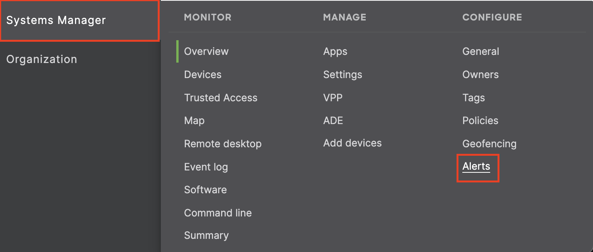

# Cisco Meraki Integration

## In ilert: Create Cisco Meraki alert source

1. Go to **Alert sources** and click on the **Create new alert source** button
2. Set a name for your Cisco Meraki alert source and select an escalation policy
3. In the field Integration type select **Cisco Meraki** and save
4.

    <figure><figcaption></figcaption></figure>
5. On the next page, a Webhook URL is generated. You will need this URL below when setting up in Cisco Meraki.
6.

    <figure><figcaption>
j
</figcaption></figure>

## In Cisco Meraki: Add ilert as a webhook receiver

1. Select the desired **Network**
2.

    <figure><figcaption></figcaption></figure>
3. In the sidebar, go to **Alerts & AI** -> **Destinations** -> **Webhook**
4.

    <figure><figcaption></figcaption></figure>
5. On the next page, scroll down to **Webhooks** and enter a **Name**, the Webhook URL generated in ilert and choose **Meraki (included)** as payload template
6.

    <figure><figcaption></figcaption></figure>
7. Click on **Send test webhook**, to send a test alert to ilert
8.

    <figure><figcaption></figcaption></figure>
9. Click on **Save** to save the webhook

## FAQ

**Will alerts in ilert be resolved automatically?**

No, unfortunately Cisco Meraki is not compatible with ilert's resolve event.

