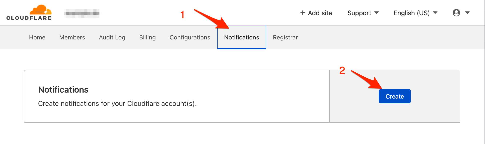
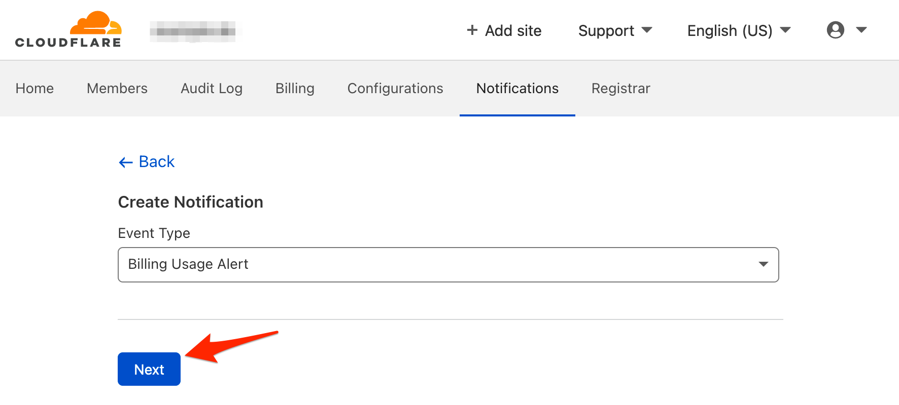

# Cloudflare Integration

Cloudflare allows you to set alert notifications to track DDoS attacks, billing usage and many more.

With iLert Cloudflare Integration, you can receive Cloudflare alert through iLert and easily extend Cloudflare functionality with SMS, push, voice, and iLert on-call schedules.

## In iLert 

### Create an email alert source

1. Go to **Alert sources** and click on **Add a new alert source**
2. Enter a name and select an escalation policy
3. Chose **Email** as integation type
4. Enter an email address for the alert source, you will need this email below when setting up the notification in Cloudflare
5. Save the email alert source

## In Cloudflare

### Create a notification

1. Go to Cloudflare and then to **Account Home**

1. On the next page,  click on the **Notifications** tab and then on the **Create** button

1. On the next page,  choose an **Event Type** and then on the **Next** button

1. On the next page,  name the notification e.g. iLert, paste the **email** paste that you created in iLert and click on the **Create** button

Finished! Your Cloudflare notifications will now create alerts in iLert.

## FAQ 

**Will alerts in iLert be resolved automatically?**

No, unfortunately Cloudflare is not sent resolution notifications.

**Can I connect Cloudflare with multiple alert sources from iLert?**

Yes, simply add more notification settings in Cloudflare.

