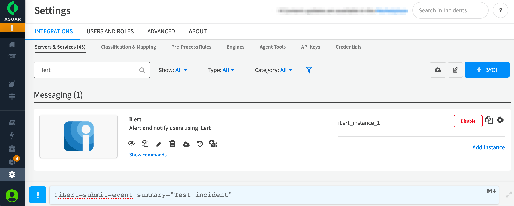

# Cortex XSOAR \(formerly Demisto\) Integration

[Cortex XSOAR](https://www.paloaltonetworks.com/cortex/xsoar) is the industry’s only extended security orchestration, automation and response platform that unifies case management, automation, real-time collaboration and threat intelligence management to transform every stage of the incident lifecycle. Teams can manage alerts across all sources, standardize processes with playbooks, take action on threat intelligence and automate response for any security use case, resulting in significantly faster responses that require less manual review.

## In iLert <a id="in-ilert"></a>

### Create an alert source <a id="create-alert-source"></a>

1. Go to the "Alert sources" tab and click **Create new alert source**

2. Enter a name and select your desired escalation policy. Select "Cortex XSOAR" as the **Integration Type** and click on **Save**.


3. On the next page, an **API Key** is generated. You will need this API Key below when setting up the Cortex XSOAR integration.


## In Cortex XSOAR Server <a id="in-cortex-xsoar"></a>

### Add Integration

1. Go to Cortex XSOAR, then to **Settings -&gt; Integrations**, search for **iLert** integration and click on the **Add instance** button


2. On the modal window, name the instance, paste the iLert **API Key** that that you generated in iLert and click on the **Save & exit** button


3. Type some available iLert command to test the integration, e.g.

```bash
!iLert-submit-event summary="Test incident"
```



## FAQ <a id="faq"></a>

**Can I connect Cortex XSOAR with multiple alert sources from iLert?**

Yes, simply add more integration instances in Cortex XSOAR.

