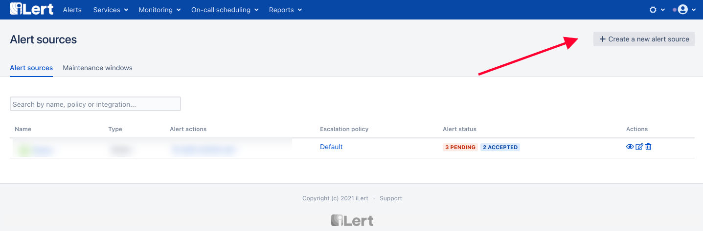

# CrowdStrike Integration

## In iLert

* Go to the "**Alert sources**" tab and click "**Create new alert source**"

* Enter a name and select your desired escalation policy.  &#x20;
* Select "**CrowdStrike**" as the **Integration Type** and click **Save**.

* On the next page, an **CrowdStrike URL** is generated. You will need the URL for the webhook configuration

## In CrowdStrike

* Go to Workflows Dashboard by clicking the "**CrowdStrike**" logo on top left and choose **Workflows**

* Click on **Create a Workflow** on top right, on the workflow workspace add a trigger, and choose "**New Detection"** additionally you can also add Condition, in this case we chose greater than **Medium** severity

* On creating Action choose Action type **Notification** and **Call webhook** as Action, you might need to configure it from store if you haven't done so. Go ahead and click the Store link, and click "**Configure**" on the Webhook.&#x20;
* Add the **Name** in this case we name it as ilert-incident and put the **Webhook URL** that we got from iLert's dashboard earlier.

.png>)

* Click **Save Configuration**, and it should be added to the Workflow workspace.
* Choose the Webhook name based on the name that we set earlier, and choose **ALL** Data to include&#x20;

* Save the configuration and turn the workflow on, and upon Detection creation, the incident will be created on iLert.
