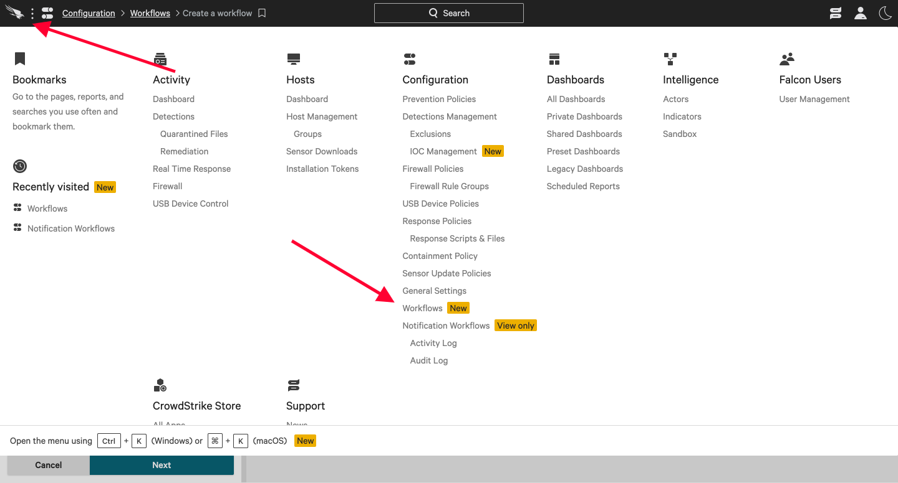
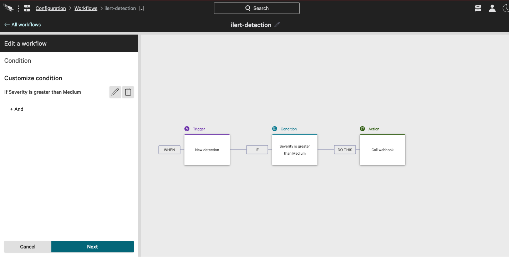
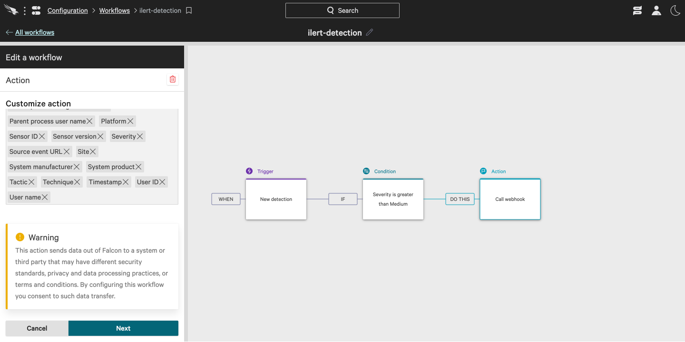

# CrowdStrike Integration

## In ilert: Create a CrowdStrike alert source

1.  Go to **Alert sources** --> **Alert sources** and click on **Create new alert source**

    <figure><figcaption></figcaption></figure>
2.  Search for **CrowdStrike** in the search field, click on the CrowdStrike tile and click on **Next**.&#x20;

    <figure><figcaption></figcaption></figure>
3. Give your alert source a name, optionally assign teams and click **Next**.
4.  Select an **escalation policy** by creating a new one or assigning an existing one.

    <figure><figcaption></figcaption></figure>
5.  Select you [Alert grouping](../alerting/alert-sources.md#alert-grouping) preference and click **Continue setup**. You may click **Do not group alerts** for now and change it later.&#x20;

    <figure><figcaption></figcaption></figure>
6. The next page show additional settings such as customer alert templates or notification prioritiy. Click on **Finish setup** for now.
7.  On the final page, an API key and / or webhook URL will be generated that you will need later in this guide.

    <figure><figcaption></figcaption></figure>

## In CrowdStrike

1. Go to Workflows Dashboard by clicking the "**CrowdStrike**" logo on top left and choose **Workflows**

2. Click on **Create a Workflow** on top right, on the workflow workspace add a trigger, and choose "**New Detection"** additionally you can also add Condition, in this case we chose greater than **Medium** severity

3. On creating Action choose Action type **Notification** and **Call webhook** as Action, you might need to configure it from store if you haven't done so. Go ahead and click the Store link, and click "**Configure**" on the Webhook.
4. Add the **Name** in this case we name it as ilert-incident and put the **Webhook URL** that we got from ilert's dashboard earlier.

.png>)

5. Click **Save Configuration**, and it should be added to the Workflow workspace.
6. Choose the Webhook name based on the name that we set earlier, and choose **ALL** Data to include

7. Save the configuration and turn the workflow on, and upon Detection creation, the incident will be created on ilert.
