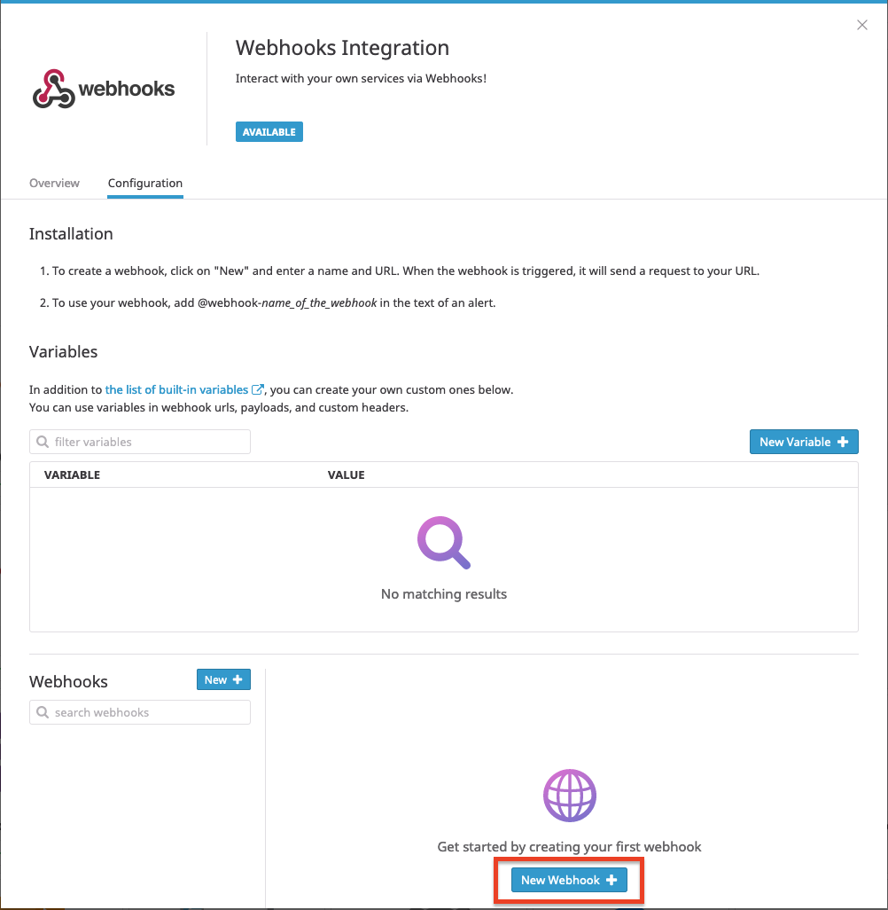
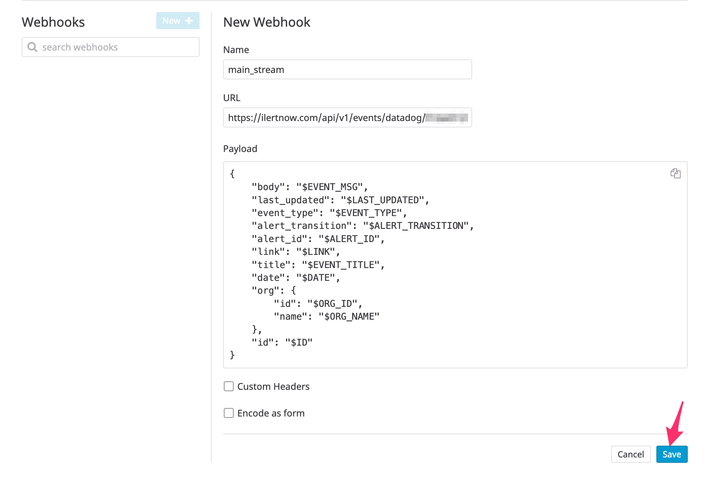

# Datadog Inbound Integration

With the ilert Datadog integration, you can create alerts in ilert based on Datadog events.

## In ilert: Create Datadog alert source <a href="#alert-source" id="alert-source"></a>

1.  Go to **Alert sources** --> **Alert sources** and click on **Create new alert source**

    <figure><figcaption></figcaption></figure>
2.  Search for **Datadog** in the search field, click on the Datadog tile and click on **Next**.&#x20;

    <figure><figcaption></figcaption></figure>
3. Give your alert source a name, optionally assign teams and click **Next**.
4.  Select an **escalation policy** by creating a new one or assigning an existing one.

    <figure><figcaption></figcaption></figure>
5.  Select you [Alert grouping](../../alerting/alert-sources.md#alert-grouping) preference and click **Continue setup**. You may click **Do not group alerts** for now and change it later.&#x20;

    <figure><figcaption></figcaption></figure>
6. The next page show additional settings such as customer alert templates or notification prioritiy. Click on **Finish setup** for now.
7.  On the final page, an API key and / or webhook URL will be generated that you will need later in this guide.

    <figure><figcaption></figcaption></figure>

## In Datadog: Add ilert Webhook as alerting channel <a href="#add-webhook" id="add-webhook"></a>

1. Go to Datadog integrations page and **install Webhooks integration**: [https://app.datadoghq.com/account/settings#integrations](https://app.datadoghq.com/account/settings#integrations)
2. Click an Webhooks integration, scroll to bottom and add a new webhook:



3. Enter a name, the **Datadog webhook URL** from ilert alert source and **template payload**:

```
{
 "body": "$EVENT_MSG",
 "last_updated": "$LAST_UPDATED",
 "event_type": "$EVENT_TYPE",
 "alert_transition": "$ALERT_TRANSITION",
 "alert_id": "$ALERT_ID",
 "link": "$LINK",
 "title": "$EVENT_TITLE",
 "date": "$DATE",
 "org": {
     "id": "$ORG_ID",
     "name": "$ORG_NAME"
 },
 "id": "$ID"
}
```



4. Click **save** button
5. The integration is now set up!

## FAQ <a href="#faq" id="faq"></a>

**Are alerts in ilert automatically resolved?**

Yes, as soon as an Incident is closed in Datadog, the corresponding Alert is automatically resolved in ilert.

**Can I link Datadog to several alert sources in ilert?**

Yes, create a webhook in Datadog for each alert source.\


## Further References <a href="#faq" id="faq"></a>

Here is the instruction on how to import metrics from Datadog and display them on your ilert status page: \
\
[Import metrics from Datadog](https://docs.ilert.com/incident-comms-and-status-pages/metrics/import-metrics-from-datadog)
