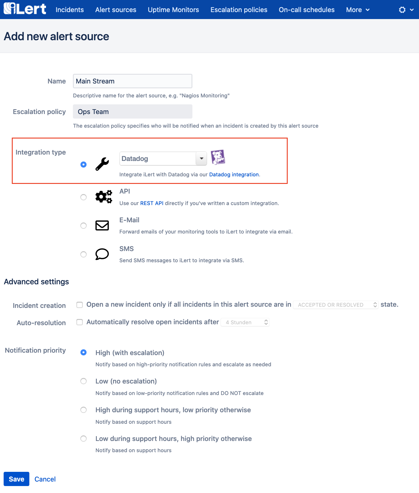
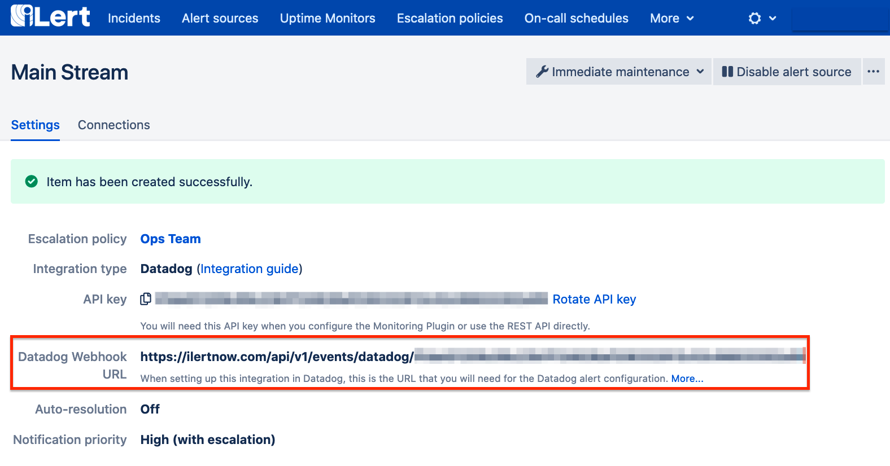

# Datadog Inbound Integration

With the iLert Datadog integration, you can create incidents in iLert based on Datadog events.

## In iLert: Create Datadog alert source <a id="alert-source"></a>

1. Switch to the **Alert Sources** tab and click on the "Create new alert source" button

2. Assign name and select escalation chain

3. Select **Datadog** in the Integration type field and save.



4. On the next page a **Webhook URL** is generated. You will need this URL at the bottom of the setup in Datadog.



## In Datadog: Add iLert Webhook as alerting channel <a id="add-webhook"></a>

1. Go to Datadog integrations page and **install Webhooks integration**: [https://app.datadoghq.com/account/settings\#integrations](https://app.datadoghq.com/account/settings#integrations)

2. Click an Webhooks integration, scroll to bottom and add a new webhook:


3. Enter a name, the **Datadog webhook URL** from iLert alert source and **template payload**:

```text
{
 "body": "$EVENT_MSG",
 "last_updated": "$LAST_UPDATED",
 "event_type": "$EVENT_TYPE",
 "alert_transition": "$ALERT_TRANSITION",
 "alert_id": "$ALERT_ID",
 "link": "$LINK",
 "title": "$EVENT_TITLE",
 "date": "$DATE",
 "org": {
     "id": "$ORG_ID",
     "name": "$ORG_NAME"
 },
 "id": "$ID"
}
```


4. Click **save** button

5. The integration is now set up!

## FAQ <a id="faq"></a>

**Are incidents in iLert automatically resolved?**

Yes, as soon as an Incident is closed in Datadog, the corresponding Incident is automatically resolved in iLert.

**Can I link New Relic to several alert sources in iLert?**

Yes, create a webhook in Datadog for each alert source.With the iLert TOPdesk integration, you can create incidents in iLert based on TOPdesk event such as tickets or calls.

